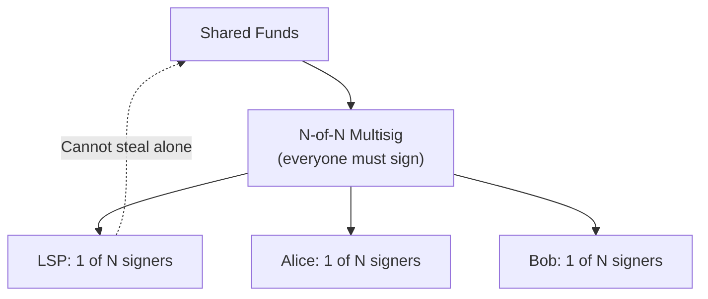
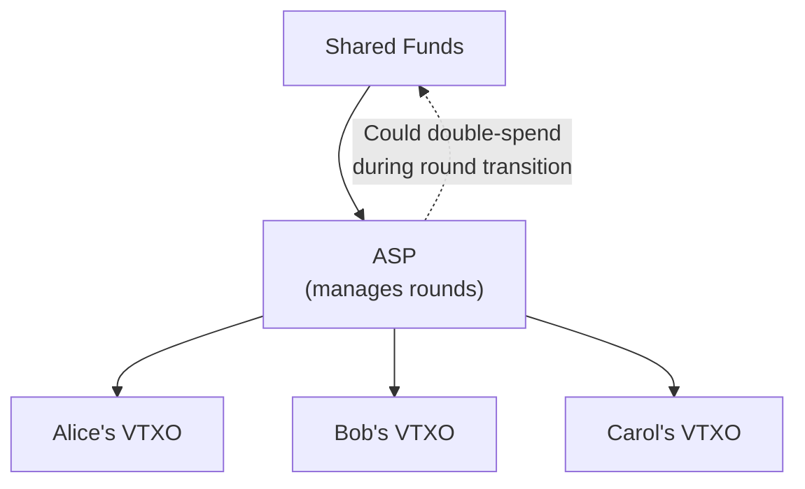

# Comparison to Ark

> **TLDR**: Ark and SuperScalar both solve "many users, one UTXO" but with fundamentally different trust models. Ark uses a semi-custodial ASP (Ark Service Provider) that can double-spend during rounds. SuperScalar uses N-of-N multisig where the LSP physically cannot steal.

## The Shared Goal

Both Ark and SuperScalar try to solve the same problem: **how to give many users non-custodial (or near-non-custodial) Lightning access without one UTXO per user.**

But they make very different trade-offs.

## Side-by-Side Comparison

| Feature | **SuperScalar** | **Ark** |
|---------|----------------|---------|
| **Provider role** | LSP (one signer among many) | ASP (Ark Service Provider, more centralized) |
| **Trust model** | N-of-N — LSP cannot steal | ASP could double-spend during rounds |
| **Provider can steal?** | **No** (multisig prevents it) | **Conditional** (during round transitions) |
| **Consensus changes needed** | None | None (but significantly better with CTV) |
| **User liveness requirement** | Once per month | Must refresh before expiry |
| **On-chain exit** | O(log N) transactions (tree publication) | O(1) transaction (VTXO redemption) |
| **State updates** | Only affected subtree signers needed | All users participate in round |
| **Interactivity** | High (MuSig2 signing ceremonies) | Lower (ASP constructs rounds) |
| **Maturity** | Implementation in progress | Ark Labs funded, building (2024+) |

## Trust Model Deep Dive

### SuperScalar: N-of-N Multisig

The LSP is **mathematically unable** to move funds without all other participants signing. This is the same trust model as an on-chain multisig — you trust math, not people.

**Trade-off**: Everyone must cooperate for state updates. If someone goes offline, the affected subtree can't update until they return (or the factory enters its dying period).

### Ark: ASP-Managed Rounds

The ASP constructs "rounds" where users' Virtual UTXOs (VTXOs) are refreshed. During the transition between rounds, the ASP has a window where it could potentially double-spend.

**Trade-off**: Much less interactivity needed (ASP does most of the work), but users must trust the ASP during round transitions.

## When SuperScalar Is Better

- **Maximum security**: If you absolutely cannot accept any trust in the service provider
- **Developing nations**: Where service providers might be unreliable or subject to government seizure
- **Large channel balances**: When the amount at risk justifies the stronger trust model
- **No soft fork dependency**: Works fully today, no CTV needed

## When Ark Might Be Better

- **Less interactivity**: Users don't need to participate in MuSig2 signing ceremonies
- **Simpler exit**: O(1) on-chain transactions to exit vs O(log N) for SuperScalar
- **With CTV**: If CTV is activated, Ark's model becomes significantly more efficient
- **Casual users**: For small amounts where the weaker trust model is acceptable

## The Soft Fork Dimension

Both protocols would benefit from Bitcoin consensus changes, but in different ways:

| Soft Fork | SuperScalar Impact | Ark Impact |
|-----------|-------------------|------------|
| **CTV (OP_CHECKTEMPLATEVERIFY)** | Nice-to-have: removes need for client presence during factory construction | Transformative: eliminates ASP trust issue |
| **APO (SIGHASH_ANYPREVOUT)** | Could replace DW with eltoo (unlimited states) | Marginal |
| **OP_CAT** | Enables competition from other designs | Enables advanced covenant constructions |

If CTV activates, Ark's trust model improves dramatically. SuperScalar's advantage (stronger trust model) becomes less important because Ark would also be trustless.

If no soft forks activate, SuperScalar's "works today" advantage persists.

## The Real Competition

In practice, SuperScalar and Ark serve slightly different niches:

- **Ark** → Optimized for casual users who want simple UX and don't mind mild trust assumptions
- **SuperScalar** → Optimized for users who need the strongest possible trust guarantees without consensus changes

They might even coexist: an LSP could run SuperScalar factories for high-value clients and point casual users to Ark-based solutions.

## Related Concepts

- [[security-model]] — SuperScalar's full trust analysis
- [[what-is-an-lsp]] — Who coordinates factories
- [[soft-fork-landscape]] — How future Bitcoin upgrades affect both protocols
- [[why-superscalar-exists]] — The problem both protocols are solving
