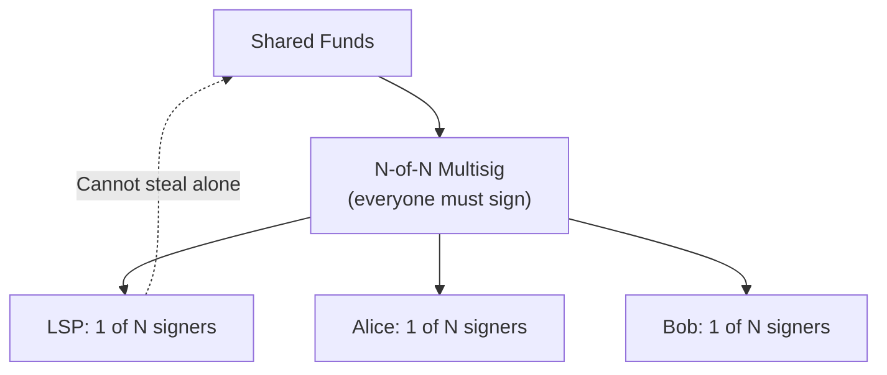
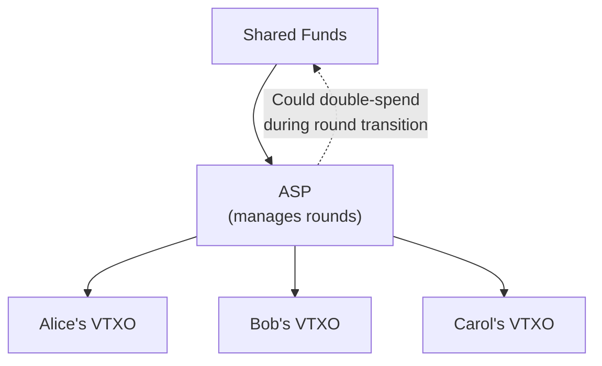

# Comparison to Ark

> **Summary**: Ark and SuperScalar both address the "many users, one UTXO" problem but make different trust and interactivity trade-offs. Ark uses an ASP (Ark Service Provider) that constructs rounds with a double-spend window during transitions. SuperScalar uses N-of-N multisig requiring full participant cooperation.

## The Shared Goal

Both Ark and SuperScalar address the same constraint: **how to give many users Lightning access without requiring one UTXO per user.** They make different trade-offs in trust model, interactivity, and soft-fork dependency.

## Side-by-Side Comparison

| Feature | **SuperScalar** | **Ark** |
|---------|----------------|---------|
| **Provider role** | LSP (one signer among N) | ASP (Ark Service Provider, round coordinator) |
| **Trust model** | N-of-N — LSP cannot steal | ASP could double-spend during rounds |
| **Provider can steal?** | No (N-of-N multisig) | Double-spend window during round transitions |
| **Consensus changes needed** | None | None (but significantly better with CTV) |
| **User liveness requirement** | Must come online before factory expiry (~30 days) | Must refresh VTXOs before expiry (~4 weeks typical) |
| **On-chain exit** | O(log N) transactions (tree publication) | O(1) transaction (VTXO redemption) |
| **State updates** | Only affected subtree signers needed | All users participate in round |
| **Interactivity** | High (MuSig2 signing ceremonies) | Lower (ASP constructs rounds) |
| **Maturity** | Implementation in progress | Testnet implementations exist; production development ongoing |

## Trust Model Deep Dive

### SuperScalar: N-of-N Multisig

The LSP cannot move funds without all other participants signing — the same trust model as an on-chain multisig.

**Trade-off**: Everyone must cooperate for state updates. If someone goes offline, the affected subtree can't update until they return (or the factory enters its dying period).

### Ark: ASP-Managed Rounds

The ASP constructs "rounds" where users' Virtual UTXOs (VTXOs) are refreshed. During the transition between rounds, the ASP has a window where it could attempt a double-spend. However, users can detect this on-chain and redeem their VTXO unilaterally before the timeout expires.

**Trade-off**: Less interactivity needed (ASP does most of the work), but users must monitor for ASP misbehavior during round transitions and exit if necessary.

## Where Each Design Fits

**SuperScalar strengths:**
- No trust assumption beyond N-of-N multisig
- No soft fork dependency — works on Bitcoin today
- Suited for higher-value channels where the stronger trust model justifies interactivity costs

**Ark strengths:**
- Lower interactivity — ASP constructs rounds without real-time participant cooperation
- Simpler exit: O(1) on-chain transactions vs O(log N)
- With CTV, the double-spend window can be eliminated, achieving trustlessness with less interactivity

## The Soft Fork Dimension

Both protocols would benefit from Bitcoin consensus changes, but in different ways:

| Soft Fork | SuperScalar Impact | Ark Impact |
|-----------|-------------------|------------|
| **CTV (OP_CHECKTEMPLATEVERIFY)** | Removes need for client presence during factory construction | Eliminates ASP double-spend window |
| **APO (SIGHASH_ANYPREVOUT)** | Replaces DW with eltoo (unlimited states) | Limited direct benefit to current Ark round model |
| **OP_CAT** | Enables competition from other designs | Enables advanced covenant constructions |

If CTV activates, Ark achieves trustlessness without requiring N-of-N interactivity, which would make its trade-off profile more competitive with SuperScalar. Without soft forks, SuperScalar remains the only construction that achieves full self-custody today.

## Coexistence

SuperScalar and Ark occupy different points in the design space. They are not mutually exclusive — an operator could use SuperScalar for clients requiring strong trust guarantees and Ark for clients who prefer lower interactivity.

## Related Concepts

- [[security-model]] — SuperScalar's full trust analysis
- [[what-is-an-lsp]] — Who coordinates factories
- [[soft-fork-landscape]] — How future Bitcoin upgrades affect both protocols
- [[why-superscalar-exists]] — The problem both protocols are solving
