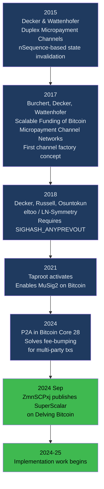

# History and Origins

> **TLDR**: SuperScalar was designed by ZmnSCPxj at Block Inc, published on Delving Bitcoin in September 2024. It builds on a decade of research into payment channel factories, combining three previously-separate ideas into something that works today.

## The Intellectual Lineage

## The Key Papers

### Decker & Wattenhofer (2015)
**"A Fast and Scalable Payment Network with Bitcoin Duplex Micropayment Channels"**

Introduced the idea of using **decreasing nSequence values** to invalidate old channel states. Their original construction was for two-party channels, not multi-party factories. The key insight: newer states have shorter time delays, so they always confirm before older states.

### Burchert, Decker & Wattenhofer (2017)
**"Scalable Funding of Bitcoin Micropayment Channel Networks"**

First formal description of **channel factories** — a multi-party structure where many users share a single funding UTXO. Each user gets their own Lightning channel at the "leaves" of the factory. The paper assumed eltoo (SIGHASH_ANYPREVOUT) would be available.

### eltoo / LN-Symmetry (2018)
**Decker, Russell, Osuntokun**

Proposed a simpler state machine where any newer state simply replaces any older state. Requires the SIGHASH_ANYPREVOUT (APO) soft fork, which has not been activated as of 2025. If APO activates, it would make the Decker-Wattenhofer component of SuperScalar unnecessary.

## The Designer: ZmnSCPxj

ZmnSCPxj is a pseudonymous Bitcoin and Lightning Network researcher employed by **Block Inc** (formerly Square). Known for prolific contributions to:

- Lightning Network protocol design
- Bitcoin covenant proposals
- Payment channel research
- The bitcoin-dev and lightning-dev mailing lists

ZmnSCPxj developed SuperScalar while at Block Inc but has publicly stated:

> *"Block has no intention of patenting SuperScalar or otherwise limiting the use of SuperScalar."*

## The Delving Bitcoin Thread

SuperScalar was published as a design proposal on [Delving Bitcoin](https://delvingbitcoin.org) on September 16, 2024, shortly before the Lightning Developer Summit. The thread contains 31 posts with significant technical discussion.

### Key Participants

| Person | Affiliation | Role in Discussion |
|--------|------------|-------------------|
| **ZmnSCPxj** | Block Inc | Designer, responded to all critiques |
| **t-bast** | ACINQ (Phoenix) | Asked about liquidity mechanics, on-chain funding |
| **ariard** | Independent | Most extensive critic — raised forced expiration spam, fair exchange, governance concerns |
| **instagibbs** | (Gregory Sanders) | Highlighted P2A connection, v3 tx policy |
| **cryptoquick** | — | Implementation questions |

### The Major Debates

**1. Forced Expiration Spam** (ariard vs ZmnSCPxj)
ariard argued that SuperScalar worsens the forced expiration spam problem (from the original Lightning whitepaper, section 9.2) because each user requires O(log N) tree transactions to exit, not just one commitment transaction. ZmnSCPxj's response:

> *"Timeout trees suck because of the large numbers of transactions in the worst case, Decker-Wattenhofer sucks because of the large numbers of transactions in the worst case, but when you mash them together they gain more power while not increasing their suckiness — their suckiness combines to a common suckiness instead of adding their suckiness together."*

**2. Fair Exchange** (ariard)
ariard raised the theoretical impossibility of fair secret exchange — the PTLC-based key handover cannot guarantee completion under all timing conditions. ZmnSCPxj acknowledged the theoretical concern but pointed to practical reality:

> *"While it does not work in theory, it does work in practice; lots of users are able to swap offchain to onchain, and vice versa; lots of people can still pay over Lightning, over multiple hops, even during high onchain fees."*

**3. Corporate Governance** (ariard)
ariard raised concerns about the Lightning Developer Summit being selective in invitations and SuperScalar being presented as Block Inc internal work. ZmnSCPxj responded that the design was published openly for community review before the summit.

### Design Evolution During the Thread

The thread wasn't just critique — the design improved through discussion:

1. **Inverted timelock default** (Post #26): Changed from LSP-favored timeout to client-favored timeout, shifting economic risk to the LSP
2. **Wide leaf variant** (Post #16): Alternative topology with fewer DW layers
3. **P2A integration** (instagibbs): Confirmed that P2A from Bitcoin Core 28 solves the fee-bumping problem that previously made DW impractical
4. **Shachain for liquidity stock**: Added punishment mechanism for old-state LSP liquidity

## The Implementation

The design was originally **zero code** — purely theoretical. The implementation accompanying these docs is building out the protocol in phases:

- **Phase 1** (complete): DW factory tree with MuSig2 signing
- **Phase 2** (complete): Timeout-sig-trees with CLTV script paths
- **Phase 3** (future): Poon-Dryja channels at the leaves
- **Phase 4** (future): PTLC key turnover for assisted exit
- **Phase 5** (future): Laddering with factory rotation

## Why It Took This Long

The ideas existed for nearly a decade. What was missing:

| Dependency | When Available | What It Enabled |
|-----------|---------------|----------------|
| Taproot | November 2021 | MuSig2 key aggregation, efficient multisig |
| MuSig2 spec (BIP-327) | 2023 | Standardized N-of-N signing |
| P2A / v3 transactions | Bitcoin Core 28 (2024) | Practical fee-bumping for multi-party trees |
| secp256k1-zkp MuSig2 module | 2023-2024 | Production-ready implementation |

All four pieces needed to be in place before SuperScalar could be built. The P2A breakthrough in 2024 was the final piece.

## Related Concepts

- [[why-superscalar-exists]] — The problem that motivated this work
- [[decker-wattenhofer-invalidation]] — The 2015 technique at the core
- [[soft-fork-landscape]] — What future Bitcoin changes would affect SuperScalar
- [[security-model]] — Including the critiques from the Delving Bitcoin thread
