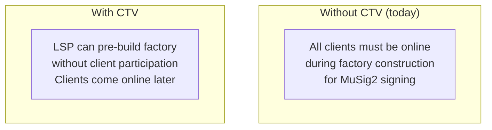
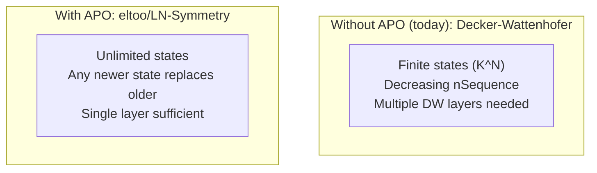
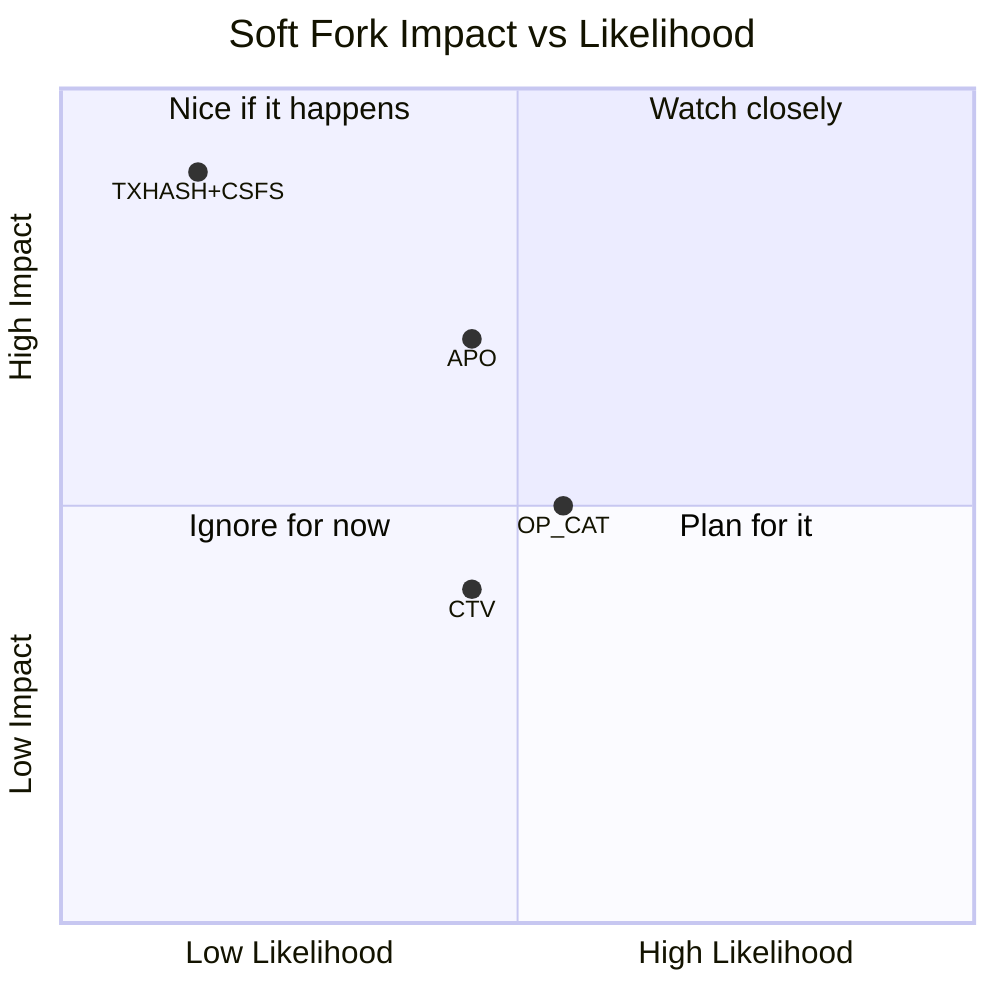

# Soft Fork Landscape

> **Summary**: SuperScalar requires no consensus changes. Several proposed Bitcoin soft forks would affect the design — some would improve it, others would enable alternative constructions. This page maps the relationships.

## Current Status: No Soft Fork Required

SuperScalar runs on Bitcoin as it exists today — no activation dependency, no soft fork prerequisite. Several proposed changes would affect the design space.

## The Proposals

### OP_CHECKTEMPLATEVERIFY (CTV) — BIP-119

**What it does**: Lets a transaction output commit to the exact transaction that will spend it, without requiring signatures.

**Impact on SuperScalar**: Orthogonal enhancement

**Specific improvements:**
- LSP could construct new factories during the [[laddering|dying period]] without waiting for clients to come online
- Clients could "claim their spot" in a new factory at any time during the dying period
- Removes the biggest coordination bottleneck in factory construction

CTV would be a construction improvement for SuperScalar, not a replacement.

| Metric | Probability in 2 years | Probability ever |
|--------|----------------------|-----------------|
| Activation | 10-20% | 45-65% |

### SIGHASH_ANYPREVOUT (APO) — BIP-118

**What it does**: Allows signatures that don't commit to the specific input being spent — just the output script. This enables **eltoo/LN-Symmetry**, where any newer state can replace any older state.

**Impact on SuperScalar**: Would replace Decker-Wattenhofer

**Specific improvements:**
- Unlimited state updates (no more [[the-odometer-counter|odometer]] running out)
- Simpler tree structure (no need for multi-layer DW)
- Shorter force-close times (fewer layers = fewer delays)

APO would supersede the Decker-Wattenhofer component, but the rest of SuperScalar (timeout-sig-trees, laddering, tree topology) would remain.

| Metric | Probability in 2 years | Probability ever |
|--------|----------------------|-----------------|
| Activation | 10-25% | 55-75% |

### OP_CAT — BIP-347

**What it does**: Concatenates two stack elements. When combined with Schnorr signature verification and other opcodes, this enables covenant constructions that can constrain how outputs are spent.

**Impact on SuperScalar**: Enables competition

OP_CAT would enable covenant constructions that enforce transaction tree structures at the consensus level rather than through pre-signing. For example, Ark-style protocols could use OP_CAT-based covenants to enforce VTXO trees without requiring interactivity. See [[comparison-to-ark]] for how this shifts the competitive landscape.

**Does not directly improve SuperScalar**, but expands the design space for alternative channel factory constructions.

| Metric | Probability in 2 years | Probability ever |
|--------|----------------------|-----------------|
| Activation | 12-25% | 55-75% |

### TXHASH (BIP-346) + CSFS (OP_CHECKSIGFROMSTACK)

**What it does**: General-purpose transaction introspection. Allows checking signatures against arbitrary messages, including parts of the transaction itself.

**Impact on SuperScalar**: Would make DW obsolete

TXHASH+CSFS provides more general transaction introspection than either CTV or APO individually, and can emulate the functionality of both. It would enable fully general covenants, potentially replacing pre-signed transaction trees with consensus-enforced spending conditions.

With general covenants available, fundamentally different factory designs would become viable. SuperScalar's higher-level mechanisms (laddering, tree topology, client migration) may still apply, but the underlying construction would likely change substantially.

| Metric | Probability in 2 years | Probability ever |
|--------|----------------------|-----------------|
| Activation | 3-8% | 25-45% |

## Strategic Summary

## Implications for SuperScalar

SuperScalar is designed to require no consensus changes:

1. If no soft forks activate → SuperScalar remains the only self-custodial factory construction available today
2. If CTV activates → Factory construction becomes easier (no client presence required)
3. If APO activates → DW component can be replaced with eltoo (unlimited states)
4. If TXHASH+CSFS activates → The design space for factory constructions expands significantly

## Related Concepts

- [[decker-wattenhofer-invalidation]] — What APO would replace
- [[laddering]] — What CTV would improve (factory construction during the dying period)
- [[comparison-to-ark]] — Ark benefits more from CTV than SuperScalar does
- [[why-superscalar-exists]] — The design philosophy
- [[history-and-origins]] — The context for these decisions
