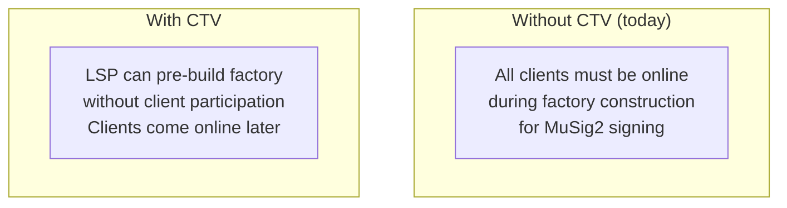
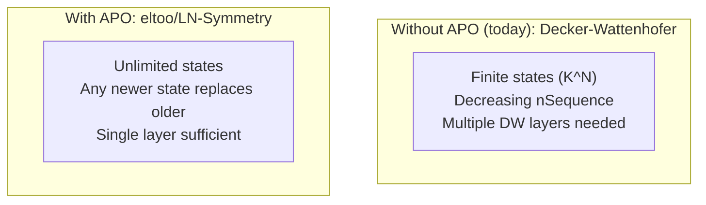
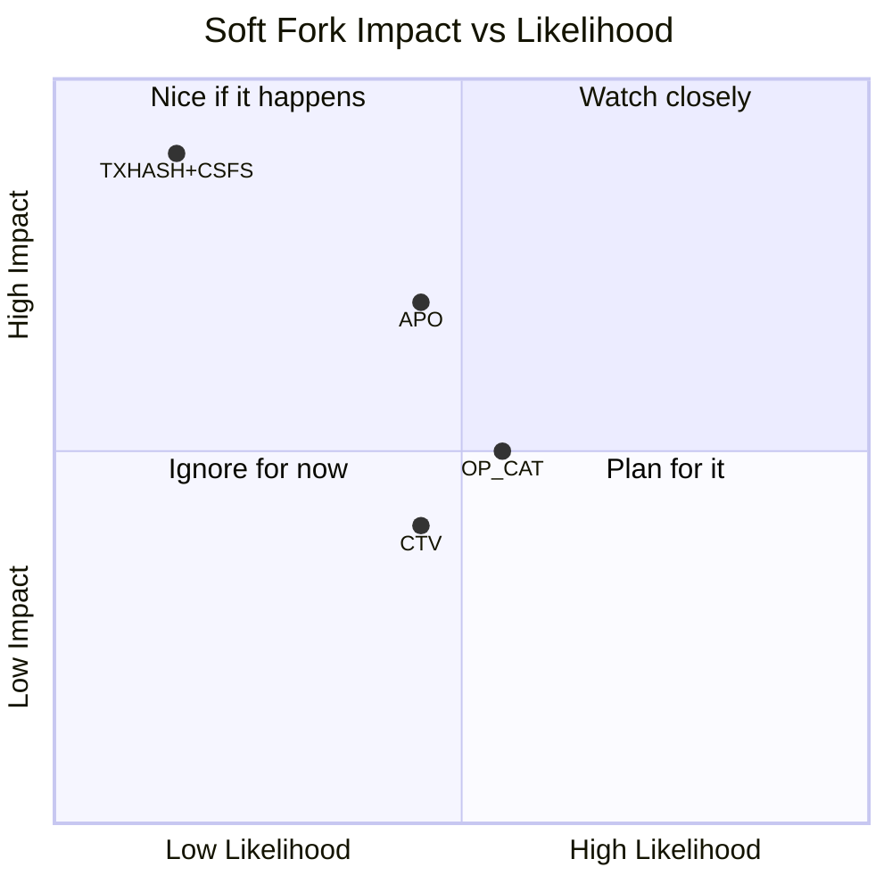

# Soft Fork Landscape

> **TLDR**: SuperScalar works today with no consensus changes. But several proposed Bitcoin soft forks would improve it — or make it obsolete. Here's how each one relates.

## Current Status: No Soft Fork Required

SuperScalar's key advantage: it runs on Bitcoin **today**. No waiting for activation, no political risk from soft fork debates. But that doesn't mean soft forks are irrelevant — several would change the landscape significantly.

## The Proposals

### OP_CHECKTEMPLATEVERIFY (CTV) — BIP-119

**What it does**: Lets a transaction output commit to the exact transaction that will spend it, without requiring signatures.

**Impact on SuperScalar**: Orthogonal enhancement

**Specific improvements:**
- LSP could construct new factories during [[laddering|dying periods]] without waiting for clients to come online
- Clients could "claim their spot" in a new factory at any time during the dying period
- Removes the biggest coordination bottleneck in factory construction

**Does NOT make SuperScalar obsolete** — it's a quality-of-life improvement, not a replacement.

| Metric | Probability in 2 years | Probability ever |
|--------|----------------------|-----------------|
| Activation | 10-20% | 45-65% |

### SIGHASH_ANYPREVOUT (APO) — BIP-118

**What it does**: Allows signatures that don't commit to the specific input being spent — just the output script. This enables **eltoo/LN-Symmetry**, where any newer state can replace any older state.

**Impact on SuperScalar**: Would replace Decker-Wattenhofer

**Specific improvements:**
- Unlimited state updates (no more [[the-odometer-counter|odometer]] running out)
- Simpler tree structure (no need for multi-layer DW)
- Shorter force-close times (fewer layers = fewer delays)

**Would make the DW component obsolete** — but the rest of SuperScalar (timeout-sig-trees, laddering, tree topology) would still be needed.

| Metric | Probability in 2 years | Probability ever |
|--------|----------------------|-----------------|
| Activation | 10-25% | 55-75% |

### OP_CAT — BIP-347

**What it does**: Concatenates two stack elements. Sounds simple, but enables complex covenant constructions when combined with other opcodes.

**Impact on SuperScalar**: Enables competition

OP_CAT would allow new designs to compete with SuperScalar — particularly constructions that use covenants to enforce transaction trees at the consensus level rather than through pre-signing.

**Doesn't directly improve SuperScalar**, but creates a richer ecosystem of channel factory designs.

| Metric | Probability in 2 years | Probability ever |
|--------|----------------------|-----------------|
| Activation | 12-25% | 55-75% |

### TXHASH + CSFS (OP_CHECKSIGFROMSTACK)

**What it does**: General-purpose transaction introspection. The most powerful proposed covenant mechanism — you can check signatures against arbitrary messages, including parts of the transaction itself.

**Impact on SuperScalar**: Would make DW obsolete

TXHASH+CSFS is strictly more powerful than both CTV and APO. It would enable fully general covenants, making pre-signed transaction trees unnecessary for many use cases.

**Would likely obsolete the entire SuperScalar design** in favor of more elegant covenant-based factories.

| Metric | Probability in 2 years | Probability ever |
|--------|----------------------|-----------------|
| Activation | 3-8% | 25-45% |

## Strategic Summary

## SuperScalar's Position

SuperScalar is explicitly designed as a **"no soft fork needed" solution**:

> *"Consensus changes required: None."*

This means:
1. If no soft forks activate → SuperScalar is the best available option
2. If CTV activates → SuperScalar gets better (easier factory construction)
3. If APO activates → DW component becomes unnecessary (but rest of design survives)
4. If TXHASH+CSFS activates → Entire landscape changes; new designs likely emerge

**The bet**: soft forks are slow and politically difficult. SuperScalar ships today.

## Related Concepts

- [[decker-wattenhofer-invalidation]] — What APO would replace
- [[timeout-sig-trees]] — What CTV would improve
- [[comparison-to-ark]] — Ark benefits more from CTV than SuperScalar does
- [[why-superscalar-exists]] — The design philosophy
- [[history-and-origins]] — The context for these decisions
