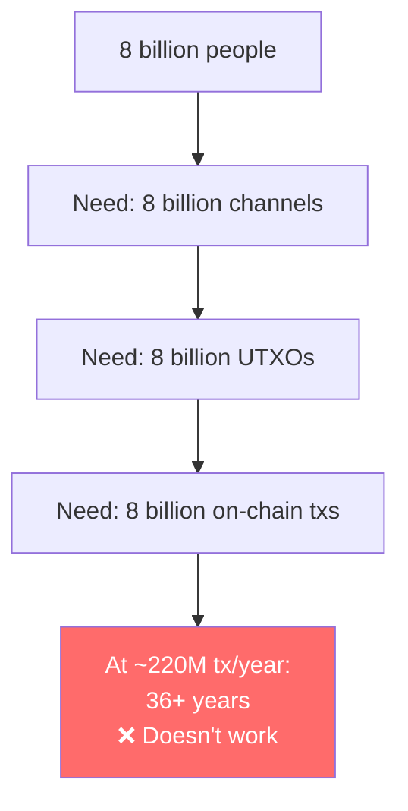
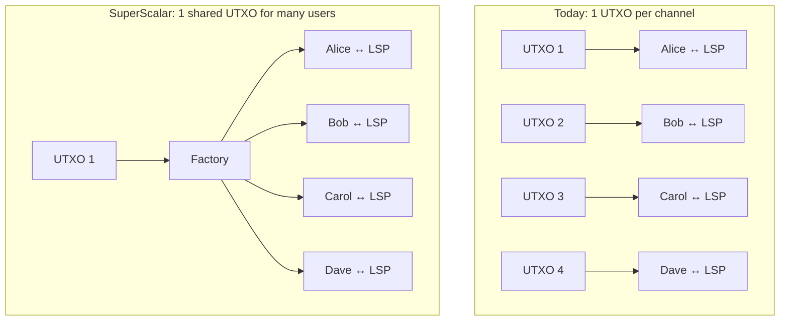

# Why SuperScalar Exists

> **Summary**: Lightning works brilliantly for payments — but getting onto Lightning still requires an on-chain UTXO, and on-chain space is finite. SuperScalar extends Lightning's reach by letting many users share one UTXO, solving the "last mile" problem of getting people with zero on-chain Bitcoin onto the network.

## The Onboarding Challenge

Bitcoin processes ~7 transactions per second. That's ~600,000 per day, ~220 million per year.

There are ~8 billion people on Earth. If each person needs **one** on-chain transaction to open a Lightning channel, it would take **36 years** just to onboard everyone — assuming Bitcoin did nothing else.

And that's just opening channels. Closing, rebalancing, and splicing each require more on-chain transactions.

## The Last Mile Problem

Even if you already use Lightning, you needed on-chain Bitcoin first:
1. Buy Bitcoin on an exchange
2. Withdraw to your own wallet (on-chain tx)
3. Open a Lightning channel (on-chain tx)
4. Now you can use Lightning

For someone in a developing nation with a mobile phone and zero Bitcoin, step 1-3 are huge barriers. They might receive their first sats as a Lightning payment — but they need a channel first. Catch-22.

> *"The goal of SuperScalar is to be able to onboard people, possibly people who do not have an existing UTXO they can use to pay exogenous fees."* — ZmnSCPxj

## The Insight: Share UTXOs

What if instead of 1 UTXO per user, we had **1 UTXO per group of users**?

With 8 clients per factory and [[laddering]] ≈ 33 concurrent factories, one LSP could serve **~260 users with 33 UTXOs** instead of 260 individual UTXOs. At scale, the ratio gets even better.

## Why Not Just Trust the LSP?

The simplest solution is custodial: the LSP holds everyone's Bitcoin and lets them "use Lightning" through accounts. This is what many wallet apps actually do today.

The problem: **if the custodian gets hacked, goes bankrupt, or disappears, everyone loses their money.**

SuperScalar gives users the **same convenience** (no on-chain Bitcoin needed, mobile-friendly, the node operator handles the complexity) with the **security of self-custody** (your funds are always recoverable on-chain, no trust required).

## What Existed Before SuperScalar

| Approach | Status | Trust Model | Consensus Changes |
|----------|--------|------------|------------------|
| **Regular Lightning** | Production | Self-custodial | None |
| **Channel factories** (Burchert et al.) | Theory (2018) | Self-custodial | None (but needed eltoo) |
| **eltoo / LN-Symmetry** | Waiting for APO | Self-custodial | Yes (BIP-118) |
| **Ark** | In development | Semi-custodial (ASP) | None (but better with CTV) |
| **Timeout trees** (bare) | Theory | Self-custodial | Better with CTV |
| **SuperScalar** | Implementation in progress | Self-custodial | **None** |

SuperScalar's key innovation: combining Decker-Wattenhofer + timeout-sig-trees + laddering into something that works **today**, without waiting for any soft fork.

## The P2A Breakthrough

SuperScalar wasn't possible until Bitcoin Core 28 introduced **Pay-to-Anchor (P2A)** outputs. Before P2A, fee management in multi-party transactions was a major obstacle — every participant needed their own anchor output for fee-bumping.

> *"P2A handled the issues I had with Decker-Wattenhofer — in particular, the difficulty of having either exogenous fees (without P2A, you need every participant to have its own anchor output) or mutable endogenous fees."* — ZmnSCPxj

P2A lets **anyone** fee-bump a transaction using a single shared anchor output. This made Decker-Wattenhofer practical for the first time.

## The Timeline

1. **2015**: Decker & Wattenhofer publish "Duplex Micropayment Channels"
2. **2018**: Burchert, Decker, Wattenhofer publish "Channel Factories" paper
3. **2021**: Taproot activates on Bitcoin (enabling MuSig2)
4. **2024 (early)**: ZmnSCPxj experiments with laddered timeout trees — "it sucked"
5. **2024 (mid)**: P2A finalized in Bitcoin Core 28
6. **2024 September**: ZmnSCPxj publishes SuperScalar design on Delving Bitcoin
7. **2024-2025**: Implementation work begins

## Related Concepts

- [[what-is-an-lsp]] — The node that coordinates a factory
- [[factory-tree-topology]] — The structure that enables UTXO sharing
- [[laddering]] — How factories scale over time
- [[comparison-to-ark]] — SuperScalar vs Ark
- [[history-and-origins]] — The full story
