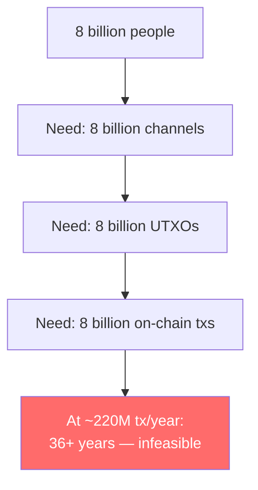
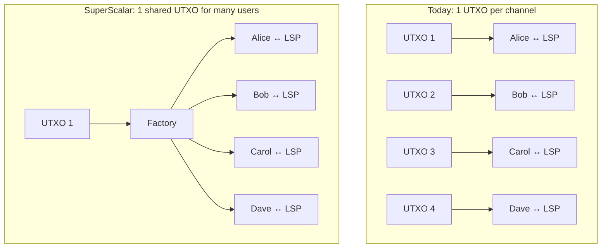

# Why SuperScalar Exists

> **Summary**: Lightning works well for payments, but getting onto Lightning still requires an on-chain UTXO, and on-chain space is finite. SuperScalar lets many users share one UTXO, addressing the onboarding bottleneck for users with no on-chain Bitcoin.

## The Onboarding Challenge

Bitcoin processes ~7 transactions per second. That's ~600,000 per day, ~220 million per year.

There are ~8 billion people on Earth. If each person needs **one** on-chain transaction to open a Lightning channel, it would take **36 years** just to onboard everyone — assuming Bitcoin did nothing else.

And that's just opening channels. Closing, rebalancing, and splicing each require more on-chain transactions.

## The Last Mile Problem

Lightning currently requires every end-user to own at least one on-chain UTXO. Users who have no existing Bitcoin — and therefore no UTXO to fund a channel — cannot bootstrap onto the network without external help. SuperScalar targets exactly this zero-UTXO onboarding case.

> *"The goal of SuperScalar is to be able to onboard people, possibly people who do not have an existing UTXO they can use to pay exogenous fees."* — ZmnSCPxj

## The Insight: Share UTXOs

What if instead of 1 UTXO per user, we had **1 UTXO per group of users**?

With 8 clients per factory and [[laddering]] across staggered expiry periods (see [[laddering]] for the derivation), one LSP can serve ~260 users from 33 UTXOs instead of 260 individual UTXOs.

## Why Not Just Trust the LSP?

A custodial model is simpler: the LSP holds funds in omnibus accounts and settles internally. Several production wallets operate this way today. The trade-off is well understood — custodial concentration reintroduces the counterparty risk that Bitcoin was designed to eliminate. Regulatory exposure, operational failure, and theft all become single points of failure for every user on the platform.

SuperScalar preserves the LSP's role as coordinator and liquidity provider while keeping fund custody with the user. The N-of-N multisig ensures the LSP cannot unilaterally move funds, and pre-signed exit transactions guarantee that every client can recover on-chain without cooperation. The goal is the onboarding convenience of a managed service with the security properties of a self-custodial channel.

## What Existed Before SuperScalar

| Approach | Status | Trust Model | Consensus Changes |
|----------|--------|------------|------------------|
| **Regular Lightning** | Production | Self-custodial | None |
| **Channel factories** (Burchert et al.) | Theory (2017) | Self-custodial | None (used Decker-Wattenhofer; benefits from eltoo) |
| **eltoo / LN-Symmetry** | Waiting for APO | Self-custodial | Yes (BIP-118) |
| **Ark** | In development | Trust-minimized (ASP can double-spend during rounds) | None (but better with CTV) |
| **Timeout trees** (bare) | Theory | Self-custodial | Better with CTV |
| **SuperScalar** | Implementation in progress | Self-custodial | **None** |

SuperScalar combines Decker-Wattenhofer, timeout-sig-trees, and laddering into a construction that works on Bitcoin **today**, without requiring any soft fork.

## Pay-to-Anchor (P2A) and Fee Management

SuperScalar's fee-bumping model depends on **Pay-to-Anchor (P2A)** outputs, introduced in Bitcoin Core 28. Before P2A, fee management in multi-party transactions required every participant to have their own anchor output for fee-bumping.

> *"P2A handled the issues I had with Decker-Wattenhofer — in particular, the difficulty of having either exogenous fees (without P2A, you need every participant to have its own anchor output) or mutable endogenous fees."* — ZmnSCPxj

P2A lets **anyone** fee-bump a transaction using a single shared anchor output. This made Decker-Wattenhofer practical for the first time.

## The Timeline (see [[history-and-origins]] for full context)

1. **2015**: Decker & Wattenhofer publish "Duplex Micropayment Channels"
2. **2017**: Burchert, Decker, Wattenhofer publish "Channel Factories" paper
3. **2021**: Taproot activates on Bitcoin (enabling MuSig2)
4. **2024 (early)**: ZmnSCPxj experiments with laddered timeout trees alone — insufficient
5. **2024 (August)**: P2A merged into Bitcoin Core (PR #30352)
6. **2024 (September)**: ZmnSCPxj publishes SuperScalar design on Delving Bitcoin
7. **2024 (October)**: Bitcoin Core 28 released (includes P2A, TRUC/v3)
8. **2024-2025**: Implementation work begins

## Related Concepts

- [[what-is-an-lsp]] — The node that coordinates a factory
- [[factory-tree-topology]] — The structure that enables UTXO sharing
- [[laddering]] — How factories scale over time
- [[comparison-to-ark]] — SuperScalar vs Ark
- [[history-and-origins]] — The full story
