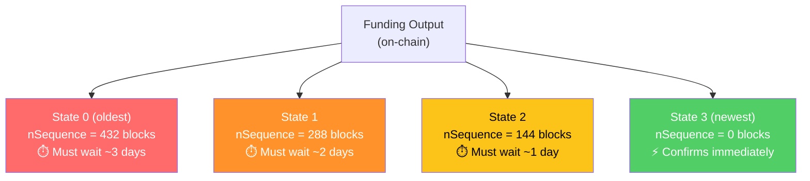
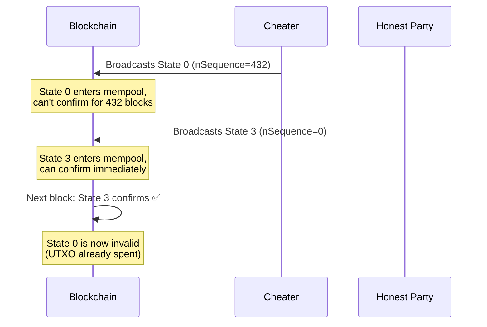

# Decker-Wattenhofer Invalidation

> **Summary**: A state machine where newer states always beat older states on-chain, because each update gets a shorter time delay. No punishment needed — old states simply can't win the race.

## The Core Idea

In a [[what-is-a-payment-channel|payment channel]], you need a way to make old states useless. Lightning (Poon-Dryja) does this with **punishment** — broadcast an old state and you lose everything. Decker-Wattenhofer takes a completely different approach: **time delays**.

Every state transaction spends the same output. Each new state gets a lower [[what-is-nsequence|nSequence]] value than the previous one. Since only one transaction can spend a given output, and the one with the shortest delay confirms first, **the newest state always wins**.

## A Simple Example (Single Layer)

Say we have 4 possible states and a step size of 144 blocks:



**All four transactions try to spend the same output.** Only one can succeed. Since State 3 has no delay, it confirms first — even if a cheater broadcasts State 0.

### Why This Works



No punishment mechanism needed. No watchtowers. The math handles it.

## The Problem: Limited States

A single layer with step size 144 and starting delay 432 only gives you **4 states** (432/144 + 1). That's not enough for a factory that needs to update dozens of times over a 30-day lifetime.

You could increase the starting delay, but that makes worst-case force-close times unacceptably long. The solution: **multiple layers** — see [[the-odometer-counter]].

## How It Compares

| Approach | Cheating Prevention | States | Requires |
|----------|-------------------|--------|----------|
| **Poon-Dryja** (Lightning) | Punishment: cheater loses ALL funds | Unlimited | Watchtower or being online |
| **Decker-Wattenhofer** | Time delay: new state always confirms first | Limited (K^N with layers) | Nothing — automatic |
| **eltoo / LN-Symmetry** | Any newer state replaces older | Unlimited | APO soft fork (not yet activated) |

### Decker-Wattenhofer Advantages
- **No watchtower needed** for the factory layer — newer states win automatically
- **No punishment** — less catastrophic if someone makes a mistake
- **Works today** — no consensus changes required

### Decker-Wattenhofer Disadvantages
- **Finite states** — the counter eventually runs out (mitigated by [[the-odometer-counter|multi-layer odometer]])
- **Time delay overhead** — worst-case exit includes the maximum nSequence delay
- **Multiple transactions on-chain** — unilateral exit requires publishing the whole path from root to leaf

## In the SuperScalar Factory Tree

Decker-Wattenhofer is used at the **state nodes** of the [[factory-tree-topology|factory tree]], NOT at every node. The tree alternates between:

- **Kickoff nodes**: No nSequence delay — just circuit breakers
- **State nodes**: Decker-Wattenhofer delay — the actual state machine

See [[kickoff-vs-state-nodes]] for why this alternation is mandatory.

```
funding → kickoff_root (no delay) → state_root (DW layer 0)
            → kickoff_left (no delay) → state_left (DW layer 1)
            → kickoff_right (no delay) → state_right (DW layer 1)
```

Each state layer runs its own independent DW counter. The [[the-odometer-counter|odometer]] coordinates them so that advancing the inner layer eventually carries over to the outer layer.

## Historical Context

Christian Decker and Roger Wattenhofer published "A Fast and Scalable Payment Network with Bitcoin Duplex Micropayment Channels" in 2015. Their construction used the same nSequence trick, but applied it to two-party channels. SuperScalar generalizes it to multi-party factory trees by combining it with [[timeout-sig-trees]] and [[what-is-musig2|MuSig2]].

The original paper envisioned a future soft fork (eltoo/LN-Symmetry) that would make DW obsolete by allowing unlimited state updates. That soft fork (SIGHASH_ANYPREVOUT, BIP-118) has not been activated as of 2025 — which is exactly why SuperScalar builds on the original DW construction instead.

## Related Concepts

- [[the-odometer-counter]] — How to get 64+ states from just 2 layers
- [[what-is-nsequence]] — The Bitcoin mechanism that makes this possible
- [[kickoff-vs-state-nodes]] — Why state nodes alternate with kickoff nodes
- [[factory-tree-topology]] — Where DW fits in the full tree structure
- [[force-close]] — What happens when DW transactions hit the blockchain
