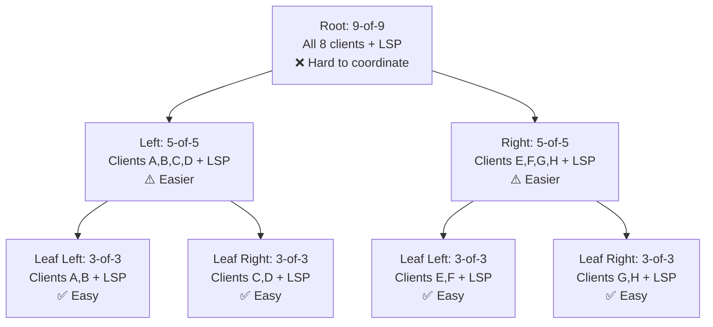
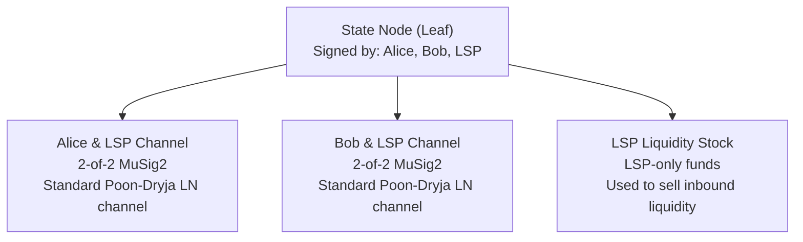
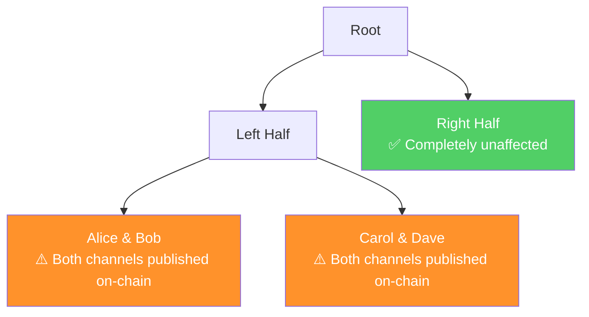

# Factory Tree Topology

> **Summary**: The factory is a tree of pre-signed transactions rooted in a single shared UTXO. Internal nodes split participants into smaller groups. At the leaves, the shared UTXO resolves into standard Lightning channels. The tree alternates between kickoff nodes (circuit breakers) and state nodes (DW state machine).

## Why a Tree?

The fundamental tension in SuperScalar is:

- **N-of-N is secure** — nobody can steal
- **N-of-N is fragile** — everyone must cooperate to update state

If you have 8 clients and the LSP (9 signers), getting everyone online simultaneously is hard — especially for mobile wallet users. A tree solves this by creating **subtrees** where only the local participants need to cooperate:



**Leaf updates (most common) only need 3 signers** — 2 clients + the LSP. This is dramatically easier to coordinate than getting all 9 online.

## The Full Tree (8 Clients)

Here's the complete factory tree for an LSP with 8 clients (A through H):

```
                                                          nSequence
                                                          +---+---+
                                                          |   |A&L| LN channel
                                                          |   +---+
                                                      +-->|432|B&L| LN channel
                                                      |   |   +---+
                                                      |   |   | L | Liquidity stock
                                                      |   +---+---+
                                                      |    state_left_left
                                                      |
                                                      |   +---+---+
                                                      |   |   |C&L| LN channel
                         nSequence             +------+   |   +---+
                         +---+----------+  +-->| A&B&L|-->|432|D&L| LN channel
                         |   |(A..D&L)  |  |   | kickoff  |   +---+
         +--+---------+  |   |or(L&CLTV)|--+   +------+   |   | L | Liquidity stock
funding->|  |A..H & L |->|432+----------+   |              +---+---+
         |  | kickoff  |  |   |(E..H&L)  |  |              state_left_right
         +--+---------+  |   |or(L&CLTV)|--+
           kickoff_root  +---+----------+   |   +------+   +---+---+
                          state_root    +-->| E&F&L|   |   |E&L| LN channel
                                            | kickoff  |   |   +---+
                                            +------+-->|432|F&L| LN channel
                                                   |   |   +---+
                                                   |   |   | L | Liquidity stock
                                                   |   +---+---+
                                                   |    state_right_left
                                                   |
                                                   |   +---+---+
                                                   |   |   |G&L| LN channel
                                                   |   |   +---+
                                                   +-->|432|H&L| LN channel
                                                       |   +---+
                                                       |   | L | Liquidity stock
                                                       +---+---+
                                                        state_right_right
```

## Layer by Layer

### Layer 0: Kickoff Root
- **Spends**: The shared funding UTXO
- **Signers**: All 8 clients + LSP (9-of-9)
- **nSequence**: Disabled (no delay)
- **Purpose**: Initiates the unilateral exit process

### Layer 1: State Root
- **Spends**: Kickoff root output
- **Signers**: All 8 clients + LSP (9-of-9)
- **nSequence**: [[decker-wattenhofer-invalidation|DW Layer 0]] (decrements each epoch)
- **Outputs**: Two outputs, each for a subtree of 4 clients + LSP
- **Timeout**: Each output has [[timeout-sig-trees|CLTV timeout]] script path for LSP recovery

### Layer 2: Kickoff Nodes (Left & Right)
- **Spends**: One output from the state root
- **Signers**: 4 clients + LSP (5-of-5) per side
- **nSequence**: Disabled (no delay)
- **Purpose**: Circuit breakers — see [[kickoff-vs-state-nodes]]

### Layer 3: State Nodes (Leaves)
- **Spends**: One output from their kickoff node
- **Signers**: 2 clients + LSP (3-of-3) per leaf
- **nSequence**: [[decker-wattenhofer-invalidation|DW Layer 1]] (decrements independently)
- **Outputs**: Individual Lightning channels + LSP liquidity stock

## Leaf Outputs: What Lives at the Bottom

Each leaf state node has 3 outputs:



### Client Channels (A&L, B&L)
Standard Lightning channels. Once the factory tree is set up, these work exactly like normal Lightning — Alice can send and receive payments through the LSP without touching the factory at all.

### LSP Liquidity Stock (L)
Funds the LSP has set aside to sell inbound liquidity to clients. Protected by [[shachain-revocation|shachain secrets]] so the LSP can't cheat by broadcasting an old state where it had more liquidity stock.

## Why the LSP Is in Every Subtree

Notice that the **LSP participates in every single node** of the tree. This is by design:

- The LSP node is always online (it's the coordinator)
- The LSP is one party in every Lightning channel at the leaves
- The LSP coordinates signing rounds for state updates
- The LSP provides liquidity at every level

This makes the LSP a **coordinator** — but the N-of-N multisig means it has no special power. It can't move funds without every other participant signing. Coordinator, not custodian.

## Arity: How Many Branches Per Node?

The **arity** (branching factor) of the tree is a tunable parameter:

| Arity at Leaves | Clients Per Leaf | Signers Needed for Leaf Update |
|----------------|-----------------|-------------------------------|
| 2 | 2 clients | 3 (2 clients + LSP) |
| 3 | 3 clients | 4 (3 clients + LSP) |
| 4 | 4 clients | 5 (4 clients + LSP) |

**Recommended: Arity 2 at leaves** — only 3 signers needed for the most common updates. Higher arity means more coordination difficulty.

For higher-level nodes (where the groups are already large), higher arity is acceptable since the marginal coordination cost of adding one more signer to an already-large group is small.

## Collateral Damage on Force-Close

When one client force-closes, **sibling subtrees are affected but the other half of the tree is not**:



If Alice force-closes:
- **Alice**: Fully exits to on-chain
- **Bob** (same leaf): Channel goes on-chain, still works, but loses cheap off-chain liquidity management
- **Carol, Dave** (same half): Same impact as Bob
- **Eve, Frank, Grace, Heidi** (other half): **Zero impact** — their subtree was never published

## Related Concepts

- [[kickoff-vs-state-nodes]] — Why the alternation between node types is mandatory
- [[the-odometer-counter]] — How DW layers in the tree map to the odometer
- [[decker-wattenhofer-invalidation]] — The state machine at each state node
- [[timeout-sig-trees]] — The timeout scripts on internal outputs
- [[building-a-factory]] — How this tree is actually constructed
- [[force-close]] — Detailed walkthrough of unilateral exit
