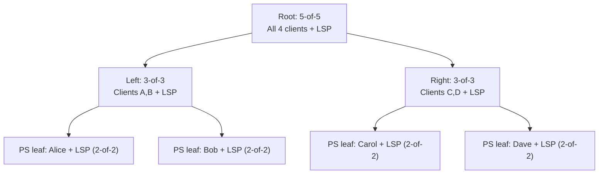
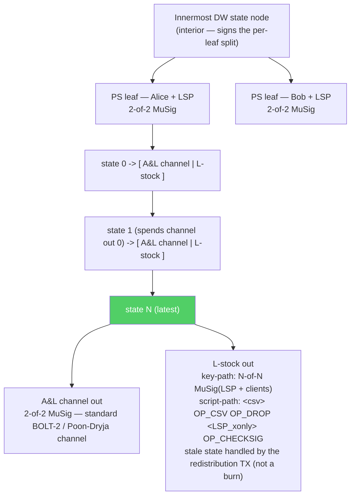
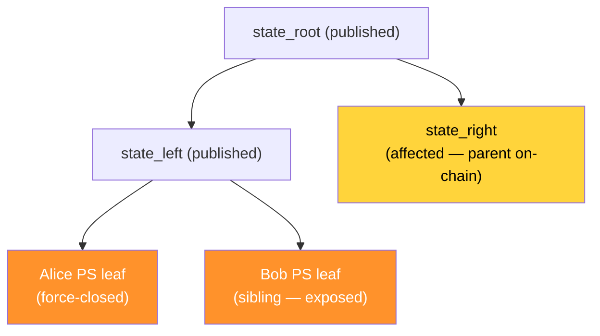

# Factory Tree Topology

> **Summary**: The factory is a tree of pre-signed transactions rooted in a single shared UTXO. The **interior** alternates between kickoff nodes (circuit breakers) and Decker-Wattenhofer state nodes (which split participants into smaller groups). At the **bottom**, each leaf is a **[[pseudo-spilman-leaves|pseudo-Spilman leaf]]** — one client + the LSP in a 2-of-2 MuSig, TX-chained and CLTV-gated — producing a standard Lightning channel output plus the LSP's liquidity stock.


## Why a Tree?

The fundamental tension in SuperScalar is:

- **N-of-N is secure** — nobody can steal
- **N-of-N is fragile** — everyone must cooperate to update state

If you have 4 clients and the LSP (5 signers), getting everyone online simultaneously is hard — especially for mobile wallet users. A tree solves this by creating **subtrees** where only the local participants need to cooperate (real factories fan out wider — up to 127 clients — but the shape is the same):


```mermaid
graph TD
    R["Root: 5-of-5<br/>All 4 clients + LSP"]
    R --> L["Left: 3-of-3<br/>Clients A,B + LSP"]
    R --> Ri["Right: 3-of-3<br/>Clients C,D + LSP"]
    L --> LA["PS leaf: Alice + LSP (2-of-2)"]
    L --> LB["PS leaf: Bob + LSP (2-of-2)"]
    Ri --> RC["PS leaf: Carol + LSP (2-of-2)"]
    Ri --> RD["PS leaf: Dave + LSP (2-of-2)"]
```

A routine leaf update (the most common case — a payment, splice, or liquidity purchase) is a PS-leaf advance needing only **2 signers (1 client + the LSP)**, rather than coordinating all 5.

## The Full Tree (4-Client Example)

The complete factory tree for an LSP with 4 clients (A through D). The **interior**
layers are Decker-Wattenhofer (kickoff/state alternation with decrementing nSequence);
each **leaf** is a per-client pseudo-Spilman chain. A 4-client example is used for
legibility — real factories fan out wider (up to 127 clients), but the leaf layer has
the same shape regardless of width.

```
  funding UTXO
      |
      v
  +--------------+
  | kickoff_root |   nSeq: disabled (circuit breaker)
  +--------------+
      |
      v
  +--------------+
  |  state_root  |   nSeq: 432   (DW Layer 0)
  +--------------+
      |
      +-- out (A,B & L) ---> +--------------+
      |                      | kickoff_left |   nSeq: disabled
      |                      +--------------+
      |                          |
      |                          v
      |                      +--------------+
      |                      |  state_left  |   nSeq: 432   (DW Layer 1)
      |                      +--------------+
      |                          |
      |                          +-- out_A --> Alice PS leaf   (Alice + LSP, 2-of-2)
      |                          +-- out_B --> Bob   PS leaf   (Bob   + LSP, 2-of-2)
      |
      +-- out (C,D & L) ---> +---------------+
                             | kickoff_right |   nSeq: disabled
                             +---------------+
                                 |
                                 v
                             +---------------+
                             |  state_right  |   nSeq: 432   (DW Layer 1)
                             +---------------+
                                 |
                                 +-- out_C --> Carol PS leaf   (Carol + LSP, 2-of-2)
                                 +-- out_D --> Dave  PS leaf   (Dave  + LSP, 2-of-2)
```

Each `out_*` feeds a per-client **pseudo-Spilman leaf**: a chain of pre-signed
transactions where state N spends state N-1's channel output, so the latest state
wins **structurally** (no nSequence, no DW race at the leaf; the L-stock path is
CSV/CLTV-gated). The `nSequence 432` delay lives on the **interior** state nodes
only. Every PS leaf has the same shape:

```
  Alice PS leaf   (Alice + LSP, 2-of-2 MuSig)   — TX-chained, no nSequence, CLTV-gated
  +----------+      +----------+               +----------+
  | A&L chan | ---> | A&L chan | ---> ... ----> | A&L chan |   <- BOLT-2 LN channel
  +----------+      +----------+               +----------+       (spent by next state)
  | L-stock  |      | L-stock  |               | L-stock  |   <- LSP liquidity stock
  +----------+      +----------+               +----------+       (+ redistribution TX)
    state 0           state 1                    state N (latest)
```

## Layer by Layer

### Layer 0: Kickoff Root
- **Spends**: The shared funding UTXO
- **Signers**: All 4 clients + LSP (5-of-5)
- **nSequence**: Disabled (no delay)
- **Purpose**: Initiates the unilateral exit process

### Layer 1: State Root
- **Spends**: Kickoff root output
- **Signers**: All 4 clients + LSP (5-of-5)
- **nSequence**: [[decker-wattenhofer-invalidation|DW Layer 0]] (decrements each epoch)
- **Outputs**: Two outputs, each for a subtree of 2 clients + LSP
- **Timeout**: Each output has [[timeout-sig-trees|CLTV timeout]] script path for LSP recovery

### Layer 2: Kickoff + State Nodes (per subtree)
- **Spends**: One output from the state root
- **Signers**: 2 clients + LSP (3-of-3) per side
- **nSequence**: kickoff = disabled; the paired state node carries [[decker-wattenhofer-invalidation|DW Layer 1]] (decrements independently)
- **Purpose**: Kickoff = circuit breaker (see [[kickoff-vs-state-nodes]]); the state node is the bottom **interior** DW layer that then splits into per-client PS leaves

### Layer 3: Pseudo-Spilman Leaves
- **Hang off**: An output of the innermost DW state node (`state_left` / `state_right`) — the bottom **interior** layer, which still carries [[decker-wattenhofer-invalidation|DW Layer 1]] nSequence (decrements independently per epoch) and is signed by that subtree's clients + LSP
- **Signers**: **1 client + LSP (2-of-2 MuSig)** per leaf
- **nSequence**: **None** — leaves are **TX-chained** (each state spends the prior state's channel output) and **CLTV-gated**, so the latest state wins structurally with no DW delay
- **Outputs**: One standard BOLT-2 Lightning channel + the LSP liquidity stock (L-stock)
- **Width**: One client per leaf in the canonical case; wider (k>1) leaves are handled by [[tree-shaping-and-multi-process|sub-factories]]

## Leaf Outputs: What Lives at the Bottom

The innermost DW state node no longer holds the channels directly — it feeds a **per-client pseudo-Spilman leaf**. Each leaf is a TX chain; every state in the chain has two outputs: the client's BOLT-2 channel and the LSP L-stock. The latest state wins structurally because its predecessor's channel output is already spent:


```mermaid
graph TD
    K["Innermost DW state node<br/>(interior — signs the per-leaf split)"]
    K --> A["PS leaf — Alice + LSP<br/>2-of-2 MuSig"]
    K --> B["PS leaf — Bob + LSP<br/>2-of-2 MuSig"]
    A --> A0["state 0 -> [ A&L channel | L-stock ]"]
    A0 --> A1["state 1 (spends channel out 0) -> [ A&L channel | L-stock ]"]
    A1 --> AN["state N (latest)"]
    AN --> CH["A&L channel out<br/>2-of-2 MuSig — standard BOLT-2 / Poon-Dryja channel"]
    AN --> LS["L-stock out<br/>key-path: N-of-N MuSig(LSP + clients)<br/>script-path: &lt;csv&gt; OP_CSV OP_DROP &lt;LSP_xonly&gt; OP_CHECKSIG<br/>stale state handled by the redistribution TX (not a burn)"]
    style AN fill:#51cf66,color:#fff
```

### Client Channels (A&L, B&L)
Standard Lightning channels. Once the factory tree is set up, these work exactly like normal Lightning — Alice can send and receive payments through the LSP without touching the factory at all.

### LSP Liquidity Stock (L)
Funds the LSP has set aside to sell inbound liquidity to clients. Protected by a pre-signed [[l-stock-redistribution|redistribution transaction]] that redistributes the LSP's L-stock equally to clients if the LSP broadcasts a stale state.

## Why the LSP Is in Every Subtree

The LSP participates in every node of the tree:

- It is one party in every leaf channel
- It coordinates signing rounds for state updates
- It provides liquidity at every level

The N-of-N multisig means the LSP has no unilateral spending power — it cannot move funds without every other participant signing.

## Arity: How Many Branches Per Node?

The **arity** (branching factor) of the tree is a tunable parameter. It is an **interior** property — it sets how many clients a bottom DW state node groups together, and therefore how many per-client PS leaves hang off it. Each PS leaf still carries exactly **one** client:

| Interior arity (bottom state node) | Clients in that group → PS leaves | Signers to update the interior state node | Routine PS-leaf advance |
|----------------|-----------------|-------------------------------|-------------------|
| 2 | 2 clients → 2 PS leaves | 3 (2 clients + LSP) | 2-of-2 (1 client + LSP) |
| 3 | 3 clients → 3 PS leaves | 4 (3 clients + LSP) | 2-of-2 (1 client + LSP) |
| 4 | 4 clients → 4 PS leaves | 5 (4 clients + LSP) | 2-of-2 (1 client + LSP) |

The **most common** operation — a routine payment, splice, or liquidity purchase — is a PS leaf advance, which is always just **2-of-2 (1 client + LSP)** no matter the interior arity. Arity only sets the quorum for re-balancing the *interior* state node that groups those leaves.

**Recommended: Arity 2 at the bottom interior layer** — only 3 signers needed to re-balance the group. Higher arity means more coordination difficulty for interior state updates.

For higher-level nodes (where the groups are already large), higher arity is acceptable since the marginal coordination cost of adding one more signer to an already-large group is small.

## Collateral Damage on Force-Close

When one client force-closes, the **sibling PS leaves under the same interior state node** are affected, and how far the damage spreads depends on tree depth:


```mermaid
graph TD
    R["state_root (published)"] --> L["state_left (published)"]
    R --> Ri["state_right<br/>(affected — parent on-chain)"]
    L --> LA["Alice PS leaf<br/>(force-closed)"]
    L --> LB["Bob PS leaf<br/>(sibling — exposed)"]

    style Ri fill:#ffd43b,color:#000
    style LA fill:#ff922b,color:#fff
    style LB fill:#ff922b,color:#fff
```

If Alice force-closes (the 4-client tree above):
- **Alice**: Publishes her PS leaf's latest state TX and fully exits on-chain.
- **Bob** (sibling PS leaf, same `state_left` node): his leaf is a *separate* TX chain, but the shared `state_left` interior node is now on-chain, so his channel must also resolve on-chain — it still works, he just loses cheap off-chain liquidity management.
- **Carol, Dave** (other subtree): because `state_root` was published, their branch's parent is on-chain, so they must resolve their subtree too.

**Subtree isolation** — where a whole sibling *half* of the tree stays completely off-chain — kicks in with **deeper trees**: in an 8-client tree, force-closing Alice publishes only her half, leaving the other four clients' subtree untouched. See [[tree-shaping-and-multi-process]].

## Design note

The leaf mechanism here is **pseudo-Spilman** (ZmnSCPxj's [t/1242 refinement](https://delvingbitcoin.org/t/superscalar-laddered-timeout-tree-structured-decker-wattenhofer-factories-with-pseudo-spilman-leaves/1242)): each leaf is a TX-chained channel between one client and the LSP, so [[decker-wattenhofer-invalidation|Decker-Wattenhofer]] invalidation applies only to the interior tree layers — not the leaves. (The original t/1143 design put DW state nodes at the leaves; the diagrams above reflect the current PS-leaf model.) Wider, multi-client leaves are handled by [[tree-shaping-and-multi-process|sub-factories]].

## Related Concepts

- [[kickoff-vs-state-nodes]] — Why the alternation between node types is mandatory
- [[the-odometer-counter]] — How DW layers in the tree map to the odometer
- [[decker-wattenhofer-invalidation]] — The state machine at each state node
- [[timeout-sig-trees]] — The timeout scripts on internal outputs
- [[building-a-factory]] — How this tree is actually constructed
- [[force-close]] — Detailed walkthrough of unilateral exit
