# Kickoff vs State Nodes

> **Summary**: The factory tree alternates between two types of nodes. State nodes run the Decker-Wattenhofer time-delay mechanism. Kickoff nodes are "circuit breakers" that prevent a state update at one level from forcing all lower levels to be published on-chain.

## The Two Node Types

| Property | Kickoff Node | State Node |
|----------|-------------|------------|
| **nSequence** | Disabled (confirms immediately) | DW decrementing delay |
| **Purpose** | Circuit breaker / isolation | State machine layer |
| **Can be updated?** | No (always the same tx) | Yes (new version each epoch) |
| **Outputs** | Pointers to state nodes | Pointers to kickoff nodes (or leaf channels) |

```mermaid
graph TD
    F["Funding UTXO"] --> K0["Kickoff Root<br/>nSeq: disabled<br/>🔌 Circuit breaker"]
    K0 --> S0["State Root<br/>nSeq: DW Layer 0<br/>⚙️ State machine"]
    S0 --> K1L["Kickoff Left<br/>nSeq: disabled<br/>🔌 Circuit breaker"]
    S0 --> K1R["Kickoff Right<br/>nSeq: disabled<br/>🔌 Circuit breaker"]
    K1L --> S1L["State Left<br/>nSeq: DW Layer 1<br/>⚙️ State machine"]
    K1R --> S1R["State Right<br/>nSeq: DW Layer 1<br/>⚙️ State machine"]

    style K0 fill:#4c6ef5,color:#fff
    style S0 fill:#fab005,color:#000
    style K1L fill:#4c6ef5,color:#fff
    style K1R fill:#4c6ef5,color:#fff
    style S1L fill:#fab005,color:#000
    style S1R fill:#fab005,color:#000
```



## Why Alternation Is Mandatory

This is one of the most important design decisions in SuperScalar, and the answer comes down to how [[decker-wattenhofer-invalidation|Decker-Wattenhofer]] works with child transactions.

### The Problem Without Kickoff Nodes

Imagine a tree with ONLY state nodes (no kickoff nodes). Each state node uses decreasing nSequence values:

```
state_root (nSeq = 288)
  └── state_leaf (nSeq = 432)
```

Now you update the leaf state. The new leaf transaction has `nSeq = 288`. But wait — **the leaf transaction's nSequence is relative to when its parent confirms**. If the parent (state_root) is also a DW transaction that might be replaced, which version of the parent does the leaf's delay start from?

**The answer: all child transactions break.** If state_root gets replaced (because a newer version confirms first), ALL of its child transactions become invalid — they reference an output that no longer exists. You'd have to re-publish everything.

### How Kickoff Nodes Fix This

A kickoff node **always confirms the same way** — it has no DW mechanism, no competing versions. Once it's on-chain, its outputs are stable reference points.

```mermaid
sequenceDiagram
    participant Chain as Blockchain
    participant KR as Kickoff Root
    participant SR as State Root
    participant KL as Kickoff Left
    participant SL as State Left

    KR->>Chain: Confirms immediately (no delay)
    Note over Chain: Kickoff Root output is now stable ✅

    SR->>Chain: Waits for DW delay, then confirms
    Note over Chain: State Root output is now stable ✅
    Note over Chain: (If old State Root was published,<br/>new one beats it via DW)

    KL->>Chain: Confirms immediately (no delay)
    Note over Chain: Kickoff Left output is now stable ✅

    SL->>Chain: Waits for DW delay, then confirms
    Note over Chain: Leaf channels are now on-chain ✅
```



Each kickoff node is a **firewall** between DW layers. The DW race happens between competing state transactions at one level. The kickoff at the next level doesn't participate in that race — it just waits for whichever state transaction wins, then confirms immediately.

## The Cascade Prevention Rule

> **When a kickoff transaction is published on-chain, ALL its outputs MUST have their corresponding latest state transactions confirmed.**

This is the circuit breaker behavior. Publishing a kickoff means you're committing to resolving everything below it. But crucially, the kickoff itself isn't contested — only the state transactions above and below it are.

## Practical Example

Consider a factory with 4 clients (A, B, C, D) + LSP:

```
kickoff_root (disabled nSeq) ← Always the same transaction
    │
state_root (DW layer 0: 432→288→144→0) ← Multiple versions compete
    ├── output 1: for clients A,B
    └── output 2: for clients C,D

kickoff_left (disabled nSeq) ← Always the same transaction
    │
state_left (DW layer 1: 432→288→144→0) ← Multiple versions compete
    ├── A&L channel
    ├── B&L channel
    └── L liquidity stock
```

**Scenario**: Alice wants to force-close.
1. Publish `kickoff_root` → confirms next block (no delay)
2. Cheater publishes old `state_root` (nSeq=432) → honest party publishes latest `state_root` (nSeq=144) → latest wins
3. After state_root confirms, publish `kickoff_left` → confirms next block (no delay)
4. Same DW race for `state_left` → latest version wins
5. Alice's channel is now on-chain

**The two kickoff nodes prevented the DW races from interfering with each other.** Layer 0's race resolves independently of Layer 1's race.

## Why Kickoff Nodes Don't Need DW

Kickoff nodes represent the **structure** of the tree — which clients are grouped together. This doesn't change between state updates. What changes is the **state** — how much money each client has, how liquidity is allocated. State nodes handle that.

Think of it this way:
- **Kickoff**: "Alice and Bob are in the left subtree" (permanent)
- **State**: "Alice has 0.3 BTC, Bob has 0.5 BTC, LSP liquidity stock is 0.2 BTC" (changes over time)

## Related Concepts

- [[decker-wattenhofer-invalidation]] — The mechanism that state nodes implement
- [[factory-tree-topology]] — The full tree structure showing alternation
- [[force-close]] — How the cascade plays out during unilateral exit
- [[the-odometer-counter]] — How DW layers across state nodes form the odometer
