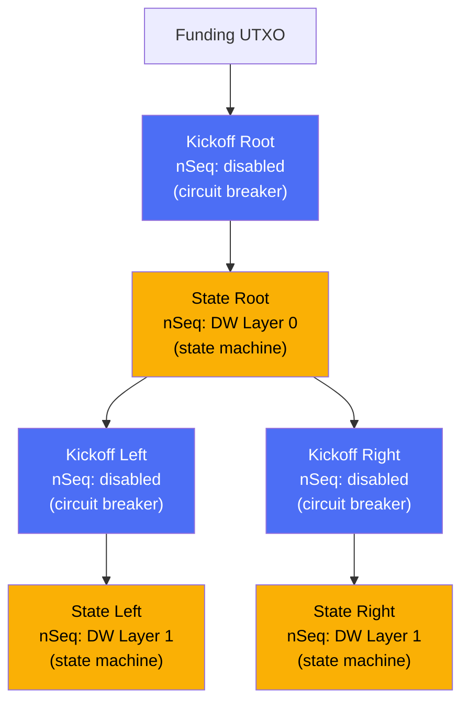
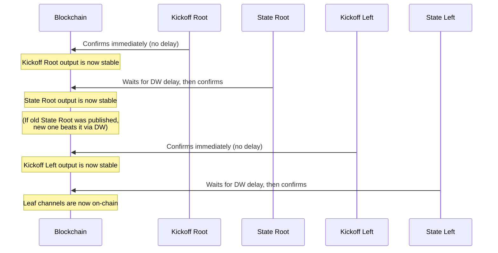

# Kickoff vs State Nodes

> **Summary**: The factory tree alternates between two types of nodes. State nodes run the Decker-Wattenhofer time-delay mechanism. Kickoff nodes are "circuit breakers" that prevent a state update at one level from forcing all lower levels to be published on-chain.

## The Two Node Types

| Property | Kickoff Node | State Node |
|----------|-------------|------------|
| **nSequence** | Disabled (confirms immediately) | DW decrementing delay |
| **Purpose** | Circuit breaker / isolation | State machine layer |
| **Can be updated?** | No (always the same tx) | Yes (new version each epoch) |
| **Outputs** | Pointers to state nodes | Pointers to kickoff nodes (or leaf channels) |



## Why Alternation Is Mandatory

This is one of the most important design decisions in SuperScalar, and the answer comes down to how [[decker-wattenhofer-invalidation|Decker-Wattenhofer]] works with child transactions.

### The Problem Without Kickoff Nodes

Imagine a tree with ONLY state nodes (no kickoff nodes). Each state node uses decreasing nSequence values:

```
state_root (nSeq = 288)
  └── state_leaf (nSeq = 432)
```

Now you update the leaf state. The new leaf transaction has `nSeq = 288`. However, **the leaf transaction's nSequence is relative to when its parent confirms**. If the parent (state_root) is also a DW transaction that might be replaced, which version of the parent does the leaf's delay start from?

If `state_root` gets replaced (a newer version confirms first), every child transaction that referenced the old `state_root` output becomes invalid — the output they spend no longer exists. The entire subtree below it must be re-signed and re-published against the new output.

### How Kickoff Nodes Fix This

A kickoff node **always confirms the same way** — it has no DW mechanism, no competing versions. Once it's on-chain, its outputs are stable reference points.



Each kickoff node is a **circuit breaker** between DW layers. The DW race happens between competing state transactions at one level. The kickoff at the next level doesn't participate in that race — it just waits for whichever state transaction wins, then confirms immediately.

## The Cascade Prevention Rule

**When a kickoff transaction confirms on-chain, the honest party should broadcast the latest state transaction for each of its outputs.** The DW mechanism ensures that the latest version, having the lowest nSequence delay, will confirm before any older competing version.

This is the circuit breaker behavior. Publishing a kickoff commits the participants to resolving the subtree below it. The kickoff itself is uncontested — only the state transactions that spend its outputs are subject to the DW race.

## Practical Example

Consider a factory with 4 clients (A, B, C, D) + LSP:

```
kickoff_root (disabled nSeq) ← Always the same transaction
    │
state_root (DW layer 0: 432→288→144→0) ← Multiple versions compete
    ├── output 1: for clients A,B
    └── output 2: for clients C,D

kickoff_left (disabled nSeq) ← Always the same transaction
    │
state_left (DW layer 1: 432→288→144→0) ← Multiple versions compete
    ├── A&L channel
    ├── B&L channel
    └── L liquidity stock (LSP-only funds for selling inbound liquidity)
```

**Scenario**: Alice wants to force-close.
1. Publish `kickoff_root` → confirms next block (no delay)
2. Adversarial party publishes old `state_root` (nSeq=432) → honest party publishes latest `state_root` (nSeq=144) → latest wins
3. After state_root confirms, publish `kickoff_left` → confirms next block (no delay)
4. Same DW race for `state_left` → latest version wins
5. Alice's channel is now on-chain

**The two kickoff nodes prevented the DW races from interfering with each other.** Layer 0's race resolves independently of Layer 1's race.

## Why Kickoff Nodes Don't Need DW

Kickoff nodes encode the **structure** of the tree — which clients are grouped together (e.g., "Alice and Bob are in the left subtree"). This grouping is fixed for the factory's lifetime and does not require a versioning mechanism. State nodes encode the **balances and liquidity allocation** (e.g., "Alice has 0.3 BTC, Bob has 0.5 BTC, LSP liquidity stock is 0.2 BTC"), which change on every update and therefore require the DW mechanism.

## Related Concepts

- [[decker-wattenhofer-invalidation]] — The mechanism that state nodes implement
- [[factory-tree-topology]] — The full tree structure showing alternation
- [[force-close]] — How the cascade plays out during unilateral exit
- [[the-odometer-counter]] — How DW layers across state nodes form the odometer
