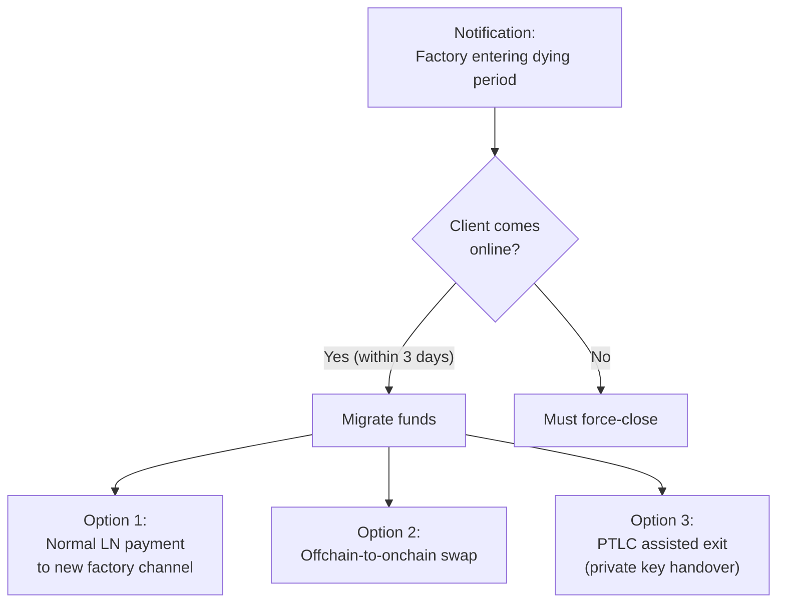
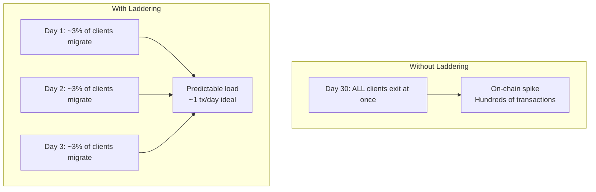

# Laddering

> **Summary**: Instead of one giant factory, the LSP runs ~33 factories at once with staggered lifetimes. Each day, one factory expires and a new one is created. Users migrate during a 3-day window. This spreads the on-chain footprint to roughly 1 transaction per day.

## The Problem

A single factory has a **fixed lifetime** — its [[the-odometer-counter|DW counter]] will eventually run out, and its [[timeout-sig-trees|CLTV timeout]] will eventually expire. When a factory ends, everyone needs to move their funds somewhere. If all users exit at once, that's a massive spike of on-chain transactions.

## The Solution: Stagger Everything


In reality, the parameters are:

| Parameter | Value |
|-----------|-------|
| Active period | ~30 days |
| Dying period | 3 days (after active period ends) |
| New-factory cadence | 1 per day |
| Concurrent factories | ~33 (= 30 active + up to 3 dying) |
| On-chain transactions per day (ideal) | 1 |

## How It Works

### The Lifecycle of a Single Factory


**Born**: The LSP creates the factory — constructs the tree, signs all transactions with participating clients, publishes the funding UTXO on-chain.

**Active** (30 days): Normal operation. Clients have Lightning channels inside the factory. Payments flow normally. The LSP can sell inbound liquidity. State updates consume [[the-odometer-counter|odometer]] ticks.

**Dying** (3 days): The factory is winding down. Clients receive push notifications and should come online to migrate their funds to a new factory. The LSP creates a new factory using funds from the dying one.

**Gone** (Day 34+): The factory no longer accepts cooperative migrations. The CLTV timeout has not yet expired (that occurs around Day ~40), so clients still have time for a unilateral [[force-close]] before the LSP's timeout path activates.

### The Daily Rhythm

With 33 concurrent factories:

```
Day 1:   Factory #1 enters dying period → Factory #34 is born
Day 2:   Factory #2 enters dying period → Factory #35 is born
Day 3:   Factory #3 enters dying period → Factory #36 is born
...
Day 33:  Factory #33 enters dying period → Factory #66 is born
Day 34:  Factory #1 is gone; Factory #34 enters dying period → Factory #67 is born
```

**Ideally**, each day the LSP performs ONE on-chain transaction: the funding transaction for the new factory, which is funded by the cooperatively-closed old factory.

## Client Migration

When a factory enters its dying period, clients need to move their funds:



### Option 1: Normal Lightning Payment
The simplest path. The client's old channel pays the client's new channel via a standard Lightning payment through the LSP. No extra on-chain footprint.

### Option 2: Offchain-to-Onchain Swap
The client receives their funds on-chain. More expensive (on-chain transaction) but gives the client a real UTXO they fully own.

### Option 3: PTLC Assisted Exit
The client hands over their private key for the old factory (via a PTLC) and receives funds on-chain. The LSP can then sign as the departed client for the rest of the old factory's lifetime, reducing coordination overhead.

## The On-Chain Footprint



Laddering converts a concentrated on-chain load into a steady ~1 tx/day schedule. The LSP's on-chain footprint becomes predictable.

## The CLTV Timeout Formula

Each factory's absolute CLTV timeout must account for:

```
CLTV timeout = active_period + dying_period + worst_case_unilateral_exit + safety_margin
```

For a 2-layer DW factory (per the [[force-close]] worst-case analysis):

```
             = 30 days + 3 days + ~7 days + buffer
             ≈ 42 days
```

The worst-case unilateral exit includes DW delays at each layer (up to 432 blocks each), kickoff confirmations, and the Poon-Dryja `to_self_delay`. See [[force-close]] for the full breakdown. The CLTV timeout must be far enough in the future that even a worst-case exit completes before the LSP's timeout path activates.

## What If a Client Never Comes Online?

If a client misses the 3-day dying period AND never comes back:

1. Their channel in the old factory eventually hits the CLTV timeout
2. The LSP can recover its own funds via the [[timeout-sig-trees|timeout script path]]
3. The client's funds remain spendable on-chain via the pre-signed exit transactions
4. With the **inverted timelock** design, a pre-signed nLockTime'd transaction distributes funds to clients automatically

The client's funds are never lost — but they may end up on-chain as small UTXOs, which the client would need to claim.

## What CTV Would Improve

One limitation today: when the LSP creates a new factory, ALL the clients joining it must be online to participate in the MuSig2 signing ceremony. With OP_CHECKTEMPLATEVERIFY (CTV, a proposed soft fork):

> The LSP could preemptively add clients to new factories without their participation. Clients would only need to come online during the dying period to claim their spot.

This would make the migration process much smoother, but CTV is not yet activated on Bitcoin.

## Related Concepts

- [[the-odometer-counter]] — Why factories have finite lifetimes
- [[timeout-sig-trees]] — The CLTV timeout that defines factory death
- [[client-migration]] — Detailed walkthrough of the migration process
- [[cooperative-close]] — How factories close cleanly
- [[force-close]] — What happens when migration fails
- [[soft-fork-landscape]] — How CTV would improve laddering
