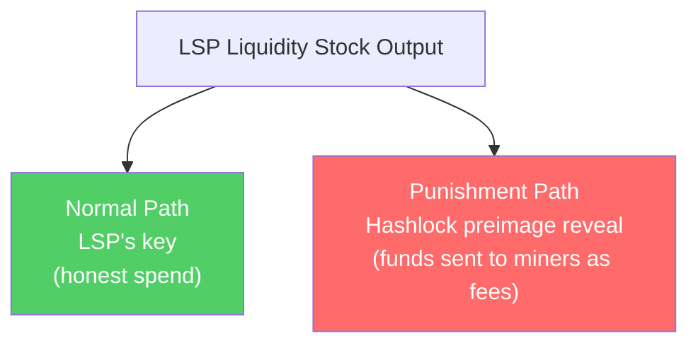
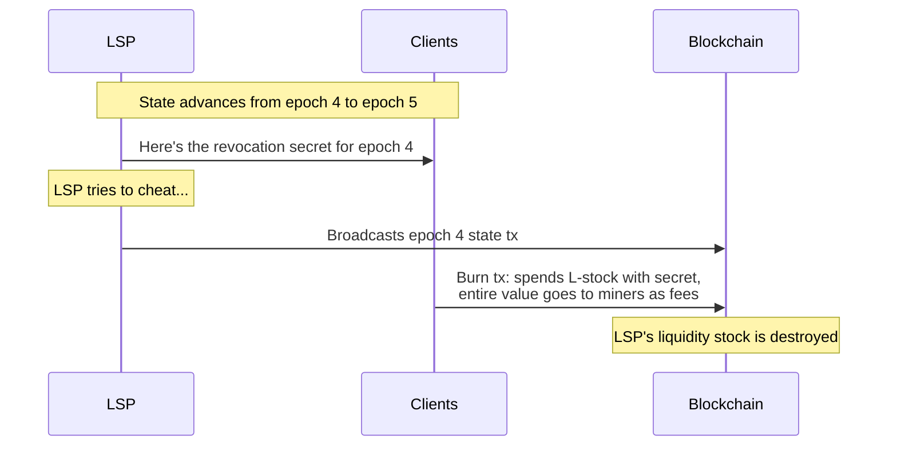

# Revocation Secrets

> **Summary**: When the factory state updates, the LSP reveals a secret for the old state. If the LSP later tries to broadcast that old state, clients can use the secret to claim the LSP's funds as penalty. This makes cheating economically irrational.

## The Problem

In the [[factory-tree-topology|factory tree]], the LSP has **liquidity stock** — funds it owns that it uses to sell inbound liquidity to clients. When the factory state advances (via the [[the-odometer-counter|odometer]]), the liquidity stock amounts change. What stops the LSP from broadcasting an old state where it had MORE liquidity stock?

[[decker-wattenhofer-invalidation|Decker-Wattenhofer invalidation]] handles this for the tree structure (newer states confirm first), but if the honest party is offline during the DW delay window, an old state could confirm before a newer state is broadcast. An additional economic deterrent is needed.

## The Solution: Secret-Based Punishment

Each LSP liquidity stock output has a hidden spending condition:


```mermaid
graph TD
    LS["LSP Liquidity Stock Output"]
    LS --> N["Normal Path<br/>LSP's key<br/>(honest spend)"]
    LS --> P["Punishment Path<br/>Hashlock preimage reveal<br/>(funds sent to miners as fees)"]

    style N fill:#51cf66,color:#fff
    style P fill:#ff6b6b,color:#fff
```

The L-stock output is a P2TR with two spending paths:

- **Key-path**: MuSig2 aggregate key (normal cooperative spend by the LSP)
- **Script-path**: A hashlock that anyone can spend by revealing the revocation secret preimage

The hashlock script:

```
OP_SIZE OP_PUSHBYTES_1 0x20 OP_EQUALVERIFY OP_SHA256 OP_PUSHBYTES_32 <hash> OP_EQUAL
```

This verifies that the witness provides a 32-byte value whose SHA256 matches the committed hash. No signature is required — anyone who knows the preimage can spend the output. The burn transaction sends the full value to `OP_RETURN`, making it unspendable and directing all funds to miners as fees.

### How the Punishment Works

1. Factory is at **epoch 5**. The LSP shares the revocation secret for **epoch 4** with the co-signing clients.
2. If the LSP broadcasts the epoch 4 state, clients know the secret for epoch 4's liquidity stock.
3. Clients create a **burn transaction** that spends the liquidity stock via the secret path, directing the full value to miner fees.
4. The LSP's funds are destroyed. Cheating is economically irrational.


```mermaid
sequenceDiagram
    participant LSP
    participant Clients
    participant Chain as Blockchain

    Note over LSP,Clients: State advances from epoch 4 to epoch 5
    LSP->>Clients: Here's the revocation secret for epoch 4

    Note over LSP: LSP tries to cheat...
    LSP->>Chain: Broadcasts epoch 4 state tx

    Clients->>Chain: Burn tx: spends L-stock with secret,<br/>entire value goes to miners as fees
    Note over Chain: LSP's liquidity stock is destroyed
```

## Flat Secrets vs Shachain

The implementation supports two methods for generating revocation secrets:

### Flat Secrets (Recommended)

Each epoch gets an **independent random 32-byte secret**, generated from `/dev/urandom`. The LSP pre-generates secrets for all epochs at factory construction and pre-computes `SHA256(secret)` hashes that are shared with clients so both sides can build identical L-stock taptrees.

```
Epoch 0: random 32-byte secret_0  →  SHA256(secret_0) = hash_0
Epoch 1: random 32-byte secret_1  →  SHA256(secret_1) = hash_1
Epoch 2: random 32-byte secret_2  →  SHA256(secret_2) = hash_2
...
Epoch 255: random 32-byte secret_255
```

Storage cost: 256 epochs × 32 bytes = **8 KB** per factory.

**Why flat secrets are preferred**: Shachain is inherently a single-party construct — all secrets derive from one seed. If a channel endpoint is composed of multiple signers (e.g., a multisig wallet across multiple devices), there is no way to collaboratively generate shachain secrets without one device holding the full seed. A compromised single device would leak all revocation secrets at once, defeating the purpose of multisig. With flat secrets, each epoch's secret can be independently generated via a multi-party protocol where each signer contributes randomness.

> *ZmnSCPxj recommends flat secrets for this reason (Delving Bitcoin, post #34): "there is no multi-participant method of creating shachain... having a single device perform the shachain in full is not truly multisignature."*

### Shachain (Legacy)

A **compact secret derivation tree** from the Lightning Network spec (BOLT #3). It derives 2^48 unique secrets from a single 32-byte seed:

- **One-way derivation**: Revealing secret N doesn't reveal secret N+1
- **Compact storage**: The receiver only needs O(log N) values to reconstruct any previously-revealed secret
- **Deterministic**: Given the seed and an index, anyone can compute the exact secret

The storage advantage (O(log N) vs O(N)) is negligible at SuperScalar's scale — 8 KB for 256 flat secrets vs ~192 bytes for shachain. The multi-signer security advantage of flat secrets outweighs the storage savings.

The implementation retains shachain support as a legacy path, controlled by the `use_flat_secrets` flag.

## Rationale: Burn to Fees

If clients received the LSP's funds when catching a cheat, there would be an incentive to provoke or frame the LSP. Burning to fees avoids this:

- The LSP loses money (punishment works)
- Clients gain nothing from provoking cheating
- Miners get a windfall (neutral third party)
- The threat alone is sufficient deterrent — it never actually needs to happen

## When Are Revocation Secrets Used vs DW?

Both are invalidation mechanisms, but they protect different things:

| Mechanism | Protects | Against |
|-----------|----------|---------|
| **Decker-Wattenhofer** | Tree structure (which state tx confirms) | Anyone broadcasting old state |
| **Revocation secrets** | LSP liquidity stock amounts | LSP specifically trying to reclaim sold liquidity |

DW invalidation is **automatic** — newer states win the time race. Revocation is **economic** — cheating costs more than it gains. Together they cover both the tree structure and the liquidity allocation within it.

## Related Concepts

- [[decker-wattenhofer-invalidation]] — The time-delay mechanism that revocation complements
- [[the-odometer-counter]] — Each odometer epoch corresponds to a revocation secret
- [[factory-tree-topology]] — Where liquidity stock outputs live in the tree
- [[what-is-an-lsp]] — Why the LSP has liquidity stock in the first place
- [[security-model]] — Full analysis of the combined security properties
