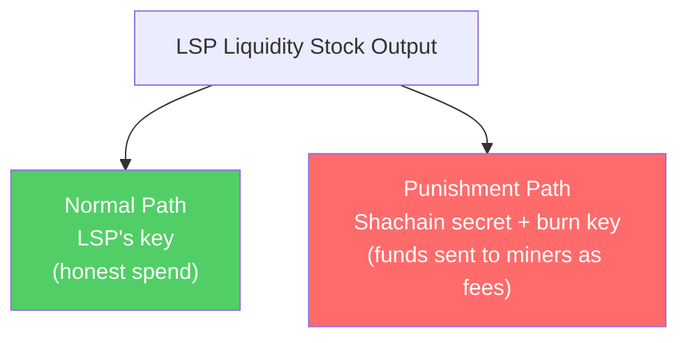
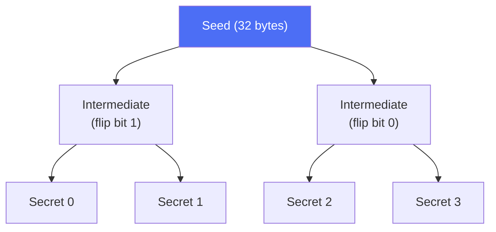

# Shachain Revocation

> **Summary**: When the factory state updates, the LSP reveals a secret for the old state. If the LSP later tries to broadcast that old state, clients can use the secret to claim the LSP's funds as penalty. This makes cheating economically irrational.

## The Problem

In the [[factory-tree-topology|factory tree]], the LSP has **liquidity stock** — funds it owns that it uses to sell inbound liquidity to clients. When the factory state advances (via the [[the-odometer-counter|odometer]]), the liquidity stock amounts change. What stops the LSP from broadcasting an old state where it had MORE liquidity stock?

[[decker-wattenhofer-invalidation|Decker-Wattenhofer invalidation]] handles this for the tree structure (newer states confirm first), but if the honest party is offline during the DW delay window, an old state could confirm before a newer state is broadcast. An additional economic deterrent is needed.

## The Solution: Secret-Based Punishment

Each LSP liquidity stock output has a hidden spending condition:



The script on the liquidity stock looks like:

```
OP_IF
    <shachain_secret_hash> OP_EQUALVERIFY <burn_key> OP_CHECKSIG
OP_ELSE
    <LSP_key> OP_CHECKSIG
OP_ENDIF
```

`<burn_key>` is a key whose private key is known to all factory clients, enabling them to construct the burn transaction.

### How the Punishment Works

1. Factory is at **epoch 5**. The LSP shares the shachain secret for **epoch 4** with the co-signing clients.
2. If the LSP broadcasts the epoch 4 state, clients know the secret for epoch 4's liquidity stock.
3. Clients create a **burn transaction** that spends the liquidity stock via the secret path, directing the full value to miner fees.
4. The LSP's funds are destroyed. Cheating is economically irrational.


## What Is a Shachain?

A shachain is a **compact secret derivation tree** from the Lightning Network spec (BOLT #3). It lets you derive 2^48 unique secrets from a single 32-byte seed, with these properties:

- **One-way derivation**: Revealing secret N doesn't reveal secret N+1
- **Compact storage**: The receiver only needs to store O(log N) values to reconstruct any previously-revealed secret
- **Deterministic**: Given the seed and an index, anyone can compute the exact secret



*Simplified — the actual derivation is a 48-level binary hash tree (see BOLT #3).*

```
shachain_from_seed(seed, 0) → secret_0
shachain_from_seed(seed, 1) → secret_1
shachain_from_seed(seed, 2) → secret_2
...
```

Each factory epoch uses the corresponding shachain index. When advancing from epoch 2 to epoch 3, the LSP reveals `secret_2`. Now clients can punish any attempt to use epoch 2's liquidity stock outputs.

## Why Burn to Fees Instead of Giving to Clients?

If clients received the LSP's funds when catching a cheat, there would be an incentive to provoke or frame the LSP. Burning to fees avoids this:

- The LSP loses money (punishment works)
- Clients gain nothing from provoking cheating
- Miners get a windfall (neutral third party)
- The threat alone is sufficient deterrent — it never actually needs to happen

## Compact Storage with Shachain Receiver

When the LSP shares old secrets with clients, clients don't need to store every single secret. The shachain receiver algorithm (from BOLT #3) stores at most **O(log N)** elements and can derive any previous secret from them:

```
Epoch 0: Receive secret_0                  (1 element stored)
Epoch 1: Receive secret_1                  (2 elements stored)
Epoch 2: Receive secret_2, replaces 0 & 1  (1 element stored)
Epoch 3: Receive secret_3                  (2 elements stored)
Epoch 4: Receive secret_4, replaces 0-3    (1 element stored)
...
Epoch 63:                                  (6 elements stored = log2(64))
```

## When Is Shachain Used vs DW?

Both are invalidation mechanisms, but they protect different things:

| Mechanism | Protects | Against |
|-----------|----------|---------|
| **Decker-Wattenhofer** | Tree structure (which state tx confirms) | Anyone broadcasting old state |
| **Shachain revocation** | LSP liquidity stock amounts | LSP specifically trying to reclaim sold liquidity |

DW invalidation is **automatic** — newer states win the time race. Shachain is **economic** — cheating costs more than it gains. Together they cover both the tree structure and the liquidity allocation within it.

## Related Concepts

- [[decker-wattenhofer-invalidation]] — The time-delay mechanism that shachain complements
- [[the-odometer-counter]] — Each odometer epoch corresponds to a shachain index
- [[factory-tree-topology]] — Where liquidity stock outputs live in the tree
- [[what-is-an-lsp]] — Why the LSP has liquidity stock in the first place
- [[security-model]] — Full analysis of the combined security properties
