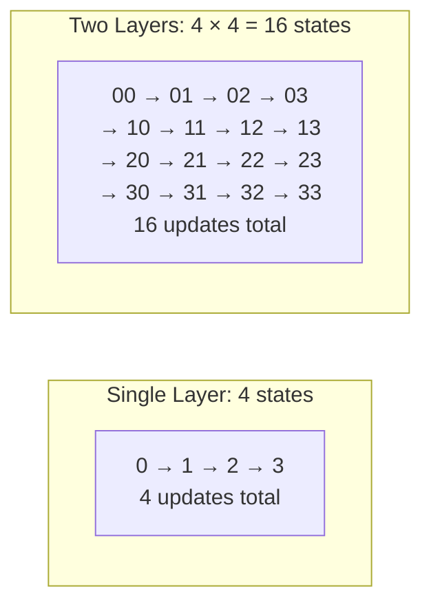

# The Odometer Counter

> **Summary**: By stacking multiple Decker-Wattenhofer layers, you get exponentially more states. 2 layers with 4 states each = 4^2 = 16 total states. 3 layers with 4 states each = 4^3 = 64. The inner layer ticks fastest and carries over to the next outer layer.

## The Problem

A single [[decker-wattenhofer-invalidation|Decker-Wattenhofer]] layer with 4 states only gives you 4 updates. This is insufficient — a factory running for 30 days may need 64 state changes for channel opens, closes, and rebalances.

You could have a single layer with 64 states, but the starting delay would be `63 × 144 = 9,072 blocks` ≈ **63 days**. This exceeds the factory's own lifetime.

## The Solution: Stack Layers

The approach is analogous to an odometer: a single digit gives K values, but N digits give K^N values — exponentially more, without increasing the range of any single digit.



**With 3 layers × 4 states each = 64 total states** — enough for a 30-day factory lifetime, and the maximum delay per layer remains 432 blocks (~3 days).

## How the Odometer Ticks

The **innermost layer** (closest to the leaves) ticks fastest. When it exhausts its states, it resets and carries over to the next outer layer:

```
Epoch  0: Layer0=432, Layer1=432  (both at max delay)
Epoch  1: Layer0=432, Layer1=288  (inner ticks)
Epoch  2: Layer0=432, Layer1=144  (inner ticks)
Epoch  3: Layer0=432, Layer1=0    (inner maxed out)
Epoch  4: Layer0=288, Layer1=432  (carry! outer ticks, inner resets)
Epoch  5: Layer0=288, Layer1=288  (inner ticks again)
Epoch  6: Layer0=288, Layer1=144
Epoch  7: Layer0=288, Layer1=0    (inner maxed out again)
Epoch  8: Layer0=144, Layer1=432  (carry again)
...
Epoch 15: Layer0=0,   Layer1=0    (fully exhausted — 16 states used)
```


## Why This Is Efficient

| Configuration | Total States | Max Delay Per Layer | Total Worst-Case Delay |
|---------------|-------------|--------------------|-----------------------|
| 1 layer × 4 states | 4 | 432 blocks (~3 days) | 3 days |
| 2 layers × 4 states | 16 | 432 blocks (~3 days) | 6 days |
| 3 layers × 4 states | **64** | 432 blocks (~3 days) | 9 days |
| 1 layer × 64 states | 64 | 9,072 blocks (~63 days) | **63 days** |

The odometer gives 64 states with a worst-case delay of 9 days. A flat counter with 64 states would require 63 days — the layered approach reduces worst-case force-close time by a factor of 7.

## In the Factory Tree

In the [[factory-tree-topology|SuperScalar factory tree]], each DW layer corresponds to a **pair of tree levels** (a kickoff node + a state node). The number of DW layers depends on tree depth. The standard 8-client binary tree has 2 DW layers (16 states):

```
Root kickoff  ─── (no delay)
└─ Root state ─── DW Layer 0 (outer, ticks slowly)
   ├─ Left kickoff  ─── (no delay)
   │  └─ Left state  ─── DW Layer 1 (inner, ticks fast)
   └─ Right kickoff ─── (no delay)
      └─ Right state ─── DW Layer 1 (inner, ticks fast)
```

A deeper tree with an additional level of branching would add a 3rd DW layer, giving 64 states — suitable for factories requiring more frequent structural updates.

When a leaf state update happens:
1. The inner layer ticks — its nSequence decrements by one step
2. If the inner layer has exhausted all states, it resets and the outer layer ticks (a carry)

## What Happens When It Runs Out?

When all epochs are exhausted, the factory can no longer update state. But this is by design — factories have a **fixed lifetime** (around 30 days). The [[laddering]] mechanism ensures that old factories are replaced by new ones before they run out.

**Regular Lightning payments within the leaf channels do NOT consume factory states.** Only structural changes consume epochs:
- Opening a new channel in the factory
- Closing a channel in the factory
- Rebalancing liquidity between subtrees

With 2 layers (16 states) or 3 layers (64 states), this is sufficient for a 30-day factory in most cases.

## The Implementation

In the codebase, the odometer is implemented in `dw_state.c`:

```c
dw_counter_init(layers, states_per_layer)  // Initialize: e.g., 2 layers, 4 states
dw_counter_advance()                        // Tick the odometer (inner-first)
dw_current_nsequence(layer)                 // Get current nSequence for a specific layer
dw_counter_is_exhausted()                   // Check if all epochs are used up
```

## Related Concepts

- [[decker-wattenhofer-invalidation]] — The single-layer mechanism this extends
- [[factory-tree-topology]] — How layers map to the physical tree structure
- [[kickoff-vs-state-nodes]] — Why each layer is actually two tree levels
- [[updating-state]] — What triggers the odometer to tick
- [[laddering]] — What happens when the odometer runs out
