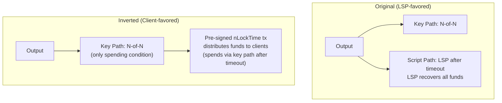

# Timeout-Sig-Trees

> **Summary**: Every output in the factory has two spending paths — an N-of-N multisig for cooperative spending, and a timeout that lets the LSP recover funds if clients vanish. This prevents capital from being locked forever.

## The Problem

In an N-of-N [[what-is-multisig|multisig]], **every** signer must cooperate. If even one client disappears forever, the funds are stuck — nobody can spend them.

For any [[what-is-an-lsp|LSP]], this is unacceptable. If a client disappears permanently, the LSP's capital in that factory cannot be trapped indefinitely.

## The Solution: Two Paths

Every output in the factory tree is a [[what-is-taproot|Taproot]] output with two spending conditions:


| Path | Who Signs | When Available | Used For |
|------|-----------|---------------|----------|
| **Key Path** | All N participants (MuSig2) | Always | Normal operation — single-sig-sized witness, no script reveal |
| **Script Path** | LSP alone | After CLTV timeout (e.g., block 890,000) | Emergency — LSP recovers stuck capital |

## How the Timeout Script Works

The script path contains:

```
<absolute_block_height> OP_CHECKLOCKTIMEVERIFY OP_DROP <LSP_pubkey> OP_CHECKSIG
```

Semantics: after block 890,000, the LSP can spend this output with only its own signature.


### Before the timeout
Only the N-of-N key path works. The LSP cannot unilaterally do anything. Clients are fully protected.

### After the timeout
The LSP can spend via the script path. But by design, the factory should have been replaced long before this — via [[laddering]], the factory's [[laddering|dying period]] happens well before the CLTV timeout.

## What This Emulates

Timeout-sig-trees emulate **OP_CHECKTEMPLATEVERIFY (CTV)** — a proposed soft fork that would let you pre-commit to a specific transaction tree. CTV isn't activated yet, but timeout-sig-trees achieve something similar:

| Feature | CTV (proposed) | Timeout-Sig-Trees (today) |
|---------|---------------|--------------------------|
| Pre-commit to tx tree | Yes, enforced by consensus | Yes, via N-of-N pre-signing |
| Clients must be online to build tree | No | Yes (for initial signing) |
| LSP recovery if clients vanish | Built into tree structure | Via CLTV timeout script path |
| Consensus changes required | **Yes** (soft fork) | **No** |

## The Inverted Timelock (Design Refinement)

In the original design, the timeout defaults **favored the LSP** — after timeout, the LSP gets everything. ZmnSCPxj later refined this by **inverting the default**:

> Instead of `L & CLTV` on the output, signatories pre-sign an nLockTime'd transaction that distributes funds to clients at timeout.



**With the inverted design:**
- If the LSP cooperates → smooth migration via key path
- If the LSP disappears → pre-signed timeout tx gives funds to clients
- The LSP is **forced** to actively participate or lose capital

This shifts economic risk to the LSP operator, which is the correct incentive for whoever coordinates the factory.

## Where Timeout-Sig-Trees Appear in the Factory

```
funding UTXO → kickoff_root → state_root
                                  ├── output 1: MuSig2(A,B,LSP) | LSP+CLTV
                                  └── output 2: MuSig2(C,D,LSP) | LSP+CLTV

state_left → leaf outputs
              ├── A&LSP channel (no timeout — it's a standard LN channel)
              ├── B&LSP channel (no timeout)
              └── LSP liquidity stock (LSP-controlled, no channel partner)
```

The CLTV timeout paths are on **internal tree nodes**, not on the final leaf channels. Leaf channels use standard Poon-Dryja mechanics.

## Related Concepts

- [[what-is-taproot]] — The Bitcoin feature that enables dual spending paths
- [[factory-tree-topology]] — Where timeout-sig-tree outputs live in the tree
- [[what-is-an-lsp]] — Why LSP capital recovery is essential
- [[laddering]] — How factory rotation prevents timeout paths from being needed
- [[force-close]] — What happens if the timeout path is actually used
- [[soft-fork-landscape]] — How CTV activation would improve this
