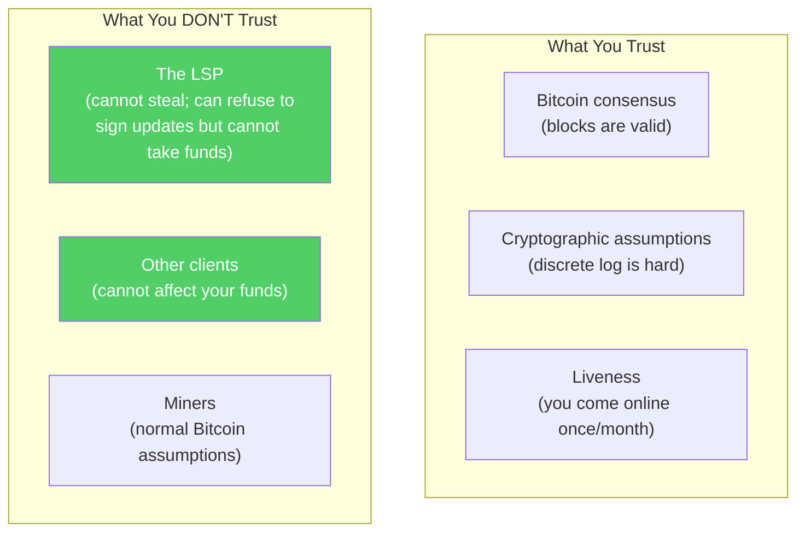

# Security Model

> **Summary**: SuperScalar's security guarantee is simple — every client can always exit unilaterally, and the LSP cannot steal funds. The N-of-N multisig means no single party has unilateral control. The trade-offs are in liveness requirements, force-close costs, and the unsolved forced expiration spam problem.

## Core Property

> *"Each client can unilaterally exit; LSP cannot steal."*

This property is enforced by the N-of-N multisig and pre-signed exit transactions. All other design decisions (efficiency, scalability, UX) are secondary.

## Trust Assumptions

| Assumption | Required? | What Happens If Violated |
|-----------|-----------|------------------------|
| Bitcoin works correctly | Yes | Everything breaks (same as all Bitcoin) |
| Schnorr/MuSig2 is secure | Yes | Signatures could be forged |
| Client comes online once/month | Yes | Client must force-close; funds safe but inconvenient |
| LSP is honest | **No** | Client can always force-close |
| Other clients cooperate | **No** | Subtree isolation limits blast radius |
| Miners don't censor | Mostly | Standard Bitcoin assumption |

## Threat Analysis

### Threat 1: LSP Tries to Steal

**Attack**: LSP broadcasts an old state to reclaim liquidity it had already sold to clients.

**Defense (primary)**: [[decker-wattenhofer-invalidation]] — the newest state has the lowest nSequence delay. If any honest party broadcasts the newer state, it confirms before the old one. The DW mechanism guarantees the newer state wins the race, but only if someone holding it is online to broadcast it.

**Defense (secondary)**: [[shachain-revocation]] — if the honest party is offline and an old state confirms, clients hold the revealed shachain secret for that epoch's liquidity stock outputs. They can burn the LSP's liquidity stock to miner fees, making cheating economically irrational even in this case.

**Verdict**: LSP cannot profitably steal.

### Threat 2: LSP Goes Offline Permanently

**Attack**: LSP shuts down (bankrupt, shut down by authorities, etc.)

**Defense**: All exit transactions are **pre-signed during factory construction**. Clients hold copies of every transaction needed to force-close. No cooperation from the LSP is needed.

**Impact**: All clients must force-close. This is expensive (many on-chain transactions + fees) and slow (DW delays), but funds are recoverable.

**Verdict**: Inconvenient but safe.

### Threat 3: Client Goes Offline

**Attack**: Client loses phone, forgets about wallet, or becomes permanently unreachable.

**Defense**: [[timeout-sig-trees|CLTV timeout]] — after the factory's absolute timeout, the LSP can recover its own funds. With the inverted timelock design, a pre-signed nLockTime'd transaction distributes the client's funds on-chain.

**Impact**: Client's funds land on-chain at the timeout. LSP recovers its capital. No funds are lost.

**Verdict**: Handled by design.

### Threat 4: Forced Expiration Spam

**Attack**: An adversary (or market event) causes many factories to force-close simultaneously, overwhelming Bitcoin's block space.

**Concern** (from ariard's critique):
> *"With 8 users and k-factor 2, SuperScalar requires 12 tree txs in worst case vs 8 commitment txs without factories."*

**Defense**: None fully satisfactory. This is an **unsolved problem** for all timelock-based protocols (Lightning included). SuperScalar mitigates it through:
- [[laddering]] — staggers factory expirations across days
- Tree structure — only affected subtrees are published
- P2A outputs — allow fee-bumping during congestion

**Verdict**: Known limitation. Mitigated but not eliminated.

### Threat 5: Miner-Counterparty Collusion

**Attack**: A miner colludes with the LSP to censor the honest client's newer state transaction, allowing the old state to confirm after the DW delay.

**Defense**: Standard Bitcoin censorship resistance — the client can submit their newer state transaction to any miner. The defense window equals the nSequence difference between the old and new states (at minimum 144 blocks per DW step, approximately 1 day). The client's newer transaction, having a shorter delay, confirms first as long as any honest miner includes it within this window.

**Verdict**: Requires sustained mining censorship. Same assumption as all Lightning.

### Threat 6: LSP Refuses Assisted Exit

**Attack**: LSP refuses to cooperate with PTLC-based [[client-migration|assisted exit]], trapping the client.

**Defense**: Assisted exit is optional. The client can always:
1. Make a standard Lightning payment to a new channel
2. Force-close and take funds on-chain
3. Wait for the inverted timelock to distribute funds automatically

**Verdict**: Inconvenient but not dangerous. Client has multiple fallback paths.

## The Economic Security Model

Beyond cryptographic guarantees, SuperScalar relies on **economic incentives**:

> *"It can be done in practice such that it is more economical for the LSP to not screw over its clients, just as typical capitalism works. You cannot earn money from a dead customer."* — ZmnSCPxj

| LSP Action | Cost to LSP | Benefit to LSP |
|-----------|-------------|---------------|
| Cooperate honestly | Operational costs | Revenue from liquidity sales |
| Broadcast old state | Liquidity stock burned (shachain) | Whatever was in the old state |
| Refuse to cooperate | Loses all future revenue from client | Nothing |
| Shut down entirely | Loses all business | N/A |

Cheating is unprofitable under normal conditions because the shachain punishment destroys more value than the LSP could gain from an old state.

## Open Problems

### 1. Forced Expiration Spam
See [Threat 4](#threat-4-forced-expiration-spam) above. No protocol-level solution exists for any timelock-based protocol. Laddering and subtree isolation mitigate but do not eliminate the risk.

### 2. Fair Exchange of Private Keys
The PTLC-based key handover is atomic, but there's no guarantee the LSP will initiate the on-chain PTLC before timelocks expire. In theory, this is an unsolved problem. In practice, the LSP is incentivized to cooperate.

### 3. Dust Economics
If a client's channel balance is very small, the on-chain force-close transaction might cost more in fees than the channel is worth. The client's funds are effectively "dust" — they exist in theory but aren't economically recoverable.

### 4. Are 64 States Enough?
With 2 DW layers of 4 states each, the odometer provides 4^2 = 16 total epochs (the default for an 8-client binary tree). A deeper tree with 3 DW layers provides 4^3 = 64 epochs. The factory has a fixed number of state updates over its 30-day lifetime. If the factory is busy, epochs could be exhausted before expiry. This remains an open question.

## Comparison to Other Trust Models

| System | Trust Model | Can Provider Steal? |
|--------|------------|-------------------|
| **Custodial wallet** | Full trust in provider | Yes |
| **Ark (ASP model)** | Trust ASP won't double-spend during round | During round transitions |
| **SuperScalar** | N-of-N multisig | No (requires all signers) |
| **On-chain Bitcoin** | Zero trust | No (you hold the keys) |

SuperScalar's trust model matches on-chain multisig: no single party can move funds unilaterally, and pre-signed transactions guarantee exit without cooperation.

## Related Concepts

- [[decker-wattenhofer-invalidation]] — Defense against old state broadcasts
- [[shachain-revocation]] — Economic punishment for cheating
- [[timeout-sig-trees]] — Defense against permanent client disappearance
- [[force-close]] — The mechanism that enforces all guarantees
- [[comparison-to-ark]] — Different trust model comparison
- [[soft-fork-landscape]] — How future upgrades could strengthen security
