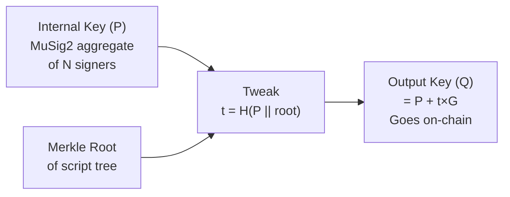

# Tapscript Construction (Deep Dive)

> **Summary**: How the Taproot script trees are built — from raw Bitcoin script opcodes, through TapLeaf hashing, Merkle root computation, key tweaking, and control block construction for script-path spending.

## Prerequisites

- [[what-is-taproot]] — Conceptual overview of key path vs script path
- [[timeout-sig-trees]] — Why the CLTV timeout scripts exist

## The CLTV Timeout Script

The core script used in [[timeout-sig-trees]]:

```
<cltv_timeout>
OP_CHECKLOCKTIMEVERIFY
OP_DROP
<lsp_pubkey>
OP_CHECKSIG
```

**Byte-by-byte breakdown:**

```
03 [3 bytes: CLTV timeout as little-endian int]    ← e.g., block 890000 (0x0D9530)
b1                                                  ← OP_CHECKLOCKTIMEVERIFY
75                                                  ← OP_DROP
20 [32 bytes: LSP x-only pubkey]                    ← BIP-340 format
ac                                                  ← OP_CHECKSIG
```

Total script size: **40 bytes** (1 push opcode + 3 CLTV value + 1 OP_CLTV + 1 OP_DROP + 1 push opcode + 32 pubkey + 1 OP_CHECKSIG). The CLTV value size varies by block height; 3 bytes covers heights up to 16,777,215 (~320 years at current pace).

## TapLeaf Hashing

Each script becomes a TapLeaf with a hash:

```
leaf_hash = H_TapLeaf(leaf_version || compact_size(script_len) || script)
```

Where:
- `H_TapLeaf` = SHA-256 with the tagged hash prefix `"TapLeaf"`
- `leaf_version` = `0xc0` (the default Tapscript version)
- `compact_size(script_len)` = Bitcoin's variable-length integer encoding

```
H_TapLeaf = SHA256(SHA256("TapLeaf") || SHA256("TapLeaf") || 0xc0 || script_len || script)
```

## Merkle Root Computation

For a single-leaf tree (most common in SuperScalar):

```
merkle_root = leaf_hash
```

For multiple leaves:

```
            merkle_root
           /           \
     branch_hash    branch_hash
      /    \          /    \
  leaf_0  leaf_1  leaf_2  leaf_3
```

Branch hashing:

```
if leaf_a < leaf_b:  (lexicographic comparison)
    branch = H_TapBranch(leaf_a || leaf_b)
else:
    branch = H_TapBranch(leaf_b || leaf_a)
```

The sorting ensures a canonical tree — different orderings produce the same root.

## Output Key Tweaking

The on-chain Taproot output key is the internal key tweaked with the Merkle root:

```
t = H_TapTweak(internal_key.x || merkle_root)
Q = P + t × G
```

Where:
- `P` = internal key (MuSig2 aggregate key, x-only)
- `t` = tweak scalar
- `Q` = output key (appears on-chain)
- `H_TapTweak` = SHA-256 with tagged hash prefix `"TapTweak"`

If Q has odd y-coordinate, it's negated (BIP-340 x-only key convention).



## Control Block Construction

To spend via the script path, the spender must provide a **control block** that proves the script is committed in the tree:

```
control_block = leaf_version | internal_key.x | merkle_path
```

- `leaf_version` (1 byte): `0xc0` OR'd with the parity of the output key
- `internal_key.x` (32 bytes): The x-coordinate of the internal key (NOT the output key)
- `merkle_path` (32 bytes per level): Sibling hashes needed to reconstruct the root

For a single-leaf tree, the merkle path is empty (0 bytes).

**Total control block size**: 33 bytes (single leaf) to 33 + 32×depth bytes (deep tree).

## Script-Path Witness

The full witness for a script-path spend:

```
witness:
  <signature>     ← 64 bytes (Schnorr sig under the script's pubkey)
  <script>        ← The actual script being executed
  <control_block> ← Proof of inclusion in the tree
```

## BIP-341 Sighash for Script Path

The sighash for script-path spending (spend_type = 0x02) differs from key-path:

```
sighash = H_TapSighash(
    0x00                          // sighash epoch
    || hash_type                  // 0x00 = SIGHASH_DEFAULT (equivalent to SIGHASH_ALL)
    || nVersion                   // tx version
    || nLocktime                  // tx locktime
    || sha_prevouts               // hash of all input outpoints
    || sha_amounts                // hash of all input amounts
    || sha_scriptpubkeys          // hash of all input scriptPubKeys
    || sha_sequences              // hash of all input nSequences
    || sha_outputs                // hash of all outputs
    || spend_type                 // 0x02 = ext_flag × 2 + 0 (script path, no annex)
    || input_index                // which input we're signing
    || tapleaf_hash               // hash of the specific TapLeaf being spent
    || 0x00                       // key version
    || codesep_pos                // OP_CODESEPARATOR position (0xFFFFFFFF if none)
)
```

The key difference from key-path: script-path includes the `tapleaf_hash` and `key_version`, binding the signature to the specific script being executed.

## In the Codebase

```c
// Build the CLTV timeout script
tapscript_build_cltv_timeout(&script, cltv_height, &lsp_pubkey);

// Hash it as a TapLeaf
tapscript_leaf_hash(&leaf_hash, TAPSCRIPT_LEAF_VERSION, &script);

// Compute Merkle root (for single leaf, root = leaf hash)
tapscript_merkle_root(&root, leaves, n_leaves);

// Tweak the internal key
tapscript_tweak_pubkey(&output_key, &internal_key, &root);

// Build control block for script-path spend
tapscript_build_control_block(&cb, &internal_key, &merkle_path, TAPSCRIPT_LEAF_VERSION);

// Compute script-path sighash
compute_tapscript_sighash(&sighash, &tx, input_idx, &leaf_hash);

// Finalize witness with [sig, script, control_block]
finalize_script_path_tx(&tx, input_idx, &sig, &script, &cb);
```

## Related Concepts

- [[what-is-taproot]] — The Bitcoin feature these scripts use
- [[timeout-sig-trees]] — Why these scripts exist
- [[musig2-signing-rounds]] — How the key-path signatures are created
- [[transaction-structure]] — Where scripts and witnesses live in transactions
