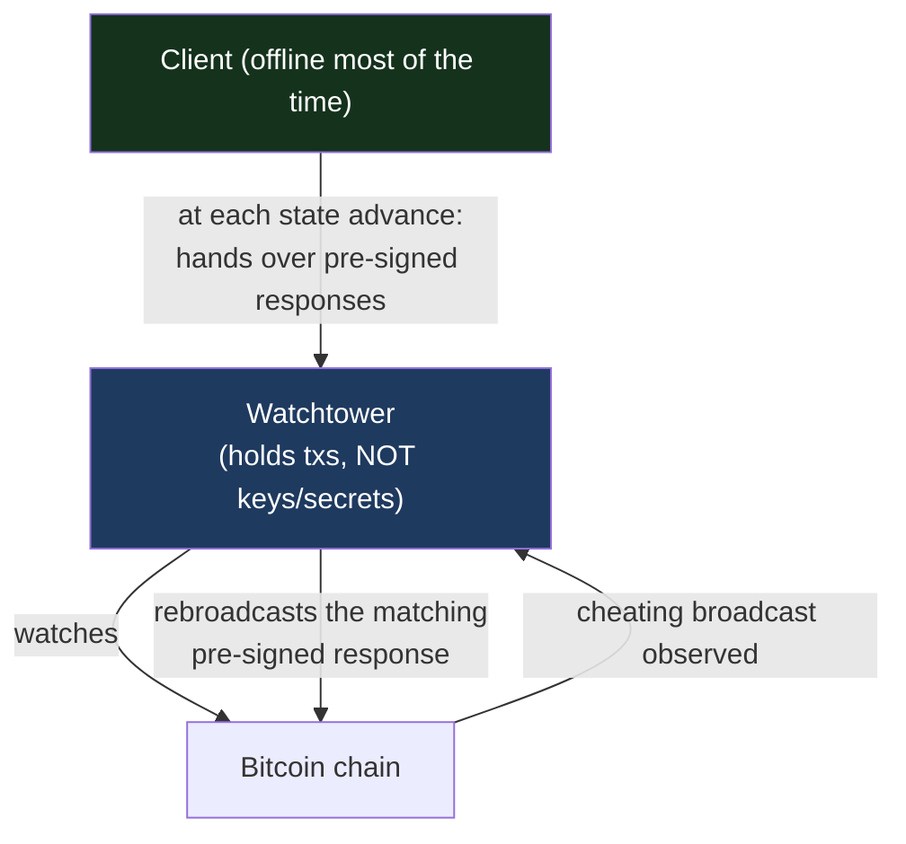

# The Watchtower

> **Summary**: A SuperScalar watchtower watches the chain on a client's behalf and, the moment it sees a cheating broadcast, publishes a **pre-signed** response that was authorized when the state was created. It is **trustless** — it holds no spending keys and no secrets, so a malicious or compromised watchtower cannot steal funds; the worst it can do is fail to act. It can run alongside the LSP or as a fully **standalone** process.

## Why a watchtower

A SuperScalar client only has to come online about once a month. But the on-chain defenses — punishing a revoked channel commitment, clawing back the L-stock from a stale leaf state — only work if *someone* is watching the chain and reacts within the relevant timelock window. The watchtower is that someone, so the client's funds stay safe even while the client's device is offline.

This is the same role a watchtower plays in ordinary Lightning, extended to also cover the factory-tree and leaf mechanisms unique to SuperScalar.

## The trustless (secret-less) model

The defining property: **the watchtower never holds a key or a secret that can move funds.** Everything it might need to broadcast is a **fully pre-signed transaction**, handed to it when the corresponding state was created. When it observes the trigger on-chain, it simply rebroadcasts that pre-signed transaction.

Consequences of holding no keys:
- A **compromised watchtower cannot steal** — it can only broadcast transactions that were already authorized by the rightful parties. Those transactions pay out to the client / clients, never to the watchtower.
- The **worst-case failure is liveness, not safety** — a dead or dishonest watchtower means a cheat might go un-penalised, but it can never *cause* a loss. For that reason a client can run several independent watchtowers; only one needs to be alive.
- There is **no secret to leak**. Unlike designs that hand the watchtower revocation secrets, there is nothing here whose disclosure would help an attacker.

## What it watches

| Trigger observed on-chain | Pre-signed response the watchtower holds |
|---------------------------|------------------------------------------|
| A **revoked inner-channel commitment** (BOLT-2 / Poon-Dryja) | The penalty transaction sweeping the cheater's output |
| A **stale leaf state** carrying the LSP's L-stock | The [[l-stock-redistribution\|redistribution TX]] that redistributes the L-stock to the leaf's clients |
| A **stale interior factory / sub-factory state** | The newer state (which wins the [[decker-wattenhofer-invalidation\|DW]] race) and any matching L-stock redistribution |
| A **force-close** that lands a commitment the client owns | The pre-signed sweep of the client's own output |

The first row is ordinary Lightning revocation; the rest are SuperScalar-specific and are what make the factory safe to leave unattended.

## Registration

Whenever a channel or factory state advances, the new state's responses are registered with the watchtower as part of the same signing ceremony — there is no separate trip. Each registration records what to watch for (the outpoint / commitment that would signal cheating) and the exact pre-signed transaction to broadcast in response. Because registration is bundled into the [[updating-state|state advance]], the watchtower is always one step behind the live state and never missing coverage for a state that could actually be published.

## Standalone operation

The watchtower can run **embedded** with the LSP (convenient for the LSP's own monitoring) or **standalone** — a separate process, on separate hardware, that a client points at to cover its channels independently of the LSP. Standalone operation is the important case for self-custody: it means a client's safety does **not** depend on the LSP's watchtower being honest or alive. The standalone watchtower has been exercised end-to-end against factory, sub-factory, and channel-commitment breaches.

## Liveness, not just correctness

Because a silent watchtower is the one real failure mode, a SuperScalar watchtower surfaces a **liveness signal** — it is observable whether it is up and current with the chain tip — so an operator (or the client) can alert on a watchtower that has fallen behind or died, and bring up a replacement before any timelock window matters.

## What the watchtower is *not* responsible for

- It does **not** custody funds or hold spending keys.
- It does **not** need the client's revocation secrets (the secret-less model).
- It does **not** initiate cooperative closes or ordinary payments — only adversarial responses.

## Related Concepts

- [[l-stock-redistribution]] — The pre-signed response the watchtower broadcasts against a stale L-stock state
- [[shachain-revocation]] — Inner-channel revocation, the one place secrets exist (held by the channel parties, not the watchtower)
- [[decker-wattenhofer-invalidation]] — Why a newer interior state wins the on-chain race
- [[client-recovery]] — What the client itself persists so it can act without any watchtower
- [[force-close]] — The unilateral-exit paths the watchtower helps enforce
- [[security-model]] — Where the watchtower sits in the overall threat model
