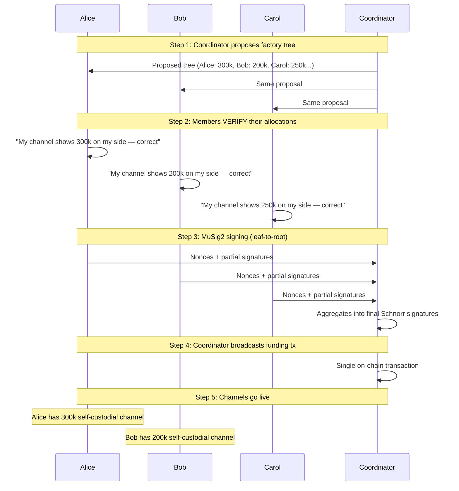
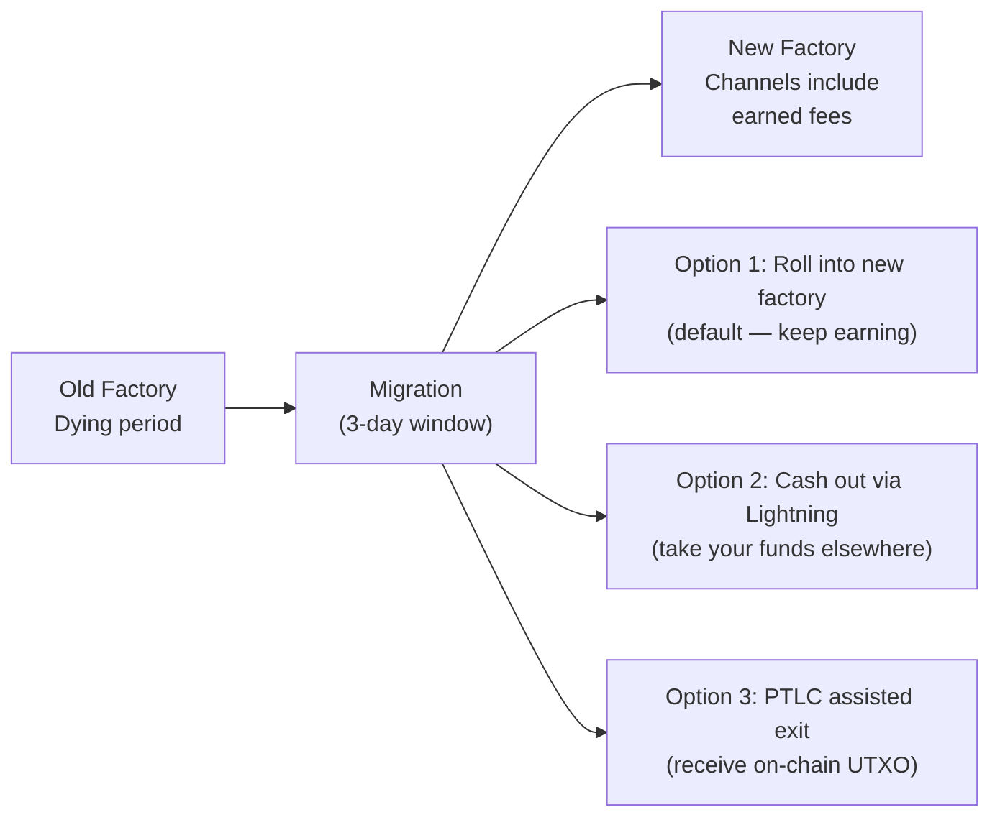

# Cooperative Factories

> **Summary**: SuperScalar's protocol is agnostic to who provides capital. Members can pool Lightning funds to create a factory where each participant holds a self-custodial channel and earns a proportional share of routing fees. The coordinator operates the node; the N-of-N multisig ensures no single party — including the coordinator — can move anyone's funds.

## The Model

The standard SuperScalar deployment assumes a commercial LSP that fronts all capital and charges fees. But the protocol doesn't require this. The N-of-N multisig treats every signer equally. Who provides the capital and how revenue is distributed are organizational decisions, not protocol constraints.

A cooperative factory replaces the commercial LSP model with a pooled-capital model:

| Property | Commercial LSP | Cooperative Factory |
|----------|---------------|-------------------|
| **Capital source** | LSP treasury | Members pool funds via Lightning |
| **Channel ownership** | Client holds their channel | Member holds their channel (same guarantee) |
| **Routing fee revenue** | LSP keeps all | Distributed proportionally to capital contributors |
| **Coordinator role** | LSP is the business | Coordinator operates the node on behalf of members |
| **Trust model** | N-of-N multisig (identical) | N-of-N multisig (identical) |
| **Unilateral exit** | Always available | Always available (same guarantee) |

The protocol's safety properties — unilateral exit, shachain punishment, inverted timelocks — protect members identically regardless of the organizational structure.

## End-to-End: How It Works

### Phase 1: Members Find Each Other

A coordination platform (website, group chat, community board) connects people who want to pool funds:

```
superscalar.win — Pool Registry

  Pool #47: "East Africa Lightning Cooperative"
    Target capacity:  2,000,000 sats
    Members:          5 / 8
    Coordinator:      node_pubkey_abc123...
    Min contribution: 50,000 sats
    Status:           Accepting members

  Pool #48: "Bitcoin Meetup Austin"
    Target capacity:  5,000,000 sats
    Members:          8 / 8  (FULL)
    Coordinator:      node_pubkey_def456...
    Status:           Construction in progress
```

Members don't need to know or trust each other. The N-of-N multisig and pre-signed exit transactions protect each member independently. What members need is:

- A Lightning wallet with funds they want to contribute
- The ability to come online for the construction ceremony (~minutes)
- The ability to come online once per month during the [[laddering|dying period]] (~3 days)

### Phase 2: Capital Contribution

Members contribute funds via Lightning payments to the coordinator. Each member's contribution determines their starting channel balance and their share of future fee revenue.

```
Pool #47 contributions:

  Alice:   300,000 sats via Lightning  →  15% of pool
  Bob:     200,000 sats via Lightning  →  10% of pool
  Carol:   250,000 sats via Lightning  →  12.5% of pool
  Dave:    150,000 sats via Lightning  →  7.5% of pool
  Eve:     400,000 sats via Lightning  →  20% of pool
  Coord:   700,000 sats (own capital)  →  35% of pool
  ──────────────────────────────────────────────────────
  Total: 2,000,000 sats                   100%
```

The coordinator contributes its own capital alongside member contributions. The coordinator's share covers the liquidity stock (reserve for future inbound allocation) and operational buffer.

#### Minimizing Prepayment Risk

The Lightning payment from member to coordinator is the one step that requires trust: the coordinator receives funds before the factory exists. Three mechanisms reduce this risk:

**1. HODL invoices.** The member's payment is held in-flight (not settled) until the factory is constructed and the member has verified their channel allocation. If construction fails, the payment times out and returns to the member automatically.

**2. Verification before signing.** During the [[building-a-factory|factory construction ceremony]], every member sees the proposed tree structure — including their channel balance — before signing. A member who contributed 300,000 sats but sees only 200,000 in their proposed channel simply refuses to sign. The factory cannot be created without every member's signature.

**3. Incremental trust.** A new coordinator starts with small pools among people who know each other. As the coordinator's track record grows, strangers join larger pools. Reputation is built over successful factory rotations, not claimed in advance.

### Phase 3: Factory Construction

Once all contributions are received, the coordinator initiates the [[building-a-factory|standard factory construction ceremony]]. The process is identical to the commercial LSP model — the coordinator takes the LSP role:



The critical property: **members sign the factory tree BEFORE the funding transaction is broadcast.** Every member holds a complete set of pre-signed exit transactions. If the coordinator disappears after funding, every member can force-close and recover their funds unilaterally.

### Phase 4: Operations — Routing and Fee Generation

Once live, the factory operates as a standard SuperScalar deployment. The coordinator routes payments through member channels, earning fees:

```
Payment: External sender → Coordinator → Alice
  Routing fee: 10 sats (earned by the factory)

Payment: Bob → Coordinator → External recipient
  Routing fee: 8 sats (earned by the factory)

Payment: Carol → Coordinator → Dave (intra-factory)
  Routing fee: 5 sats (earned by the factory)
```

Every payment that flows through the factory generates routing fees. The coordinator collects these fees as the routing node, but in a cooperative model, they belong to the pool.

Members who contributed more capital enable more routing capacity, which is why fee distribution is proportional to contribution.

### Phase 5: Fee Distribution

At each factory rotation (every ~30 days), accumulated fees are distributed:

```
Monthly factory performance:

  Total routing fees earned:         12,000 sats
  Coordinator operating costs:       -2,000 sats (server, bandwidth, monitoring)
  ──────────────────────────────────────────────
  Net distributable:                 10,000 sats

  Distribution (proportional to capital):
    Alice  (15%):    1,500 sats
    Bob    (10%):    1,000 sats
    Carol  (12.5%):  1,250 sats
    Dave   (7.5%):     750 sats
    Eve    (20%):    2,000 sats
    Coord  (35%):    3,500 sats
```

Fee distribution happens during the [[client-migration|migration]] to the new factory. Each member's channel in the new factory reflects their original contribution plus their earned fees:

```
Alice in new factory:
  Original contribution:   300,000 sats
  Earned fees (month 1):   + 1,500 sats
  New channel balance:     301,500 sats
```

The coordinator handles the accounting. Members verify their new channel allocation during the construction ceremony for the next factory — the same verification step that protects against any misallocation.

### Phase 6: Factory Rotation

Every ~30 days, the factory enters its [[laddering|dying period]]. Members come online (push notification) and migrate to a new factory:



Members who want to stay in the cooperative simply roll their balance (contribution + earned fees) into the next factory. Members who want to leave take their funds via Lightning payment or on-chain withdrawal.

**No lock-in.** A member can leave at any rotation with their full balance. If the coordinator becomes unresponsive, members can force-close at any time and recover their funds on-chain.

### Phase 7: Growth and Graduation

Over time, a member's balance grows from earned fees and received Lightning payments:

```
Month 1:  Alice contributes 300,000 sats
Month 2:  Balance: 301,500 (contribution + fees)
Month 3:  Balance: 353,000 (+ received payments + fees)
Month 6:  Balance: 520,000 (+ more payments + fees)
Month 12: Balance: 890,000 sats
```

At any point, Alice can:

- **Stay in the cooperative** — keep earning proportional fees as her balance (and thus her share of routing capacity) grows
- **Cash out partially** — withdraw some funds via Lightning, leave the rest earning fees
- **Graduate to full sovereignty** — during a factory rotation, take an on-chain UTXO via offchain-to-onchain swap or PTLC assisted exit. She now has her own UTXO and can open an independent Lightning channel if she wants

The cooperative is an on-ramp. Members can start with small amounts, grow through fees and received payments, and eventually graduate to full on-chain sovereignty — all without ever having needed an on-chain UTXO to begin with.

## The Coordinator

### What the Coordinator Does

| Responsibility | Why It's Needed |
|---------------|-----------------|
| Operates a Lightning node 24/7 | Routes payments, forwards HTLCs |
| Manages factory lifecycle | Construction, rotation, migration notifications |
| Holds the coordinator signing key | Participates in every MuSig2 session |
| Publishes the funding transaction | The single on-chain operation per factory |
| Runs the watchtower | Monitors for old state broadcasts, executes penalties |
| Tracks fee accounting | Calculates member distributions |

### What the Coordinator Cannot Do

| Action | Why Not |
|--------|---------|
| **Steal member funds** | N-of-N multisig — every member must sign every state change |
| **Move funds without consent** | Any state update requires the affected members' signatures |
| **Prevent member exit** | Members hold pre-signed exit transactions; force-close is always available |
| **Inflate their fee share** | Members verify allocations during each factory construction ceremony |
| **Lock members in** | Members can leave at any rotation or force-close at any time |

The coordinator has **operational power** (runs the node, coordinates signing) but no **custodial power** (cannot unilaterally spend anyone's funds). This is the same trust model as the commercial LSP design — the protocol enforces it regardless of organizational structure.

### What the Coordinator Can Do (Negatively)

Honest accounting of the coordinator's power to cause harm:

| Action | Impact | Member Defense |
|--------|--------|----------------|
| **Go offline** | Factory can't route payments | Members force-close; funds are safe but inconvenient |
| **Refuse to create new factory** | Members stuck in dying factory | Force-close before CLTV timeout; take funds on-chain |
| **Misreport fee revenue** | Members receive less than earned | Members can audit routing through their own channel activity |
| **Selectively refuse to route** | Specific member's payments fail | Member leaves the cooperative at next rotation |

The worst a malicious coordinator can do is **disrupt service**, not steal funds. This is a meaningful distinction. A malicious coordinator makes the cooperative useless, but every member exits with their full balance.

## Trust Analysis

### What's Trustless (Enforced by Protocol)

- **Self-custody**: Every member holds their signing key. No one can spend their funds without their signature.
- **Unilateral exit**: Pre-signed transactions guarantee on-chain recovery without anyone's cooperation.
- **State verification**: Members verify their channel allocation before signing each factory tree.
- **Old state punishment**: [[shachain-revocation|Shachain secrets]] allow members to burn the coordinator's funds if old states are broadcast.
- **Inverted timelock**: If the coordinator disappears, a pre-signed [[timeout-sig-trees|nLockTime transaction]] distributes funds to members automatically at the factory timeout.

### What Requires Trust (Reduced but Not Eliminated)

- **Prepayment**: Lightning payment to coordinator before factory exists. Mitigated by HODL invoices and incremental trust.
- **Fee accounting**: Coordinator reports fee revenue. Mitigated by member-observable channel activity.
- **Uptime**: Coordinator must be online for payments to route. Mitigated by the ability to leave at any rotation.
- **Honest routing**: Coordinator could theoretically deprioritize some members' payments. Mitigated by reputation and the ability to exit.

### What's Structurally Guaranteed

- A member who contributes 300,000 sats and sees 300,000 in their proposed channel during construction **will have** a self-custodial 300,000 sat channel after signing. The MuSig2 ceremony and pre-signed exit transactions make this irreversible once the funding transaction confirms.
- A member can **always** recover their funds on-chain, even if the coordinator, all other members, and the coordination platform disappear simultaneously.
- The coordinator earns nothing from cheating. The shachain punishment destroys more value than any old state could recover. Economic rationality reinforces the cryptographic guarantees.

## Comparison to Alternatives

| Model | Self-Custody? | Earn Fees? | Capital Required? | Trust? |
|-------|--------------|-----------|-------------------|--------|
| **Custodial wallet** | No | No | None | Full trust in provider |
| **Standard Lightning channel** | Yes | Possible | Own UTXO (~$300+ in fees at high congestion) | Counterparty for routing |
| **Commercial SuperScalar** | Yes | No (you pay fees) | None | Coordinator can't steal |
| **Cooperative SuperScalar** | Yes | Yes (proportional) | Lightning funds (no UTXO needed) | Coordinator can't steal |
| **Running your own node** | Yes | Yes | Full node + UTXO + channels | Yourself |

The cooperative model occupies a specific niche: self-custodial Lightning access with fee earnings, without requiring an on-chain UTXO or running your own infrastructure. It's positioned between "passive user of a commercial LSP" and "full sovereign node operator."

## Practical Considerations

### Pool Size

Recommended: **4-8 members** per factory (matching the protocol's tree structure). Larger pools require deeper trees, more DW layers, and more CLTV budget consumption. Multiple small factories in a [[laddering|ladder]] serve more members than one large factory.

### Minimum Contribution

The protocol has no minimum. The practical minimum is set by economics: a member contributing 10,000 sats to a 2,000,000 sat factory holds 0.5% of capacity and earns 0.5% of fees. If monthly fees are 12,000 sats, that's 60 sats/month. The coordinator should set a minimum where the member's earned fees meaningfully exceed the coordination overhead of including them.

### Coordinator Compensation

The coordinator bears real costs: server infrastructure, bandwidth, monitoring, and the operational burden of 24/7 uptime. The coordinator's capital contribution earns the same proportional return as any member's. Additionally, the coordinator may charge a flat operational fee deducted before distribution, or take a slightly higher percentage to compensate for non-capital contributions (labor, infrastructure).

### Dispute Resolution

The protocol handles disputes through exit: if a member is unhappy, they leave at the next rotation with their full balance. There is no mechanism for on-chain arbitration or voting within the factory — the N-of-N multisig means any member can halt state updates by refusing to sign, and any member can leave unilaterally. The coordination platform can mediate disputes, but the protocol itself resolves disagreement through exit, not governance.

## What the Prototype Supports Today

The [existing implementation](https://github.com/8144225309/Decker-Wattenhofer-prototype) supports the full cooperative model at the protocol layer:

| Capability | Status |
|-----------|--------|
| N-of-N factory construction | Working (181 tests) |
| Self-custodial leaf channels | Working |
| HTLC routing through coordinator | Working |
| Force-close / unilateral exit | Working (watchtower included) |
| Shachain punishment | Working |
| PTLC assisted exit (key turnover) | Working |
| Factory rotation (laddering) | Working (manual trigger) |
| Inverted timelock (distribution tx) | Working |

What needs to be built on top:

| Capability | Status |
|-----------|--------|
| Coordination platform (pool registry) | Not started |
| HODL invoice contribution flow | Not started |
| Fee tracking and distribution accounting | Not started |
| Continuous ladder daemon (auto-rotation) | Partial (exists, not automated) |
| Member dashboard (view balance, earned fees) | Web dashboard exists, needs cooperative extensions |

The protocol layer is ready. The coordination and accounting layers are what make it a cooperative.

## Related Concepts

- [[building-a-factory]] — The construction ceremony that cooperatives use unchanged
- [[laddering]] — Factory rotation that triggers fee distribution and re-pooling
- [[client-migration]] — How members move between factories (or exit)
- [[security-model]] — Trust analysis that applies equally to cooperatives
- [[force-close]] — The unilateral exit guarantee that protects every member
- [[feerate-futures]] — Fee hedging that a large cooperative could eventually access
- [[what-is-an-lsp]] — The coordinator role in a cooperative context
