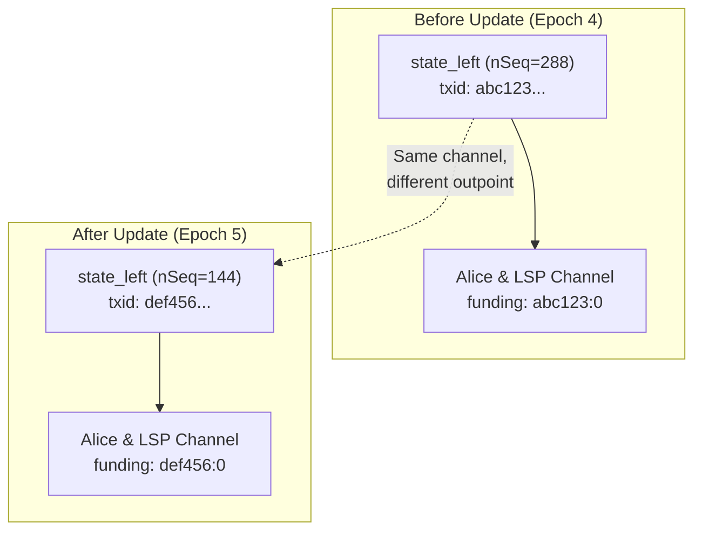
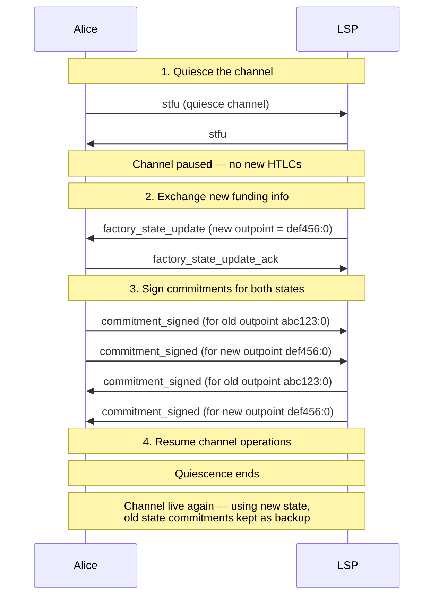

# Dual State Management

> **Summary**: When a factory updates state, the leaf channels must transition from the old funding outpoint to the new one. During the transition, both states are valid simultaneously — the same problem splicing solves, applied to off-chain factory state.

## The Problem

When the [[the-odometer-counter|DW odometer]] advances (a factory state update), the leaf state transactions change. This means the **funding outpoint** for each Lightning channel at the leaves changes too:



The channel balance is unchanged, but the funding outpoint it spends from has changed. The channel must maintain valid commitment transactions for both outpoints during the transition, since either the old or new factory state could end up on-chain.

## Failure Mode Without Dual State

If the channel only tracks the new funding outpoint but the old factory state ends up on-chain (e.g., during a force-close race), the channel's commitment transactions become **invalid** — they reference an outpoint that was never published on-chain. Alice could lose her funds.

**Both states must be maintained until the transition is finalized.**

## How It Works

The process mirrors Lightning's existing **splicing** protocol:



### Step 1: Quiesce

The channel is paused using the `stfu` message (BOLT #2, `option_quiesce`). No new HTLCs can be added while the transition is happening. This prevents race conditions where an HTLC is created on the old state but not the new one.

### Step 2: Exchange New Funding Info

The LSP (which coordinates the factory update) tells the channel participants what the new funding outpoint will be.

### Step 3: Sign Both States

Both parties sign commitment transactions for each funding outpoint. The channel maintains two parallel commitment transaction sets:

```
Old state commitments:
  - Alice's commitment tx (spends abc123:0)
  - LSP's commitment tx (spends abc123:0)

New state commitments:
  - Alice's commitment tx (spends def456:0)
  - LSP's commitment tx (spends def456:0)
```

This ensures the channel remains valid regardless of which factory state is published on-chain.

### Step 4: Resume

Once both commitment sets are exchanged, the channel resumes normal operation. New HTLCs are routed against the new state's commitments; old state commitments are retained as fallback.

## When Can Old State Be Dropped?

The old state commitments can be safely discarded when:

1. The new factory state is **fully signed** by all participants (the DW mechanism ensures it can outrace the old state on-chain, assuming an honest party broadcasts it)
2. The old state's [[shachain-revocation|shachain secret]] has been shared (making it economically irrational for the LSP to broadcast the old factory state)

Both conditions are typically satisfied simultaneously during a state advance. In practice, old state commitment sets are retained until the next state update replaces them.

## Batched Commitment Signing

For efficiency, the dual state commitments can be batched — old and new state commitment signatures are exchanged in the same round-trip, as shown in step 3 above. Each side sends a `commitment_signed` for each outpoint, but these messages can be pipelined to avoid additional round-trips.

## Relation to Splicing

| Aspect | Splicing | Factory Transition |
|--------|---------|-------------------|
| **What changes** | Funding outpoint (on-chain tx) | Funding outpoint (off-chain factory state) |
| **Dual state needed** | Yes — old/new splice | Yes — old/new factory state |
| **Quiesce required** | Yes | Yes |
| **Commitment signing** | Both outpoints | Both outpoints |
| **Resolution** | Splice tx confirms on-chain | DW nSequence race (unilateral) or shachain revocation (cooperative) |

The machinery is conceptually similar. Existing splicing implementations in CLN, Eclair, and LDK demonstrate the dual-state pattern, though factory transitions differ in that the funding outpoint changes off-chain rather than via an on-chain transaction.

## Implementation Priority

**Required for state updates.** Without dual state management, factory state updates invalidate leaf channel commitment transactions. Any SuperScalar implementation that supports state updates (Phase 1+) must include this.

For the current PoC, this is handled implicitly — the test framework signs all states in sequence and verifies the correct one ends up on-chain. For production, the full quiesce + dual-signing protocol is needed.

## Related Concepts

- [[splicing-integration]] — The analogous on-chain mechanism
- [[updating-state]] — What triggers the need for dual state management
- [[pluggable-factories]] — How this integrates with LN node software
- [[force-close]] — Why both states must be valid simultaneously
- [[the-odometer-counter]] — The state machine that drives transitions
