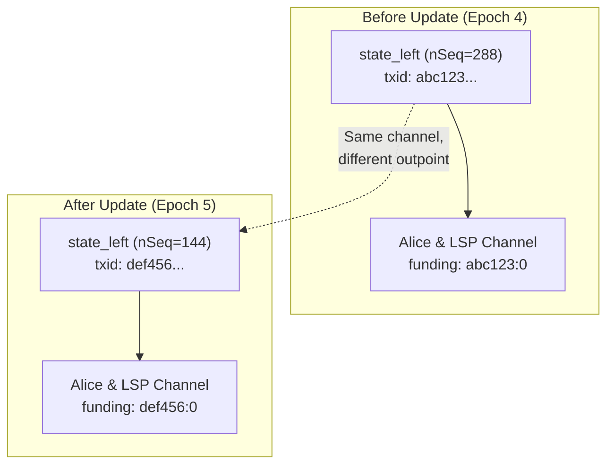
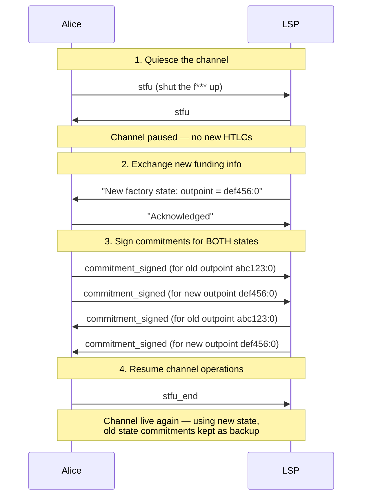

# Dual State Management

> **Summary**: When a factory updates state, the leaf channels must seamlessly transition from the old funding outpoint to the new one. During the transition, BOTH states are valid simultaneously. This is the same problem splicing solves — and it's critical infrastructure for SuperScalar, not optional.

## The Problem

When the [[the-odometer-counter|DW odometer]] ticks (a factory state update), the leaf state transactions change. This means the **funding outpoint** for each Lightning channel at the leaves changes too:



The channel balance is the same. Alice still has 150k sats. But the **transaction it's anchored to** has changed. The channel needs to work with BOTH outpoints during the transition — because either the old or new factory state could end up on-chain.

## Why This Is Critical

If the channel only knows about the new funding outpoint, but the OLD factory state ends up on-chain (e.g., during a force-close race), the channel's commitment transactions become **invalid** — they reference a txid that doesn't exist. Alice could lose her funds.

**Both states must be maintained until the transition is finalized.**

## How It Works

The process mirrors Lightning's existing **splicing** protocol:



### Step 1: Quiesce

The channel is paused using the `stfu` (Silence The Funding Uncertainty) message. No new HTLCs can be added while the transition is happening. This prevents race conditions where an HTLC is created on the old state but not the new one.

### Step 2: Exchange New Funding Info

The LSP (which coordinates the factory update) tells the channel participants what the new funding outpoint will be.

### Step 3: Sign Both States

This is the key insight: **commitment transactions are signed for BOTH the old and new funding outpoints.** The channel maintains two parallel commitment transaction sets:

```
Old state commitments:
  - Alice's commitment tx (spends abc123:0)
  - LSP's commitment tx (spends abc123:0)

New state commitments:
  - Alice's commitment tx (spends def456:0)
  - LSP's commitment tx (spends def456:0)
```

If a force-close happens and the OLD factory state ends up on-chain → old commitments work.
If the NEW factory state ends up on-chain → new commitments work.

### Step 4: Resume

Once both sides have valid commitments for both states, the channel resumes normal operation. New HTLCs use the new state's commitments.

## When Can Old State Be Dropped?

The old state commitments can be safely discarded when:

1. The new factory state is **fully signed** by all participants
2. The DW mechanism guarantees the new state will beat the old state on-chain
3. Or the old state's [[shachain-revocation|shachain secret]] has been shared (making old state economically unviable)

In practice, old state commitments are kept as backup until the factory lifetime ends or the next state update replaces them.

## Batched Commitment Signing

For efficiency, the dual state commitments are batched — both old and new state commitment signatures are sent in a single `commitment_signed` message with multiple signature entries. This avoids doubling the round-trip count.

## Relation to Splicing

| Aspect | Splicing | Factory Transition |
|--------|---------|-------------------|
| **What changes** | Funding outpoint (on-chain tx) | Funding outpoint (off-chain factory state) |
| **Dual state needed** | Yes — old/new splice | Yes — old/new factory state |
| **Quiesce required** | Yes | Yes |
| **Commitment signing** | Both outpoints | Both outpoints |
| **Resolution** | Splice tx confirms on-chain | DW mechanism resolves state |

The machinery is nearly identical. Existing splicing code in CLN, Eclair, and LDK can be **reused** for factory transitions with minimal modification.

## Implementation Priority

**Critical** — this is not an addon. Without dual state management, factory state updates would break leaf channels. Any SuperScalar implementation that supports state updates (Phase 1+) needs this.

For the current PoC, this is handled implicitly — the test framework signs all states in sequence and verifies the correct one ends up on-chain. For production, the full quiesce + dual-signing protocol is needed.

## Related Concepts

- [[splicing-integration]] — The analogous on-chain mechanism
- [[updating-state]] — What triggers the need for dual state management
- [[pluggable-factories]] — How this integrates with LN node software
- [[force-close]] — Why both states must be valid simultaneously
- [[the-odometer-counter]] — The state machine that drives transitions
