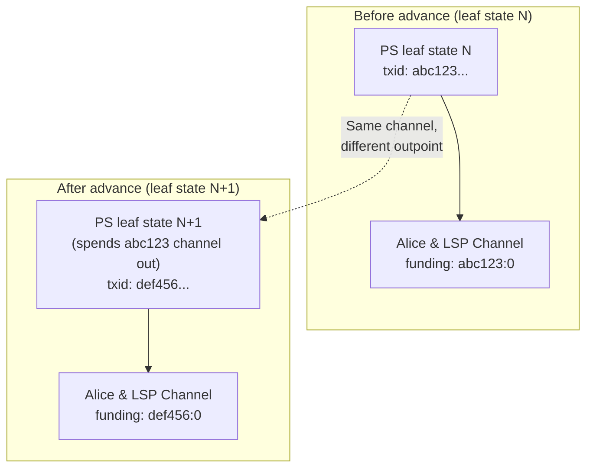
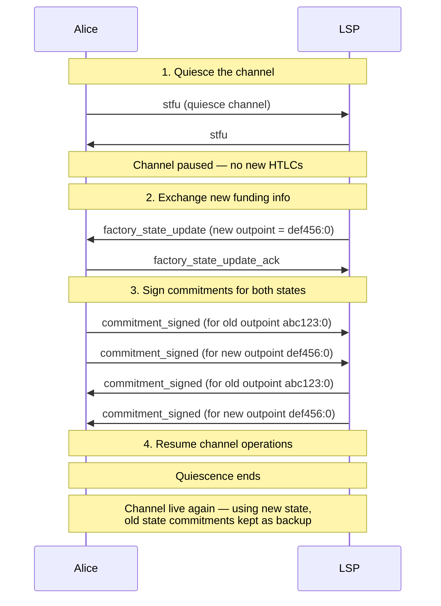

# Dual State Management

> **Summary**: When a leaf advances its state, its inner channel must transition from the old funding outpoint to the new one. During the transition, both states are valid simultaneously — the same problem splicing solves, applied to off-chain factory state.

## The Problem

When a leaf advances its [[pseudo-spilman-leaves|pseudo-Spilman chain]] (a per-leaf state advance — a rebalance, a splice, or a liquidity buy), the new leaf state transaction carries a **fresh channel output**. This means the **funding outpoint** for that leaf's inner Lightning channel changes:


```mermaid
graph TD
    subgraph "Before advance (leaf state N)"
        S1["PS leaf state N<br/>txid: abc123..."]
        S1 --> CH1["Alice & LSP Channel<br/>funding: abc123:0"]
    end

    subgraph "After advance (leaf state N+1)"
        S2["PS leaf state N+1<br/>(spends abc123 channel out)<br/>txid: def456..."]
        S2 --> CH2["Alice & LSP Channel<br/>funding: def456:0"]
    end

    S1 -.->|"Same channel,<br/>different outpoint"| S2
```

The channel balance is unchanged, but the funding outpoint it spends from has changed. The channel must maintain valid commitment transactions for both outpoints during the transition, since either the old or new leaf state could end up on-chain. (An interior restructure that re-publishes the tree path above a leaf has the same effect on the outpoint, but the common trigger is the per-leaf advance.)

## Failure Mode Without Dual State

If the channel only tracks the new funding outpoint but the old leaf state ends up on-chain (e.g., during a force-close race), the channel's commitment transactions become **invalid** — they reference an outpoint that was never published on-chain. Alice could lose her funds.

**Both states must be maintained until the transition is finalized.**

## How It Works

The process mirrors Lightning's existing **splicing** protocol:


```mermaid
sequenceDiagram
    participant A as Alice
    participant L as LSP

    Note over A,L: 1. Quiesce the channel
    A->>L: stfu (quiesce channel)
    L->>A: stfu
    Note over A,L: Channel paused — no new HTLCs

    Note over A,L: 2. Exchange new funding info
    L->>A: factory_state_update (new outpoint = def456:0)
    A->>L: factory_state_update_ack

    Note over A,L: 3. Sign commitments for both states
    A->>L: commitment_signed (for old outpoint abc123:0)
    A->>L: commitment_signed (for new outpoint def456:0)
    L->>A: commitment_signed (for old outpoint abc123:0)
    L->>A: commitment_signed (for new outpoint def456:0)

    Note over A,L: 4. Resume channel operations
    Note over A,L: Quiescence ends
    Note over A,L: Channel live again — using new state,<br/>old state commitments kept as backup
```

### Step 1: Quiesce

The channel is paused using the `stfu` message (BOLT #2, `option_quiesce`). No new HTLCs can be added while the transition is happening. This prevents race conditions where an HTLC is created on the old state but not the new one.

### Step 2: Exchange New Funding Info

The LSP (which coordinates the factory update) tells the channel participants what the new funding outpoint will be.

### Step 3: Sign Both States

Both parties sign commitment transactions for each funding outpoint. The channel maintains two parallel commitment transaction sets:

```
Old state commitments:
  - Alice's commitment tx (spends abc123:0)
  - LSP's commitment tx (spends abc123:0)

New state commitments:
  - Alice's commitment tx (spends def456:0)
  - LSP's commitment tx (spends def456:0)
```

This ensures the channel remains valid regardless of which factory state is published on-chain.

### Step 4: Resume

Once both commitment sets are exchanged, the channel resumes normal operation. New HTLCs are routed against the new state's commitments; old state commitments are retained as fallback.

## When Can Old State Be Dropped?

The old state commitments can be safely discarded when:

1. The new leaf state TX is **fully co-signed** (1 client + LSP). Because each [[pseudo-spilman-leaves|pseudo-Spilman]] state spends the prior state's channel output, the new state **structurally supersedes** the old one — the old state's channel output is already spent, so it can no longer put a competing funding outpoint on-chain.
2. The matching pre-signed [[l-stock-redistribution|redistribution TX]] for the new state has been co-signed, so if the LSP ever publishes the old leaf state, its liquidity stock is clawed back to clients.

Both conditions are satisfied simultaneously during a state advance (the redistribution TX is co-signed in the same ceremony). In practice, old-state commitment sets are retained until the next state advance replaces them. Note this is leaf-level **structural ordering plus L-stock redistribution — not revocation**: the factory/leaf state itself has no revocation secret. Revocation applies only to the inner BOLT-2 channel (see [[shachain-revocation]]).

## Batched Commitment Signing

For efficiency, the dual state commitments can be batched — old and new state commitment signatures are exchanged in the same round-trip, as shown in step 3 above. Each side sends a `commitment_signed` for each outpoint, but these messages can be pipelined to avoid additional round-trips.

## Relation to Splicing

| Aspect | Splicing | Factory Transition |
|--------|---------|-------------------|
| **What changes** | Funding outpoint (on-chain tx) | Funding outpoint (off-chain factory state) |
| **Dual state needed** | Yes — old/new splice | Yes — old/new factory state |
| **Quiesce required** | Yes | Yes |
| **Commitment signing** | Both outpoints | Both outpoints |
| **Resolution** | Splice tx confirms on-chain | PS chain ordering at the leaf + [[l-stock-redistribution]] (unilateral); cooperative close otherwise |

The machinery is conceptually similar. Existing splicing implementations in CLN, Eclair, and LDK demonstrate the dual-state pattern, though factory transitions differ in that the funding outpoint changes off-chain rather than via an on-chain transaction.

## Implementation

Dual state management is required for leaf state advances — without it, extending a leaf's pseudo-Spilman chain (which moves the channel to a new funding outpoint) would invalidate the inner channel's existing commitment transactions. The implementation signs commitment transactions for both the old and new funding outpoints during every state advance, and the test suite verifies that the correct state resolves on-chain regardless of which leaf state is published.

## Related Concepts

- [[splicing-integration]] — The analogous on-chain mechanism
- [[updating-state]] — What triggers the need for dual state management
- [[pseudo-spilman-leaves]] — The leaf chain whose advance moves the channel's funding outpoint
- [[l-stock-redistribution]] — Protects the old state's L-stock if the LSP ever publishes it
- [[force-close]] — Why both states must be valid simultaneously
