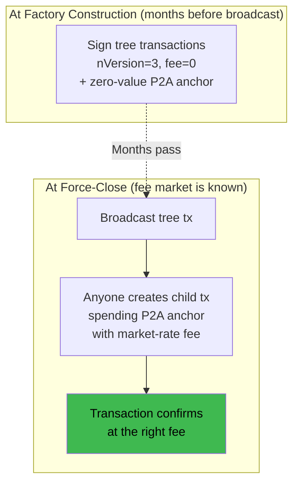

# Ephemeral Anchors & v3 Transactions

> **Summary**: Pay-to-Anchor (P2A) is the mechanism that made SuperScalar practical. It lets anyone fee-bump a pre-signed factory transaction at broadcast time, solving the fee-commitment problem inherent in multi-party off-chain protocols.

## Why This Matters

Multi-party off-chain protocols have a fundamental tension: transactions are signed **cooperatively** during factory construction, but they might not be **broadcast** until months later during a force-close. Before ephemeral anchors, every participant needed their own anchor output for fee-bumping, which bloated transactions and didn't scale. The alternative — baking fees in at signing time — meant guessing the future fee market.

P2A addresses this with a single anyone-can-spend anchor output that lets any party attach a fee-bumping child transaction at broadcast time:

> *"P2A handled the issues I had with Decker-Wattenhofer — in particular, the difficulty of having either exogenous fees (without P2A, you need every participant to have its own anchor output) or mutable endogenous fees."*

## The Three Components

All three are **live on Bitcoin mainnet**:

### 1. TRUC / v3 Transactions (Bitcoin Core 28.0, October 2024)

A new transaction version (`nVersion=3`) with mempool relay policy rules:
- Max 1 unconfirmed parent allowed
- Max 1 unconfirmed child allowed
- Child limited to 1,000 vB; parent limited to 10,000 vB

These constraints prevent transaction pinning attacks.

### 2. Pay-to-Anchor (P2A) Outputs (Bitcoin Core 28.0, October 2024)

A standard **anyone-can-spend** anchor output: `OP_1 <0x4e73>`. Any party can spend this output to attach a CPFP child transaction, replacing the per-participant anchor pattern with a single shared output.

### 3. Ephemeral Dust Exemption (Bitcoin Core 29.0, April 2025)

Normally, outputs below the dust limit (~546 sats) are rejected by the mempool. The ephemeral dust rule exempts dust outputs in zero-fee v3 transactions, provided the dust output is spent by a child in the same package. This allows the P2A anchor to carry **zero sats**, deferring fee payment entirely to the CPFP child at broadcast time.

## How It Works Together

## Why P2A Was the Missing Piece

P2A eliminated both failure modes described above — per-participant anchors and fee estimation at signing time — with a single anyone-can-spend output. This is what made Decker-Wattenhofer viable as a building block for SuperScalar.

## Package Relay

Related to v3/TRUC: **package relay** lets you submit a parent and child transaction together to the mempool as a single unit. This is critical because a zero-fee parent transaction would normally be rejected — package relay evaluates the combined feerate of parent+child.

Deployed in Bitcoin Core 28.0 alongside TRUC.

## What Needs to Change in the Code (Illustrative)

| Current | Target |
|---------|--------|
| `nVersion=2` in tx_builder.c | `nVersion=3` |
| `fee_per_tx = 500` in factory.c | `fee = 0` |
| No anchor outputs | Add P2A output to each tree transaction |
| No CPFP logic | Add child transaction builder for fee bumping |

## Related Concepts

- [[transaction-structure]] — Transaction format (design specification)
- [[force-close]] — When tree transactions actually get broadcast
- [[building-a-factory]] — When tree transactions get signed
- [[research-horizon]] — Other future improvements
