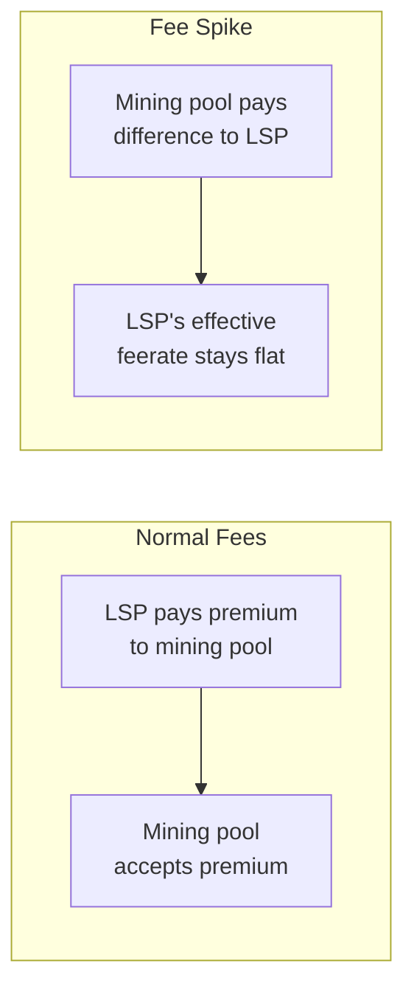

# Onchain Feerate Futures

> **Summary**: An LSP operating SuperScalar factories can negotiate feerate futures with miners to hedge against fee spikes. This is an economy-of-scale advantage unavailable to individual users — the LSP absorbs fee volatility on behalf of its clients, enabling predictable monthly service fees.

## The Problem: Fee Volatility

SuperScalar minimizes on-chain transactions through [[laddering|laddered factory rotation]] and offchain liquidity reallocation. But some on-chain activity is unavoidable:

- **Factory funding transactions** (one per ladder rung, roughly daily)
- **JIT channel fallbacks** when offchain liquidity reallocation fails (see [[jit-channel-fallbacks]])
- **Unilateral exits** from uncooperative clients or LSP-initiated force-closes

Each of these operations is subject to the prevailing mempool feerate. A fee spike during factory construction or forced exit can make the operation significantly more expensive than budgeted.

For individual Lightning users, fee spikes are unpredictable and unhedgeable. For an LSP operating at scale, they are a **manageable business risk**.

## The Mechanism: Feerate Futures

ZmnSCPxj identified this as a structural advantage of the LSP model:

> *"The LSP can negotiate onchain feerate futures with miners. The effect is that it can experience somewhat flatter feerates... If there's a spike, it doesn't see that spike much because it's going to earn money from that spike, at the cost of, if things are always low, then it's constantly paying to the miners."* — ZmnSCPxj, Bitcoin Optech Deep Dive (Oct 2024)

A feerate future is a contract between the LSP and a mining pool:



The LSP pays a steady premium to the mining pool during low-fee periods. During fee spikes, the mining pool compensates the LSP for the difference between the contracted rate and the actual rate. The LSP's effective feerate is smoothed across time.

## Why This Only Works at Scale

| Participant | Can Hedge? | Reason |
|------------|-----------|--------|
| **Individual user** | No | Too small to negotiate with miners; unpredictable transaction timing |
| **LSP with 10 factories** | Marginal | Predictable transaction schedule but low volume |
| **LSP with 1,000+ factories** | Yes | Predictable daily transaction volume; worth a miner's counterparty risk |

The LSP's transaction schedule is **predictable by design**: laddering produces a roughly constant number of factory funding transactions per day. This predictability is exactly what a mining pool needs to price a futures contract.

## How It Affects Client Pricing

With feerate hedging, the LSP can offer clients a **fixed monthly fee** for factory participation, regardless of actual on-chain conditions during that month:

```
Monthly fee = amortized UTXO cost
            + liquidity provision cost
            + feerate futures premium (smoothed)
            + margin
```

Without hedging, the LSP would need to either:
- Overcharge during low-fee periods to build a buffer (inefficient)
- Pass fee spikes through to clients (unpredictable UX)
- Absorb spikes and risk insolvency (unsustainable)

> *"Our hope is that the fallback of doing a JIT channel onchain is rare enough that even if it happens during a fee spike, we can swallow this additional cost and present to the user, 'Hey, each month you need to pay us this constant fee.'"* — ZmnSCPxj

## Relationship to SuperScalar Design Goals

Feerate futures are not a protocol mechanism — they are an **operational strategy** enabled by SuperScalar's architecture. The connection is structural:

1. **Laddering** produces predictable, regular on-chain transactions → hedgeable
2. **Offchain liquidity reallocation** reduces the number of unplanned on-chain transactions → smaller variance to hedge
3. **Single-LSP design** concentrates transaction volume → sufficient scale for futures contracts
4. **Timeout-sig-trees** with [[timeout-sig-trees|inverted defaults]] place unilateral exit costs on the LSP → the LSP has direct incentive to hedge

A P2P factory design without a coordinating LSP could not achieve this. Each participant's transaction timing would be independent and unpredictable, making futures contracts impractical.

## Current Status

- **No standard market** for onchain feerate futures exists today
- **Conceptually straightforward**: analogous to commodity futures in traditional finance
- Mining pools like Ocean, Foundry, or AntPool could offer bilateral contracts
- Hashrate futures (already traded on some platforms) are a related primitive

The mechanism becomes relevant when LSP-scale SuperScalar deployments create sufficient and predictable on-chain transaction volume to justify counterparty engagement from mining pools.

## Related Concepts

- [[what-is-an-lsp]] — The entity that would negotiate feerate futures
- [[laddering]] — Creates the predictable transaction schedule that makes hedging viable
- [[jit-channel-fallbacks]] — The fallback operation most affected by fee spikes
- [[ephemeral-anchors]] — P2A fee-bumping that feerate futures would hedge
- [[force-close]] — Unilateral exit costs that feerate futures help absorb
