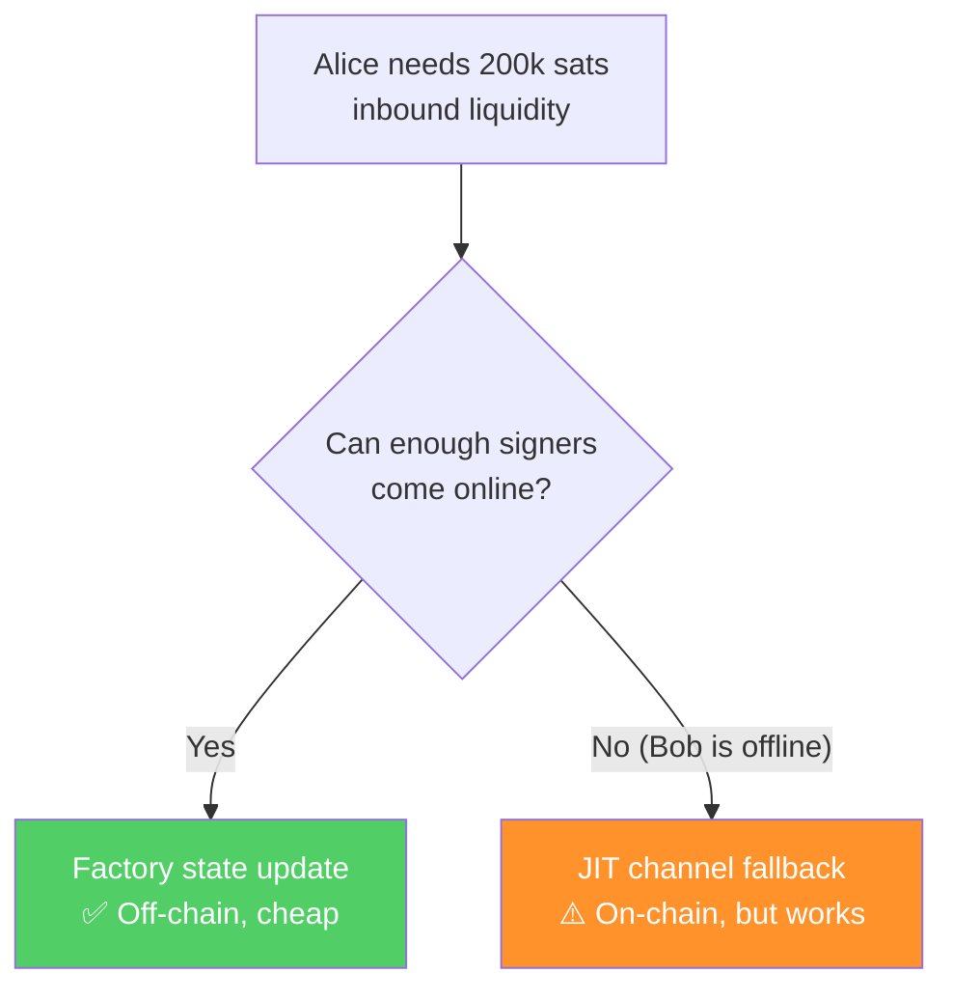
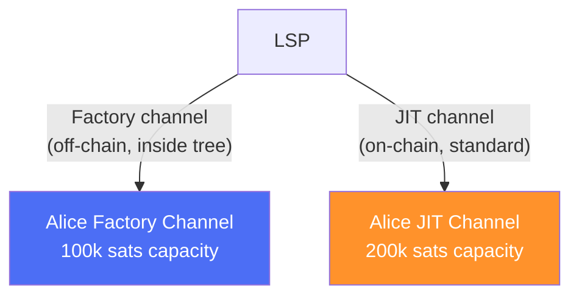

# JIT Channel Fallbacks

> **TLDR**: When a factory can't rebalance liquidity off-chain (because too many clients are offline), the LSP falls back to opening a standard on-chain "Just-In-Time" channel for the client. The client then has two channels — one in the factory, one on-chain — and uses local multipath routing to handle large payments across both.

## The Problem

SuperScalar's factory updates require multiple participants to be online simultaneously (see [[updating-state]]). If the LSP needs to provide inbound liquidity to Alice but can't wake up enough of her co-signers:



The off-chain path is always preferred — it's free. But when it fails, the LSP shouldn't just tell Alice "sorry, can't serve you." It opens a standard on-chain channel instead.

## How JIT Channels Work

JIT (Just-In-Time) channels are already used by LSPs today. When a payment is incoming for a client who doesn't have enough inbound capacity:

1. LSP intercepts the incoming HTLC
2. LSP opens a new channel on-chain to the client
3. Payment is forwarded through the new channel
4. Client receives the payment without any manual action

In the SuperScalar context, the JIT channel is opened **alongside** the existing factory channel:



## The Multipath Routing Challenge

With two channels to the same client, a new problem appears: what if a payment is **too large for either channel alone** but fits their combined capacity?

```
Factory channel: 100k sats capacity
JIT channel:     200k sats capacity
Incoming payment: 250k sats  ← too big for either alone!
```

**Solution: Local multipath splitting.** The LSP splits the HTLC across both channels:


ZmnSCPxj noted this requires protocol-level support:

> *"Another difficulty here is again, as a fallback, if you can't wake up enough of the clients to move liquidity from one of them to another, then the LSP still needs to do a JIT channel onchain... so it has to split that HTLC across those two channels."* — ZmnSCPxj, Bitcoin Optech podcast (Oct 2024)

## When JIT Fallback Is Triggered

| Situation | Preferred Path | Fallback |
|-----------|---------------|----------|
| Alice needs more inbound, Bob is online | Factory state update (off-chain) | — |
| Alice needs more inbound, Bob is offline | — | JIT channel (on-chain) |
| Large incoming payment, single channel insufficient | — | Multipath across factory + JIT |
| Factory is in dying period | — | JIT or migration to new factory |
| Factory DW counter exhausted | — | JIT until new factory is created |

## The Economic Trade-off

| Metric | Factory Update | JIT Channel |
|--------|---------------|-------------|
| On-chain cost | **Zero** | 1 on-chain tx |
| Speed | Seconds (signing round) | 10+ minutes (confirmation) |
| Capital efficiency | Shared UTXO | Dedicated UTXO |
| Coordination required | Multiple signers | Just LSP + client |

JIT channels are expensive but reliable. They're the safety net that ensures the LSP can **always** serve clients, even when the factory can't help.

## Impact on Scaling

The whole point of SuperScalar is to **reduce** the number of on-chain UTXOs. JIT fallbacks work against this goal. The expected number of channels per client becomes:

```
Expected channels = 1 (factory) + FRACTION × 1 (JIT)
```

Where `FRACTION` is the probability that a JIT fallback is needed. If the factory works well (clients are online, state updates are smooth), `FRACTION` is low and the scaling benefit holds.

If `FRACTION` approaches 100% (factories constantly failing), the system degrades to "just regular Lightning channels" — which is still functional, just not as scalable.

## Implementation Priority

**Addon for production robustness, not needed for PoC.** For initial testnet deployment:

- Assume all participants are online and cooperative (happy path)
- Factory state updates always succeed
- No JIT fallback needed

For production LSP deployment:
- Essential safety net for real-world conditions
- Prevents payment failures when factory operations stall
- Can leverage existing JIT channel code from LSP implementations (e.g., LDK-node, CLN plugins)

## Related Concepts

- [[updating-state]] — The off-chain path that JIT replaces when it fails
- [[pluggable-factories]] — How JIT channels coexist with factory channels in LN software
- [[what-is-an-lsp]] — The service provider that manages both channel types
- [[laddering]] — Factory lifecycle events that may trigger JIT fallbacks
- [[dual-state-management]] — Needed when factory + JIT channels coexist
