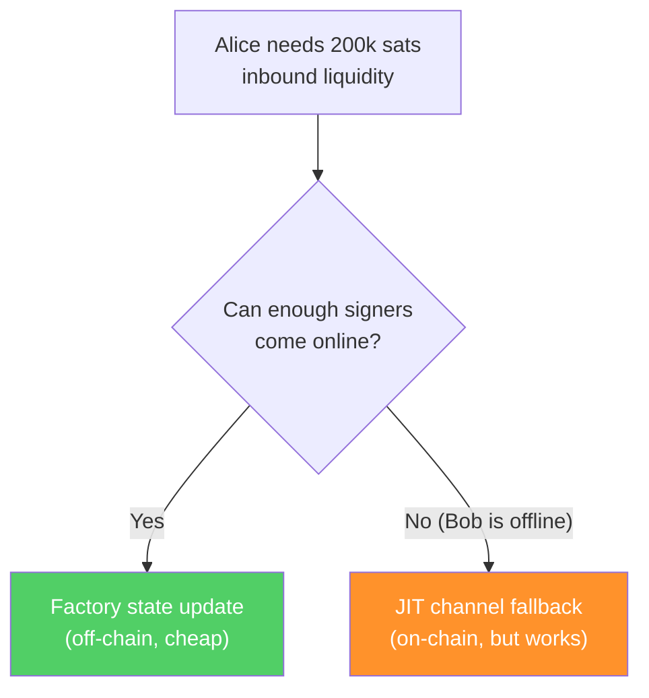
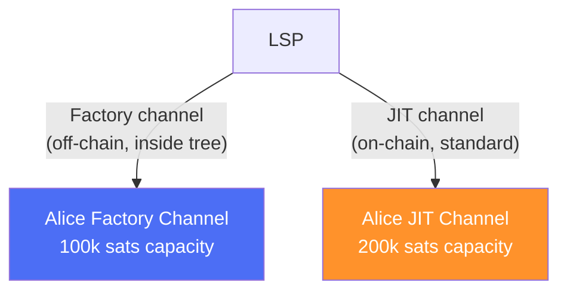
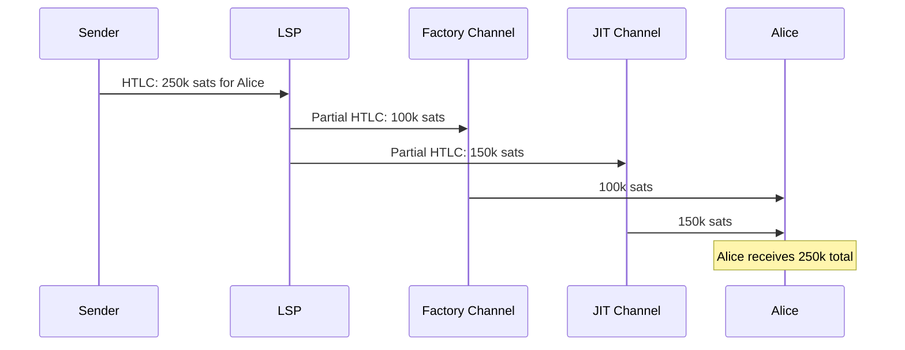

# JIT Channel Fallbacks

> **Summary**: When a factory can't rebalance liquidity off-chain (because too many clients are offline), the LSP falls back to opening a standard on-chain "Just-In-Time" channel for the client. The client then has two channels — one in the factory, one on-chain — and uses local multipath routing to handle large payments across both.

## The Problem

SuperScalar's factory updates require multiple participants to be online simultaneously (see [[updating-state]]). If the LSP needs to provide inbound liquidity to Alice but can't wake up enough of her co-signers:

The off-chain path is preferred — it costs nothing on-chain. When it fails, the LSP opens a standard on-chain channel instead.

## How JIT Channels Work

JIT channels — where the LSP intercepts an incoming HTLC and opens an on-chain channel to forward it through — are standard LSP infrastructure. In the SuperScalar context, the JIT channel is opened **alongside** the existing factory channel:

## The Multipath Routing Challenge

With two channels to the same client, a payment may exceed either channel's individual capacity but fit their combined capacity. The LSP handles this with **local multipath splitting**, splitting the HTLC across both channels:

ZmnSCPxj noted this requires protocol-level support:

> *"Another difficulty here is again, as a fallback, if you can't wake up enough of the clients to move liquidity from one of them to another, then the LSP still needs to do a JIT channel onchain... so it has to split that HTLC across those two channels."* — ZmnSCPxj, Bitcoin Optech podcast (Oct 2024)

## When JIT Fallback Is Triggered

| Situation | Preferred Path | Fallback |
|-----------|---------------|----------|
| Alice needs more inbound, Bob is online | Factory state update (off-chain) | — |
| Alice needs more inbound, Bob is offline | — | JIT channel (on-chain) |
| Large incoming payment, single channel insufficient | — | Multipath across factory + JIT |
| Factory is in [[laddering|dying period]] | — | JIT or migration to new factory |
| Factory Decker-Wattenhofer counter exhausted | — | JIT until new factory is created |

## The Economic Trade-off

| Metric | Factory Update | JIT Channel |
|--------|---------------|-------------|
| On-chain cost | None (per-update) | 1 on-chain tx |
| Speed | Seconds (signing round) | Seconds (zero-conf) to 10+ min (confirmed) |
| Capital efficiency | Shared UTXO | Dedicated UTXO |
| Coordination required | Multiple signers | Just LSP + client |

JIT channels cost an on-chain transaction but require only bilateral coordination. They provide a fallback path when factory state updates are blocked by offline co-signers.

## Impact on Scaling

SuperScalar's scaling advantage comes from sharing a single on-chain UTXO across many clients. Each JIT fallback adds a dedicated on-chain UTXO, partially negating this benefit. The aggregate impact depends on the fallback rate: if factory state updates succeed for most clients most of the time, the per-client UTXO footprint remains close to the shared-factory ideal. If fallbacks are frequent, the system converges toward conventional per-client Lightning channels.

## Implementation Priority

**Required for production; not needed for testnet proof-of-concept.** For initial testnet deployment:

- Assume all participants are online and cooperative (happy path)
- Factory state updates always succeed
- No JIT fallback needed

For production LSP deployment:
- Essential safety net for real-world conditions
- Prevents payment failures when factory operations stall
- Can leverage existing JIT channel code from LSP implementations (e.g., LDK-node, CLN plugins)

## Related Concepts

- [[updating-state]] — The off-chain state update path; JIT channels serve as a fallback when this path is unavailable
- [[pluggable-factories]] — How JIT channels coexist with factory channels in LN software
- [[what-is-an-lsp]] — Who coordinates factories and channels
- [[laddering]] — Factory lifecycle events that may trigger JIT fallbacks
- [[dual-state-management]] — Handling concurrent validity of old and new factory states, which becomes more operationally sensitive when JIT channels are also active
