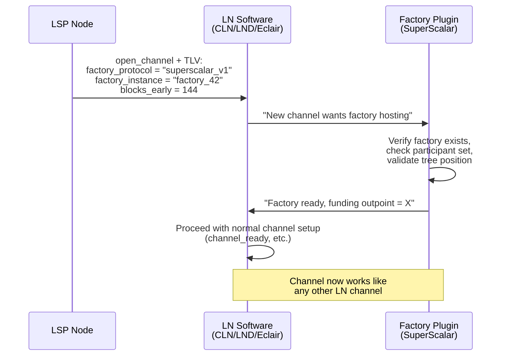
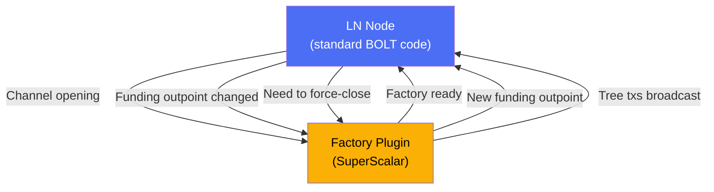
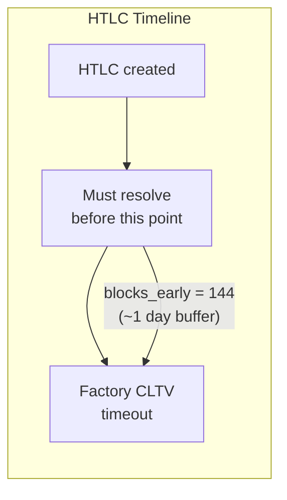

# Pluggable Channel Factories

> **Summary**: A proposed protocol extension that lets SuperScalar (and other factory designs) plug into existing Lightning Network software without forking the entire stack. New TLV fields during channel opening tell the LN node "this channel lives inside a factory" and a plugin handles the factory-specific logic.

## The Problem

Existing Lightning implementations (CLN, LND, Eclair, LDK) have years of battle-tested code for managing channels, forwarding HTLCs, handling fees, and enforcing timelocks. SuperScalar introduces a new **layer underneath** — the factory tree — but the channels at the leaves should work exactly like normal Lightning channels.

Rewriting all that channel code from scratch would be impractical. Instead: **make factories pluggable**.

## The Proposal

ZmnSCPxj proposed this in a November 2024 Delving Bitcoin thread and detailed it on the Bitcoin Optech podcast:

> *"What I'm planning to propose is that we have some kind of pluggable factory concept... add a Type-Length-Value (TLV) that says, 'Hey, this is the protocol that we are using and this is an identifier that specifies which instance of this protocol we are actually using'."* — ZmnSCPxj

## How It Would Work

### The New TLV Fields

Added to the `open_channel` message:

| Field | Purpose |
|-------|---------|
| `factory_protocol` | Identifies which factory type (e.g., `superscalar_v1`) |
| `factory_instance` | Points to a specific factory (e.g., a unique ID) |
| `blocks_early` | How many blocks before factory timeout to force-close HTLCs |

### The Plugin Interface

The factory plugin handles all factory-specific logic:

**What the LN node handles**: Standard channel operations — commitment transactions, HTLC forwarding, fee negotiation, invoice generation, routing.

**What the plugin handles**: Factory tree construction, MuSig2 signing ceremonies, DW state management, timeout-sig-tree scripts, laddering lifecycle.

## The `blocks_early` Parameter

This is critical for safety. Factory-hosted channels have an extra constraint: all HTLCs must resolve **before the factory's CLTV timeout expires**. If an HTLC is still pending when the factory times out, the LSP's timeout path could claim funds that should go to the client.

The `blocks_early` count is added to the channel's `min_final_cltv_expiry_delta` in BOLT11 invoices, ensuring HTLCs always have enough time to resolve before the factory expires.

## Implementation Priority for the PoC

**Addon, not critical for initial testnet deployment.** The pluggable architecture is about integration with existing LN software — it's the path from "working PoC" to "production LSP deployment."

For the PoC:
- Factory logic can be hardcoded directly
- Channel operations can be simplified
- No need for TLV extensions or plugin APIs

For production:
- Pluggable architecture lets LSPs run SuperScalar alongside standard channels
- Multiple factory types could coexist (SuperScalar, future designs)
- Battle-tested LN code handles the channel layer

## Current Status

- **Proposed**: By ZmnSCPxj on Delving Bitcoin (Nov 2024)
- **Implemented**: Nowhere — no public code exists
- **Depends on**: Working factory implementation (which this project provides)

The pluggable factory protocol can't exist without a factory to plug in. This implementation is the foundation that makes pluggable factories possible.

## Related Concepts

- [[dual-state-management]] — How factory transitions integrate with channel state
- [[splicing-integration]] — Shares the "funding outpoint changes" mechanic
- [[jit-channel-fallbacks]] — The fallback when factory operations fail
- [[factory-tree-topology]] — The factory structure the plugin would manage
