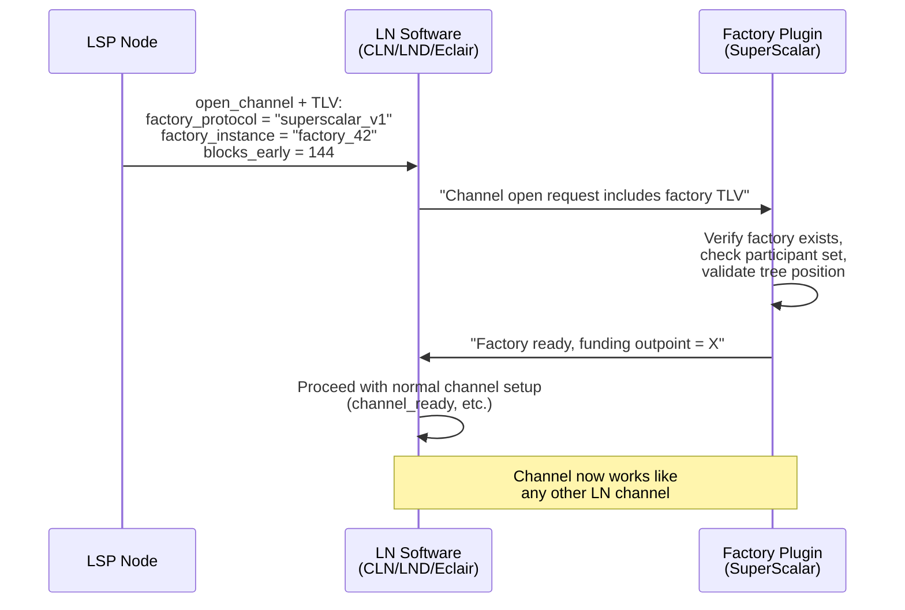
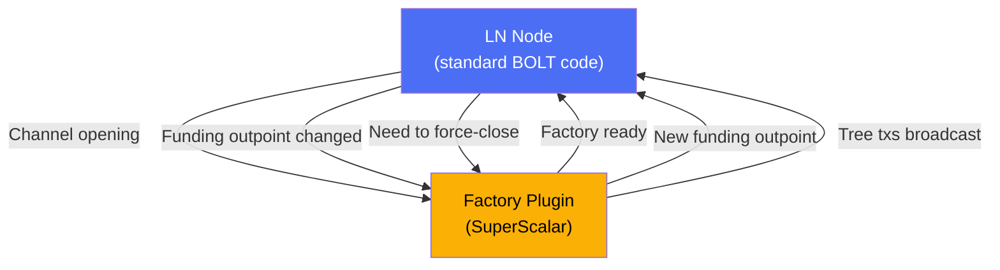
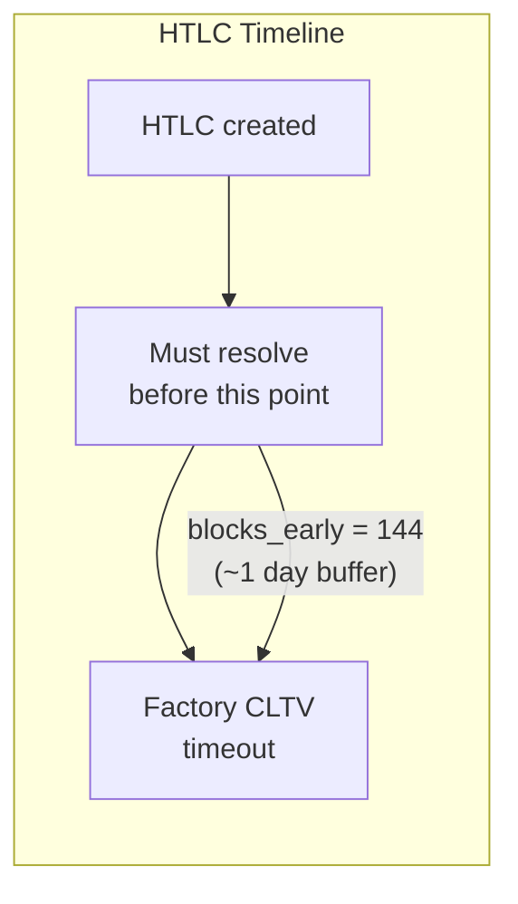

# Pluggable Channel Factories

> **Summary**: A proposed protocol extension that lets SuperScalar (and other factory designs) integrate with existing Lightning Network implementations through new TLV fields and a plugin interface, rather than requiring deep modifications to channel-management code.

## The Problem

Existing Lightning implementations (CLN, LND, Eclair) and toolkits (LDK) already handle channel management, HTLC forwarding, fee negotiation, and timelock enforcement. SuperScalar introduces a new **layer underneath** — the factory tree — but the channels at the leaves should work exactly like normal Lightning channels.

The pluggable factory proposal keeps factory logic separate from channel logic, allowing implementations to add factory support through their existing extension mechanisms.

## The Proposal

ZmnSCPxj introduced the concept on Delving Bitcoin in October 2024 and elaborated on the Bitcoin Optech podcast:

> *"What I'm planning to propose is that we have some kind of pluggable factory concept... add a Type-Length-Value (TLV) that says, 'Hey, this is the protocol that we are using and this is an identifier that specifies which instance of this protocol we are actually using'."* — ZmnSCPxj

## How It Would Work

### The New TLV Fields

Added to the `open_channel` message:

| Field | Purpose |
|-------|---------|
| `factory_protocol` | Identifies which factory type (e.g., `superscalar_v1`) |
| `factory_instance` | Points to a specific factory (e.g., a unique ID) |
| `blocks_early` | How many blocks before factory timeout to force-close HTLCs |

### The Plugin Interface

The factory plugin handles all factory-specific logic:

**What the LN node handles**: Standard channel operations — commitment transactions, HTLC forwarding, fee negotiation, invoice generation, routing.

**What the plugin handles**: Factory tree construction, MuSig2 signing ceremonies, Decker-Wattenhofer state management, timeout-sig-tree scripts, laddering lifecycle.

## The `blocks_early` Parameter

This is critical for safety. Factory-hosted channels have an extra constraint: all HTLCs must resolve **before the factory's CLTV timeout expires**. If an HTLC is still pending when the factory times out, the LSP can exercise the timeout path and sweep the factory output, forfeiting any in-flight HTLC value that should have resolved in the client's favor.

The `blocks_early` value inflates both the `min_final_cltv_expiry` in BOLT 11 invoices (for the final hop) and the `cltv_expiry_delta` announced in `channel_update` messages (for routing), ensuring all HTLCs resolve before the factory's CLTV timeout.

## Implementation Priority for the PoC

**Addon, not critical for initial testnet deployment.** The pluggable architecture is about integration with existing LN software — it's the path from "working PoC" to "production LSP deployment."

For the PoC:
- Factory logic can be hardcoded directly
- Channel operations can be simplified
- No need for TLV extensions or plugin APIs

For production:
- Pluggable architecture lets LSPs run SuperScalar alongside standard channels
- Multiple factory types could coexist (SuperScalar, future designs)
- Existing LN implementations handle the channel layer unchanged

## Current Status

- **Proposed**: By ZmnSCPxj on Delving Bitcoin (Oct 2024)
- **Implemented**: Nowhere — no public code exists
- **Depends on**: A working factory implementation

## Related Concepts

- [[dual-state-management]] — How factory transitions integrate with channel state
- [[splicing-integration]] — Shares the "funding outpoint changes" mechanic
- [[jit-channel-fallbacks]] — The fallback when factory operations fail
- [[factory-tree-topology]] — The factory structure the plugin would manage
