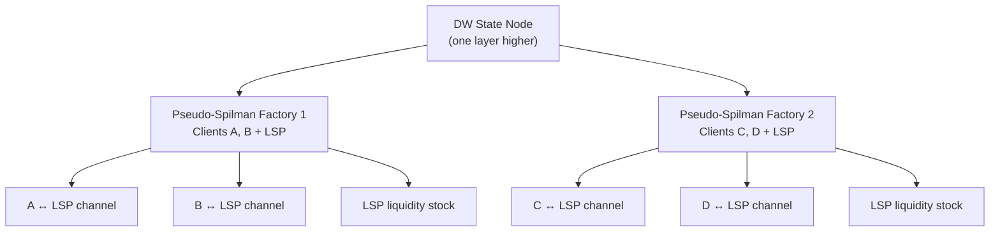
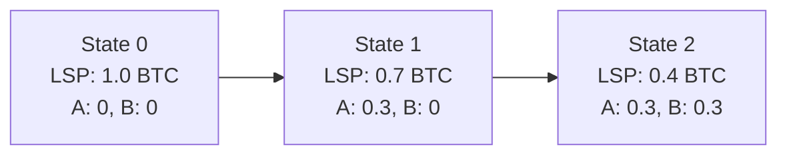

# Pseudo-Spilman Leaves

> **Summary**: An alternative leaf design that replaces one layer of Decker-Wattenhofer with a simpler unidirectional construct. Each "wide leaf" groups four clients under two pseudo-Spilman factories, reducing the total DW depth and shortening the CLTV delta imposed on public-network HTLCs.

## The Base Design vs This Refinement

The current SuperScalar prototype uses **pure Decker-Wattenhofer all the way down** — every level of the [[factory-tree-topology|factory tree]] is a DW layer, and the leaves are standard 2-of-2 Poon-Dryja channels. This is simpler to implement and is what the prototype builds.

Pseudo-Spilman leaves are an **optional optimization** proposed two months after the original design. The prototype does not use them. They become relevant if CLTV budget constraints prove to be a real bottleneck in production.

## The Problem with Deep DW Trees

Every DW layer adds a relative timelock (via [[what-is-nsequence|nSequence]]) that accumulates from root to leaf. This total delay directly inflates the `min_final_cltv_expiry_delta` that clients must advertise on the public network.

For a 3-layer DW tree with ~3 days per layer, the total DW-imposed delay is ~9 days — consuming most of the typical 2-week CLTV budget and limiting the number of hops an HTLC can traverse before reaching the client.

### Why this matters concretely

Every HTLC routed through the Lightning Network needs a CLTV budget — time for each hop to claim or refund the payment. The BOLT spec allows roughly 2 weeks total. If the factory's internal DW layers eat 9 of those 14 days, only 5 days remain for the rest of the route. That means fewer hops, which means the client must be well-connected (typically 1-2 hops from the LSP to the destination). Removing one DW layer frees ~3 days of CLTV budget, allowing more routing flexibility.

## The Refinement: Wide Leaves

ZmnSCPxj proposed replacing the lowest DW layer with a **pseudo-Spilman channel factory** — a simpler construct that doesn't require decrementing nSequence timelocks.

In an arity-2 tree, each wide leaf contains:

- **4 clients** (instead of 2)
- **2 pseudo-Spilman factories** (each serving 2 clients + LSP)
- **1 fewer DW layer** than the base design

## What Is a Pseudo-Spilman Factory?

A standard Spilman channel is **unidirectional**: one party funds it, the other receives increasing payments over time. It terminates when the funder's balance reaches zero or a timeout expires.

The pseudo-Spilman variant adapts this for multi-party liquidity distribution:

1. The LSP starts with a liquidity stock allocation for a group of clients.
2. New states are **chained on top** of old states (appended, not replaced). Each state transaction spends the output of the previous one.
3. The LSP distributes liquidity to clients by signing new state transactions that increase client channel capacities and decrease the LSP's remaining stock.

### Why "Pseudo"?

Unlike a true Spilman channel, the pseudo-Spilman doesn't rely on `nLockTime` for ordering. Instead, transactions are simply chained — state 1 spends state 0's output, state 2 spends state 1's output. Publishing state 0 forces state 1 to also be published (since state 1's input is state 0's output), and so on. The chain is self-ordering without requiring timelocks.

The trade-off: every state update adds another transaction to the unilateral-exit chain. If there have been K updates, force-close requires publishing K transactions for that leaf.

## How It Compares to Pure DW Leaves

| Property | DW at Leaves | Pseudo-Spilman at Leaves |
|----------|-------------|-------------------------|
| **DW layers removed** | 0 | 1 |
| **CLTV delta reduction** | — | ~3 days (one fewer nSequence layer) |
| **Clients per leaf** | 2 | 4 |
| **Signers for leaf update** | 3 (2 clients + LSP) | 3 (2 clients in one PS factory + LSP) |
| **Unilateral exit cost** | Fixed (one tx per DW layer) | Grows with updates (K txs per PS leaf) |
| **Direction** | Bidirectional (DW supports any reallocation) | Unidirectional (LSP → clients only) |

## The Core Difference: Replace vs Append

This is the key distinction between DW and pseudo-Spilman at the leaves:

**Decker-Wattenhofer** uses decrementing nSequence to **replace** old states. State 5 has a shorter delay than state 4, so it confirms first. Only the latest state hits the chain during force-close. The cost: each replacement consumes one nSequence tick, and the total delay across all ticks adds to the CLTV budget.

**Pseudo-Spilman** doesn't replace anything — it **appends**. State 1 spends state 0's output. State 2 spends state 1's output. There's no timelock race because the chain is structurally ordered: you can't publish state 2 without state 1 already being on-chain. No nSequence needed, so no CLTV cost.

The trade-off is direct:
- **DW**: Fixed force-close size, but eats CLTV budget
- **Pseudo-Spilman**: Zero CLTV cost, but force-close grows by one transaction per state update

In practice, the number of leaf updates is bounded by the factory's lifetime — a 30-day factory with infrequent liquidity purchases may only accumulate a handful of pseudo-Spilman states, keeping the force-close chain short.

## Old State Poisoning Protection

When the LSP signs a new pseudo-Spilman state, the old state's liquidity stock output must be protected against replay. The same [[shachain-revocation|shachain-based punishment]] used elsewhere in the factory applies here: clients hold a revealed secret for the old state and can burn the LSP's liquidity stock to miner fees if the LSP attempts to settle at an outdated state.

## When to Use Which Design

The choice between pure DW leaves and pseudo-Spilman leaves depends on deployment priorities:

- **CLTV budget is tight** (many routing hops needed) → pseudo-Spilman leaves
- **Minimal force-close footprint** is the priority → pure DW leaves
- **Leaf updates are infrequent** (clients rarely buy liquidity) → pseudo-Spilman is cheap
- **Leaf updates are frequent** (active liquidity market) → pure DW leaves avoid chain growth

ZmnSCPxj presented pseudo-Spilman leaves as a refinement for mobile-first deployments where the CLTV delta reduction matters more than worst-case force-close size.

## Current Status

- **Proposed**: By ZmnSCPxj on Delving Bitcoin (November 4, 2024)
- **Prototype**: Uses pure DW leaves (no pseudo-Spilman)
- **When relevant**: If CLTV budget becomes a constraint in production deployments with multi-hop routing

## Related Concepts

- [[factory-tree-topology]] — The tree structure that pseudo-Spilman leaves modify
- [[decker-wattenhofer-invalidation]] — The mechanism pseudo-Spilman replaces at leaves
- [[shachain-revocation]] — Old state protection for pseudo-Spilman states
- [[the-odometer-counter]] — DW state counting that pseudo-Spilman leaves bypass
- [[force-close]] — How unilateral exit changes with chained pseudo-Spilman transactions
