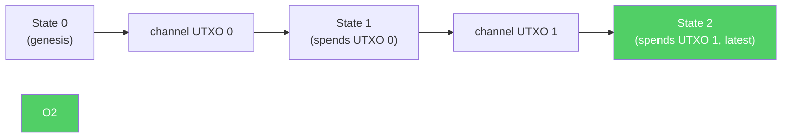

# Pseudo-Spilman Leaves

> **Summary**: Pseudo-Spilman is the canonical leaf mechanism for SuperScalar. Each leaf is a 2-of-2 MuSig between one client and the LSP; state advances are TX-chained rather than nSequence-replaced, so leaves consume zero relative-timelock budget, need no per-leaf revocation keys, and need no per-leaf watchtower. The leaves carry standard bidirectional BOLT-2 Lightning channels on top.

## What it is

A pseudo-Spilman leaf is a sequence of pre-signed Bitcoin transactions, each one spending the channel output of the previous one. Each transaction in the chain represents the current state of one Lightning channel between a client and the LSP plus the LSP's remaining liquidity stock allocated to that channel.

When the channel state advances (a payment, a splice, a liquidity purchase), the LSP and the client co-sign a new transaction that spends the prior chain TX's channel output. The new TX is now the latest valid state; the old one is structurally superseded because its child output is gone.

```mermaid
graph LR
    S0["State 0<br/>(genesis)"] --> O0["channel UTXO 0"]
    O0 --> S1["State 1<br/>(spends UTXO 0)"]
    S1 --> O1["channel UTXO 1"]
    O1 --> S2["State 2<br/>(spends UTXO 1, latest)"]

    style S2 fill:#51cf66,color:#fff
    style O2 fill:#51cf66,color:#fff
```

The leaf cohort is **1 client + LSP**, 2-of-2 MuSig. The MuSig key aggregation is computed once at factory build (`node->keyagg.agg_pubkey`) and reused for every state advance in the chain.

## Why "pseudo"

A true Spilman channel is a two-party unidirectional construct: one party funds the channel and the other receives increasing payments over time. The "pseudo" variant in SuperScalar:

- Is multi-party (1 client + LSP, but the broader factory contains many leaves)
- Uses TX chaining to enforce state ordering structurally — no decrementing nSequence, no time-delay race
- Carries a standard bidirectional BOLT-2 Lightning channel on top, so HTLC flow is fully bidirectional even though the leaf-level state advances are LSP-triggered

It's not a true Spilman channel; it borrows the chaining idea and applies it to factory leaves.

## Chain ordering replaces nSequence

The defining property of pseudo-Spilman leaves: **old states cannot be activated without re-publishing the entire chain.**

If the LSP attempts to broadcast state N-1 instead of the latest state N, it can — but state N-1's channel output has already been spent by state N's input. Two transactions cannot spend the same output; only one can confirm. As soon as N hits the mempool, N-1's child outputs become irrelevant.

This removes the need for:

- Per-leaf revocation keys
- Per-state revocation secrets
- Per-leaf watchtower coverage
- nSequence delay budget at the leaf layer

What it **does** need is a defense against the LSP (or counterparty) tricking the other side into co-signing two different state advances that both spend the same parent UTXO. A participant signing a leaf advance keeps a persistent record of the `(parent_txid, parent_vout)` it has already signed for in this factory:

- If there's no record for the proposed parent UTXO, it's safe to sign — and the partial sig + sighash are recorded before the wire reply goes out.
- If a record exists with the same sighash as the new request, this is an idempotent retry and replay is safe.
- If a record exists with a *different* sighash for the same parent UTXO, that's a double-sign attempt — refused, and logged.

Recording the partial sig before sending the wire reply makes the ceremony crash-safe.

## L-stock + redistribution TX

The leaf state also commits to the LSP's liquidity stock for that channel. The L-stock output uses a dual-condition Taproot script:

- **Key-path** — N-of-N MuSig of the leaf cohort. Used by the cooperative-close path *and* by the pre-signed *redistribution transaction*.
- **Script-path** — `<csv_blocks> OP_CSV OP_DROP <LSP_xonly> OP_CHECKSIG`. LSP-only unilateral drain after the CSV delay (default 144 blocks).

If the LSP publishes a stale leaf state, the matching pre-signed redistribution TX (co-signed during state advance, held by the client and the watchtower) becomes valid and redistributes the L-stock equally to all clients in that leaf. The LSP receives nothing from the redistribution TX, so it has no incentive to publish stale state.

See [[l-stock-redistribution]] for the full redistribution TX mechanism.

## What still uses revocation

The Lightning channels riding on top of the PS leaves are standard BOLT-2 channels. They still use:

- Per-commitment revocation keys
- HTLC commitment transactions with revocation paths
- Watchtower coverage of the inner channel

This is orthogonal to the leaf-level mechanism. The leaf is a non-revocable container; the channel inside it is a normal Lightning channel with normal revocation.

## Status

Canonical leaf mechanism. Default in the reference implementation. Verified at N=4, N=64, and N=127 clients per factory (127 is the design maximum: 128 MuSig2 signers = LSP + 127 clients) under regtest and on signet. ZmnSCPxj introduced the design in [SuperScalar with Pseudo-Spilman Leaves (Delving t/1242, November 2024)](https://delvingbitcoin.org/t/superscalar-laddered-timeout-tree-structured-decker-wattenhofer-factories-with-pseudo-spilman-leaves/1242).

## Related

- [[l-stock-redistribution]] — How the L-stock output is protected against stale leaf states
- [[tree-shaping-and-multi-process]] — How PS leaves combine with mixed-arity interior layers
- [[factory-tree-topology]] — Where PS leaves sit in the full tree
- [[force-close]] — Unilateral exit involves publishing the latest PS state TX
