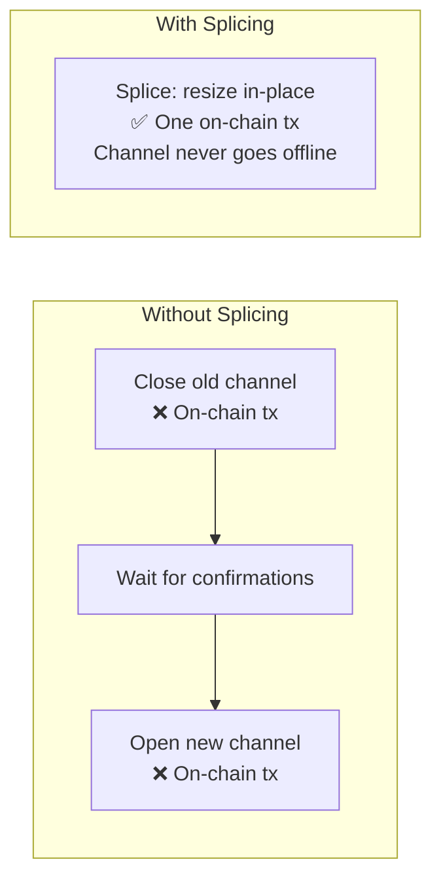
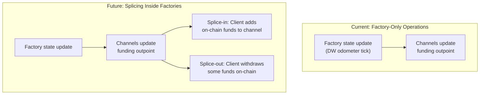
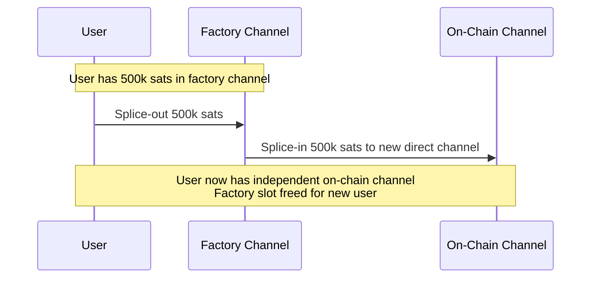

# Splicing Integration

> **Summary**: Splicing lets you resize a Lightning channel without closing it — adding or removing funds while it stays operational. In SuperScalar, splicing mechanics are directly relevant because factory state transitions work almost identically: the funding outpoint changes, but the channel stays live. Integrating splicing would let factory-hosted channels dynamically resize without restructuring the entire tree.

## What Is Splicing?

Splicing is a Lightning Network feature that lets you **add funds to** (splice-in) or **remove funds from** (splice-out) an existing channel without closing and reopening it:

During a splice, the channel's **funding outpoint changes** (a new transaction replaces the old one), but both the old and new states are valid simultaneously until the splice confirms on-chain. The channel continues operating throughout.

## Why Splicing Matters for SuperScalar

SuperScalar factory state transitions have a **directly analogous problem**: when the factory tree updates (via the [[the-odometer-counter|DW odometer]]), the funding outpoint for each leaf channel changes. The channel needs to seamlessly transition from the old factory state to the new one.

ZmnSCPxj explicitly identified this connection:

> *"While we're signing off on the new state of the factory, we need to maintain the channel state for both the old state and the new state, and that's actually very similar to splicing."* — ZmnSCPxj, Bitcoin Optech podcast (Oct 2024)

See [[dual-state-management]] for the full details of how this works.

## The Integration Vision

### What Splicing Would Enable

| Capability | Without Splicing | With Splicing |
|-----------|-----------------|---------------|
| **Add funds to a channel** | Requires new factory or on-chain channel | Resize in-place during factory update |
| **Withdraw partial funds** | Must close channel or wait for factory death | Splice-out to on-chain without disruption |
| **Rebalance between channels** | Requires both leaf clients + LSP | Could splice between factory channels |
| **Graduate to on-chain** | Close factory channel → open direct channel | Splice factory channel into on-chain channel |

### The "Graduation" Path

One of the most compelling use cases: a user who entered SuperScalar with zero on-chain Bitcoin has now accumulated enough to want their own independent channel. Splicing would let them **graduate** from a factory-hosted channel to a direct on-chain channel in a single operation:

## How It Relates to Existing Splicing Work

Splicing is already being implemented in Lightning:

| Implementation | Status | Relevance |
|---------------|--------|-----------|
| **CLN (Core Lightning)** | Splicing support merged | Could be extended for factory-hosted channels |
| **Eclair (ACINQ)** | Splicing support in Phoenix | Production experience with mobile splice UX |
| **LDK** | Splicing in progress | Rust library, potentially embeddable |

The key difference for SuperScalar: standard splicing changes the funding outpoint via an on-chain transaction. Factory splicing would change the funding outpoint via a **factory state update** (off-chain), which is cheaper but requires the [[dual-state-management|dual state management]] machinery.

## Implementation Priority

For the current SuperScalar PoC: **addon, not critical**. The core factory mechanics (DW tree, timeout-sig-trees, MuSig2 signing) work without splicing. Splicing integration is a **Phase 3+** enhancement that becomes important for production LSP deployments where users need flexible channel management.

The foundation is already there — the dual state management needed for factory transitions is the same machinery splicing requires. Once factory transitions work correctly, splicing becomes a natural extension.

## Related Concepts

- [[dual-state-management]] — The shared technical foundation
- [[pluggable-factories]] — How factory channels integrate with LN software
- [[updating-state]] — Current factory state update mechanics
- [[client-migration]] — Moving funds between factories (splicing alternative)
- [[laddering]] — Factory lifecycle that triggers migration/splicing needs
