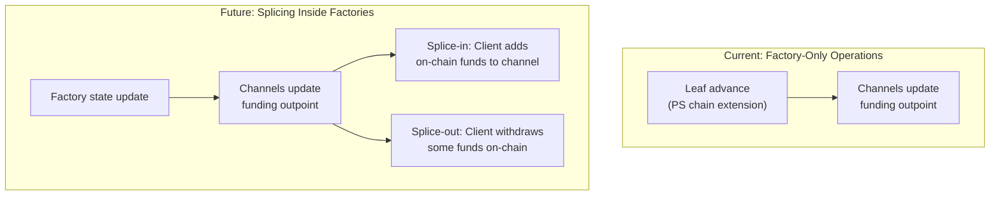
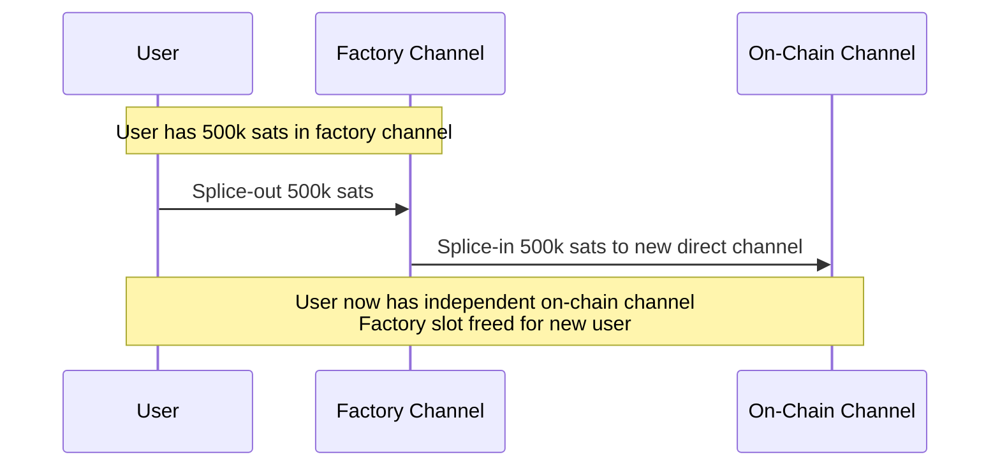

# Splicing Integration

> **Summary**: SuperScalar factory state transitions share mechanics with splicing: the funding outpoint changes while the channel stays live. Integrating splicing would let factory-hosted channels dynamically resize without restructuring the entire tree.

## Why Splicing Matters for SuperScalar

Splicing changes a channel's funding outpoint while keeping the channel operational; both old and new states coexist until the splice confirms on-chain.

SuperScalar leaf advances have a **directly analogous problem**: when a leaf advances its [[pseudo-spilman-leaves|pseudo-Spilman]] chain (a rebalance, a splice, or a liquidity buy), the funding outpoint for that leaf channel changes, and the channel needs to seamlessly transition from the old state to the new one. (Interior tree restructures move the outpoint too, but the per-leaf advance is the common case — and it consumes no [[the-odometer-counter|odometer]] budget.)

ZmnSCPxj explicitly identified this connection:

> *"While we're signing off on the new state of the factory, we need to maintain the channel state for both the old state and the new state, and that's actually very similar to splicing."* — ZmnSCPxj, Bitcoin Optech podcast (Oct 2024)

See [[dual-state-management]] for the full details of how this works.

## Potential Integration

```mermaid
graph TD
    subgraph "Current: Factory-Only Operations"
        F1["Leaf advance<br/>(PS chain extension)"]
        F1 --> U["Channels update<br/>funding outpoint"]
    end

    subgraph "Future: Splicing Inside Factories"
        F2["Factory state update"] --> U2["Channels update<br/>funding outpoint"]
        U2 --> SP["Splice-in: Client adds<br/>on-chain funds to channel"]
        U2 --> SO["Splice-out: Client withdraws<br/>some funds on-chain"]
    end
```

### What Splicing Would Enable

| Capability | Without Splicing | With Splicing |
|-----------|-----------------|---------------|
| **Add funds to a channel** | Requires new factory or on-chain channel | Resize in-place during factory update |
| **Withdraw partial funds** | Must close channel or wait for factory death | Splice-out to on-chain without disruption |
| **Rebalance between channels** | Requires both leaf clients + LSP | Could splice between factory channels |
| **Graduate to on-chain** | Close factory channel → open direct channel | Splice factory channel into on-chain channel |

### The "Graduation" Path

A notable use case: a user who entered SuperScalar with zero on-chain Bitcoin has now accumulated enough to want their own independent channel. Splicing would let them **graduate** from a factory-hosted channel to a direct on-chain channel in a single operation:

```mermaid
sequenceDiagram
    participant U as User
    participant F as Factory Channel
    participant C as On-Chain Channel

    Note over U,F: User has 500k sats in factory channel
    U->>F: Splice-out 500k sats
    F->>C: Splice-in 500k sats to new direct channel
    Note over U,C: User now has independent on-chain channel<br/>Factory slot freed for new user
```

## How It Relates to Existing Splicing Work

Splicing is already being implemented in Lightning:

| Implementation | Status | Relevance |
|---------------|--------|-----------|
| **CLN (Core Lightning)** | Splicing merged; interop testing with Eclair | Could be extended for factory-hosted channels |
| **Eclair (ACINQ)** | Splicing in production (Eclair v0.11+, Phoenix wallet) | Production experience with mobile splice UX |
| **LDK** | Experimental splicing in v0.2 | Rust library, potentially embeddable |

The difference for SuperScalar: standard splicing changes the funding outpoint via an on-chain transaction. Factory splicing would change the funding outpoint via a **factory state update** (off-chain), which is cheaper but requires the [[dual-state-management|dual state management]] machinery.

## Related Concepts

- [[dual-state-management]] — The shared technical foundation
- [[updating-state]] — Current factory state update mechanics
- [[client-migration]] — Moving funds between factories (splicing alternative)
- [[laddering]] — Factory lifecycle that triggers migration/splicing needs
