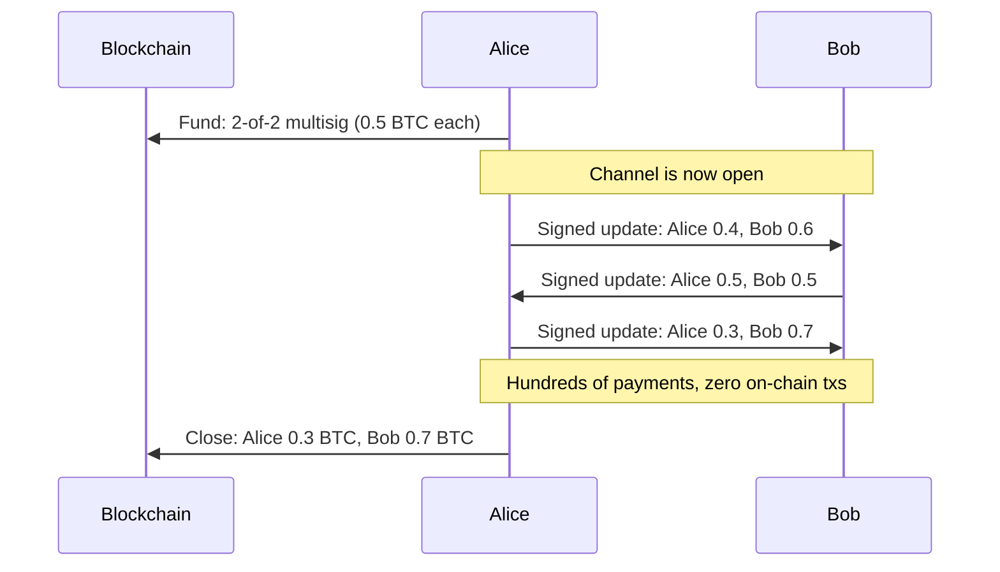

# What Is a Payment Channel?

> **TLDR**: Two people lock Bitcoin into a shared address, then pass signed IOUs back and forth off-chain. Only the final balance ever hits the blockchain.

## The Analogy

Imagine you and a friend open a **joint bar tab**. You both put $50 into a jar behind the bar ($100 total). Throughout the night, instead of paying the bartender for each drink, you just update a notepad:

- "Alice: $50, Bob: $50" (starting state)
- Alice buys Bob a drink → "Alice: $45, Bob: $55"
- Bob buys Alice two drinks → "Alice: $55, Bob: $45"

At the end of the night, you settle up once. The bartender doesn't care about every transaction — just the final split. That's a payment channel.

## How It Works on Bitcoin

1. **Funding transaction**: Alice and Bob each put Bitcoin into a 2-of-2 [[what-is-multisig|multisig]] address. This is the only transaction that hits the blockchain to open the channel.

2. **Off-chain updates**: They exchange signed transactions that redistribute the balance. Each new state replaces the old one. These never touch the blockchain.

3. **Closing transaction**: When they're done, they cooperatively sign a transaction that splits the funds according to the latest state. One more on-chain transaction.

**Result**: Two on-chain transactions total, unlimited payments in between.

## The Cheating Problem

What if Alice broadcasts an **old** state where she had more money?

This is the fundamental problem of payment channels, and different designs solve it differently:

| Design | How It Prevents Cheating |
|--------|------------------------|
| **Poon-Dryja** (Lightning) | If you broadcast an old state, the other party can take ALL your funds as punishment |
| **Decker-Wattenhofer** | Newer states have shorter time delays and always confirm first, making old states useless |
| **eltoo / LN-Symmetry** | Any newer state can simply replace any older state (requires APO soft fork) |

SuperScalar uses **both** Decker-Wattenhofer (for the factory tree) and Poon-Dryja (for the individual Lightning channels at the leaves). See [[decker-wattenhofer-invalidation]].

## Why This Matters for SuperScalar

A regular Lightning channel is a payment channel between **two** people — you and your channel partner. That's great, but it means **one UTXO per channel**.

SuperScalar extends this idea: instead of 2 people sharing one UTXO, what if **many people** shared one UTXO, and the internal structure gave each person their own individual channel? That's a [[factory-tree-topology|channel factory]].

## Related Concepts

- [[what-is-multisig]] — The locking mechanism that makes channels secure
- [[what-is-nsequence]] — The time-delay trick that Decker-Wattenhofer uses
- [[decker-wattenhofer-invalidation]] — How SuperScalar prevents cheating at the factory level
