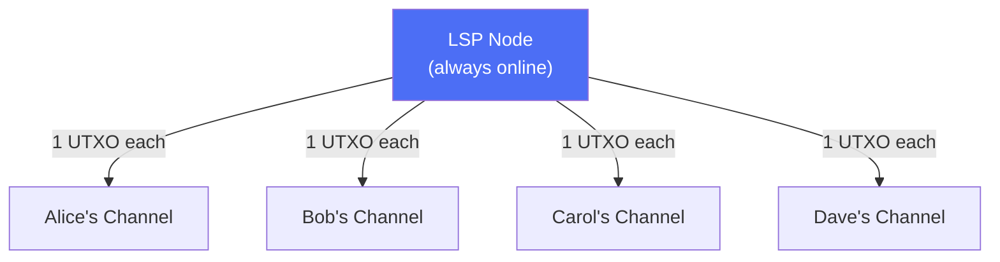

# What Is an LSP?

> **TLDR**: A Lightning Service Provider is any node that helps other users get onto Lightning — providing channels, routing payments, and managing liquidity. In SuperScalar, an LSP is whoever coordinates a factory. That could be a company, a community node, or your friend with a server in their closet.

## The Analogy

Think of running a Lightning node today. If you open a channel to someone, you're already providing them with connectivity to the network. An LSP just does this more deliberately — offering channels and liquidity to users who need it.

The key insight: **anyone with a Lightning node and some Bitcoin can be an LSP.** It's a role, not a corporate title.

## Who Can Run an LSP?

| Operator | Example |
|----------|---------|
| **A company** | Phoenix (ACINQ), Breez — mobile wallet providers |
| **A community node** | A Bitcoin meetup group running a shared node |
| **An individual node runner** | Anyone with a server, some liquidity, and the willingness to help onboard others |
| **A group of friends** | People who pool resources and run a node together |

SuperScalar is designed so that the LSP role is **accessible**, not exclusive. The protocol doesn't care who runs the node — it only cares that the cryptographic guarantees hold.

## The Current Model (Without Factories)

**The bottleneck**: Each user requires their own on-chain UTXO. If a node operator wants to serve 1,000 users, that's 1,000 on-chain transactions just to get started.

## The SuperScalar Model (With Factories)

**The improvement**: Many users share one UTXO through a factory. The LSP node coordinates factory construction, provides initial liquidity, and manages the lifecycle — but **cannot steal or censor** because every transaction requires N-of-N multisig.

## Discovery and Matching

For SuperScalar to be decentralized in practice, users need a way to **find** LSPs and LSPs need a way to **find** clients. Think of it like a marketplace:

- **LSP discovery**: A node advertises that it runs SuperScalar factories and has liquidity available
- **Client matching**: Users looking for a factory can browse available LSPs, compare terms (fees, capacity, liveness requirements), and join one
- **Friend groups**: A group of friends could form their own factory with one of them running the LSP node — no stranger required

The protocol doesn't mandate a specific discovery mechanism. It could be a simple directory, a decentralized bulletin board, or peer-to-peer gossip. What matters is that users have **choice** — if one LSP has bad terms or goes offline, you move to another.

## The LSP's Role in SuperScalar

### What the LSP Node Does
| Responsibility | Details |
|---------------|---------|
| **Coordinates factory construction** | Creates the funding transaction and tree structure with participating clients |
| **Provides liquidity** | Locks up Bitcoin as "liquidity stock" that clients can receive into |
| **Manages signing rounds** | Coordinates MuSig2 signing with online clients |
| **Runs the lifecycle** | Manages [[laddering]] — ~33 concurrent factories with staggered lifetimes |
| **Facilitates exits** | Helps clients move between factories or exit to on-chain |

### What the LSP Node Cannot Do
| Guarantee | Why |
|-----------|-----|
| **Cannot steal funds** | Every transaction uses N-of-N multisig — the LSP is just one signer among many |
| **Cannot censor unilaterally** | State updates require all participants in the affected subtree to sign |
| **Cannot prevent exit** | Exit transactions are pre-signed during construction; clients can always broadcast them |
| **Cannot refuse refund** | If the LSP stops cooperating, clients force-close and get their funds on-chain |

### The Economics

LSP operators earn revenue by providing **inbound liquidity** — the capacity for clients to receive payments:

1. The operator locks up Bitcoin as liquidity stock in each factory
2. Clients pay for inbound liquidity (via Lightning payments or fees)
3. The operator recovers capital when factories expire and new ones are created

This works whether the operator is a company serving thousands of users or a node runner serving a dozen friends. The scale is flexible.

> *"Once the LSP has sold some unit of inbound liquidity, it wants to not take back that liquidity."* — ZmnSCPxj

## The Trust Model

SuperScalar shifts risk to the LSP operator rather than clients:

> *"I have been refining SuperScalar to shift much of the risk to the LSP, precisely to prevent risks on clients."* — ZmnSCPxj

The worst case for a client: the LSP node goes offline permanently. In this case, clients perform a [[force-close|unilateral exit]], which puts their funds on-chain. It's inconvenient and costs fees, but **funds are never lost**.

## The Liveness Requirement

| Actor | Must Be Online |
|-------|---------------|
| **LSP node** | Always (it coordinates the factory) |
| **Client** | At least once during the 3-day dying period of each factory (~once per month) |

If a client misses the dying period, they must [[force-close]] — but their funds are safe.

## The Bigger Picture

SuperScalar isn't just a scaling optimization. ZmnSCPxj designed it with a specific mission: enabling financial self-sovereignty for people who have **nothing** to start with.

> *"The goal of SuperScalar is to be able to onboard people, possibly people who do not have an existing UTXO they can use to pay exogenous fees."* — ZmnSCPxj

Consider someone in a developing nation with a mobile phone and zero Bitcoin. Today, they can't use Lightning because they need an on-chain UTXO to open a channel. SuperScalar lets them receive their first sats through a factory-hosted channel — no on-chain transaction needed.

> *"One may consider this scheme as ways for a client to build up their Bitcoin holdings without having an onchain UTXO, but with an assurance that the service provider has no incentive to rug their funds until they have accumulated enough to own their own unique UTXO."* — ZmnSCPxj

The design even accounts for clients who have no funds at all to pay for exit fees. If an LSP misbehaves, a truly destitute client can take their pre-signed exit transactions to a **competing LSP**, who can broadcast them and earn a bounty for punishing the bad actor. You don't need money to have recourse — the cryptographic guarantees work regardless.

## The Decentralization Goal

The vision isn't one LSP serving everyone. It's **many LSPs** — big and small — competing on terms, with users free to move between them. SuperScalar makes this practical:

- **Low barrier to entry**: Anyone with a node and liquidity can coordinate a factory
- **Client migration**: Users can move from one LSP to another during factory transitions
- **No lock-in**: Pre-signed exit transactions mean you can always leave
- **Competitive market**: Multiple LSPs competing drives down fees and improves service

The more operators there are, the more resilient and decentralized the network becomes.

## Related Concepts

- [[why-superscalar-exists]] — The scaling challenge SuperScalar addresses
- [[factory-tree-topology]] — The structure the LSP node builds with its clients
- [[laddering]] — How factories rotate over time
- [[building-a-factory]] — Step-by-step factory construction
- [[security-model]] — Full analysis of trust assumptions
