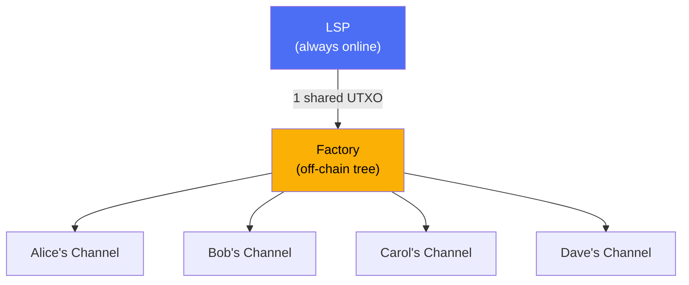

# What Is an LSP?

> **TLDR**: A Lightning Service Provider is the always-online server that runs behind your Lightning wallet app. It provides you with a channel, routes your payments, and manages liquidity. In SuperScalar, the LSP is the entity that constructs and manages factories.

## The Analogy

Think of an **internet service provider (ISP)** but for Lightning payments. You don't connect directly to every person you want to pay — your ISP connects you to the network. Similarly, your LSP gives you a Lightning channel and routes your payments through the network.

Just like you don't need to understand TCP/IP to browse the web, you don't need to understand channel factories to use a Lightning wallet. The LSP handles all of that behind the scenes.

## The Current Model (Without Factories)

**Problem**: Each user requires their own on-chain UTXO. 1 million users = 1 million UTXOs = 1 million on-chain transactions just to onboard them.

## The SuperScalar Model (With Factories)

**Solution**: Many users share one UTXO through a factory. The LSP constructs the factory, provides initial liquidity, and manages the lifecycle.

## The LSP's Role in SuperScalar

### What the LSP Does
| Responsibility | Details |
|---------------|---------|
| **Constructs factories** | Creates the funding transaction and tree structure |
| **Provides liquidity** | Locks up its own Bitcoin as "liquidity stock" that clients can buy |
| **Coordinates signing** | Manages MuSig2 signing rounds with online clients |
| **Manages lifecycle** | Runs [[laddering]] — ~33 concurrent factories with staggered lifetimes |
| **Facilitates exits** | Helps clients move between factories or exit to on-chain |

### What the LSP Cannot Do
| Guarantee | Why |
|-----------|-----|
| **Cannot steal funds** | Every transaction uses N-of-N multisig — LSP is just one signer |
| **Cannot censor unilaterally** | State updates require all participants in the subtree to sign |
| **Cannot prevent exit** | Exit transactions are pre-signed during construction; clients can always broadcast them |
| **Cannot refuse refund** | If LSP stops cooperating, clients force-close and get their funds on-chain |

### What the LSP Wants
The LSP is a **business**. It earns revenue by selling **inbound liquidity** — the capacity for clients to receive payments. The economic model:

1. LSP locks up Bitcoin as liquidity stock in each factory
2. Clients "buy" inbound liquidity by paying the LSP (via Lightning payments)
3. Once liquidity is sold, the LSP doesn't take it back — it's committed
4. LSP recovers capital when factories expire and new ones are created

> *"Once the LSP has sold some unit of inbound liquidity, it wants to not take back that liquidity."* — ZmnSCPxj

## The Trust Model

SuperScalar explicitly shifts risk to the LSP rather than clients:

> *"I have been refining SuperScalar to shift much of the risk to the LSP, precisely to prevent risks on clients... it can be done in practice such that it is more economical for the LSP to not screw over its clients, just as typical capitalism works. You cannot earn money from a dead customer."* — ZmnSCPxj

The worst case for a client: the LSP shuts down entirely (e.g., shut down by authorities). In this case, all clients **must** perform a [[force-close|unilateral exit]], which puts their funds on-chain. It's inconvenient and costs fees, but funds are never lost.

## The Liveness Requirement

For SuperScalar to work, users have a minimal liveness requirement:

| Actor | Must Be Online |
|-------|---------------|
| **LSP** | Always (it's a server) |
| **Client** | At least once during the 3-day dying period of each factory (~once per month) |

If a client misses the dying period, they must [[force-close]] — but their funds are safe.

## Real-World Examples

Current LSP implementations (pre-SuperScalar):
- **Phoenix** (ACINQ) — Mobile wallet with integrated LSP
- **Breez** — SDK for building LSP-powered apps
- **Mutiny** — Self-custodial wallet with LSP backend

SuperScalar would let these LSPs serve **orders of magnitude more users** with the same on-chain footprint.

## Related Concepts

- [[why-superscalar-exists]] — The scaling problem LSPs face today
- [[factory-tree-topology]] — The structure the LSP builds and manages
- [[laddering]] — How the LSP rotates factories over time
- [[building-a-factory]] — Step-by-step factory construction
- [[security-model]] — Full analysis of trust assumptions
