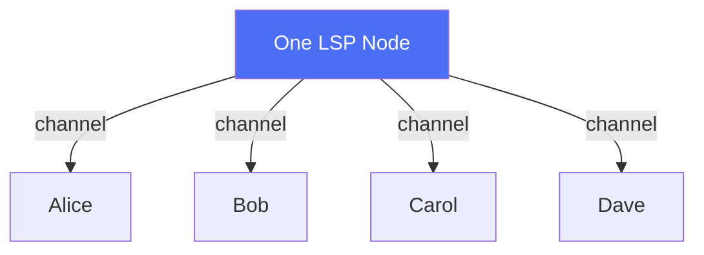

# What Is an LSP?

> **Summary**: A Lightning Service Provider (LSP) is a single node that serves many users — providing channels, routing payments, and managing liquidity. In SuperScalar, one LSP coordinates an entire factory. All users in that factory share the same LSP. The LSP role can be filled by a company, a community node, or an individual operator.

## The Core Relationship: One LSP, Many Clients

A SuperScalar factory always has **one LSP and multiple clients**. The LSP is in every subtree of the factory, participates in every signing round, and has a channel with every client. Clients do not have channels with each other — every channel is between a client and the LSP.

The LSP role isn't restricted to corporations — anyone with a Lightning node, liquidity, and a server can operate as an LSP. But within any given factory, there is exactly one.

## LSP in a Factory vs. Traditional Channels

In the traditional model, an LSP needs one on-chain UTXO per client channel (see [[why-superscalar-exists]]). In SuperScalar, one UTXO funds a factory containing channels for many clients. The LSP coordinates construction and provides initial liquidity, but N-of-N multisig prevents it from moving funds unilaterally.

LSP discovery and client onboarding are out of scope for the SuperScalar protocol itself; existing standards like the LSP Specification (LSPS) could serve this role.

## The LSP's Role in SuperScalar

### What the LSP Node Does
| Responsibility | Details |
|---------------|---------|
| **Coordinates factory construction** | Creates the funding transaction and tree structure with participating clients |
| **Provides liquidity** | Locks up Bitcoin as "liquidity stock" that clients can receive into |
| **Manages signing rounds** | Coordinates MuSig2 signing with online clients |
| **Runs the lifecycle** | Manages [[laddering]] — ~33 concurrent factories with staggered lifetimes |
| **Facilitates exits** | Helps clients move between factories or exit to on-chain |

### What the LSP Node Cannot Do
| Guarantee | Why |
|-----------|-----|
| **Cannot steal funds** | Every transaction uses N-of-N multisig — the LSP is just one signer among many |
| **Cannot block exit** | State updates require cooperation, but the LSP refusing to cooperate cannot prevent unilateral exit |
| **Cannot prevent exit** | Exit transactions are pre-signed during construction; clients can always broadcast them |
| **Cannot refuse refund** | If the LSP stops cooperating, clients force-close and get their funds on-chain |

### The Economics

LSP operators earn revenue by providing **inbound liquidity** — the capacity for clients to receive payments:

1. The operator locks up Bitcoin as liquidity stock in each factory
2. Clients pay for inbound liquidity (via Lightning payments or fees)
3. The operator recovers capital when factories expire and new ones are created

This works whether the operator is a company serving thousands of users or a node runner serving a dozen friends. The scale is flexible.

> *"Once the LSP has sold some unit of inbound liquidity, it wants to not take back that liquidity."* — ZmnSCPxj

## The Trust Model

SuperScalar shifts risk to the LSP operator rather than clients:

> *"I have been refining SuperScalar to shift much of the risk to the LSP, precisely to prevent risks on clients."* — ZmnSCPxj

The worst case for a client: the LSP node goes offline permanently. In this case, clients perform a [[force-close|unilateral exit]], which puts their funds on-chain. This requires on-chain fees and delays, but **funds are never lost**.

## The Liveness Requirement

| Actor | Must Be Online |
|-------|---------------|
| **LSP node** | Always (it coordinates the factory) |
| **Client** | At least once during the 3-day dying period of each factory (~once per month) |

If a client misses the dying period, they must [[force-close]] — but their funds are safe.

## Zero-UTXO Onboarding

A factory-hosted channel allows clients to receive their first sats without owning an on-chain UTXO:

> *"The goal of SuperScalar is to be able to onboard people, possibly people who do not have an existing UTXO they can use to pay exogenous fees."* — ZmnSCPxj

If an LSP misbehaves, a client without funds to pay exit fees can take their pre-signed exit transactions to a competing LSP, which can broadcast them and earn a bounty for the shachain punishment.

## Multiple LSPs

The protocol assumes a competitive market of LSPs:

- **Low barrier to entry**: Any node with liquidity can coordinate a factory
- **Client migration**: Users move between LSPs during factory transitions ([[client-migration]])
- **No lock-in**: Pre-signed exit transactions guarantee the ability to leave

## Related Concepts

- [[why-superscalar-exists]] — The scaling challenge SuperScalar addresses
- [[factory-tree-topology]] — The structure the LSP node builds with its clients
- [[laddering]] — How factories rotate over time
- [[building-a-factory]] — Step-by-step factory construction
- [[security-model]] — Full analysis of trust assumptions
