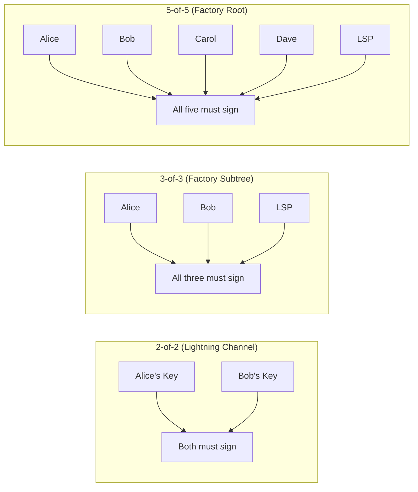

# What Is Multisig?

> **Summary**: A Bitcoin address that requires multiple private keys to spend from. N-of-N means ALL parties must sign — nobody can steal unilaterally.

## Types of Multisig

| Type | Meaning | Used In SuperScalar For |
|------|---------|------------------------|
| **2-of-2** | Both parties sign | Individual Lightning channels at the leaves |
| **3-of-3** | All three parties sign | Subtree nodes (2 clients + LSP) |
| **N-of-N** | Every participant signs | Factory root (all clients + LSP) |

## Why N-of-N Matters

N-of-N multisig is the trust model underlying SuperScalar. Because every participant must sign every transaction in the factory tree:

- The LSP cannot move funds unilaterally — it is one signer among N
- State updates require cooperation from all signers in the affected subtree
- Unilateral exit is possible via pre-signed transactions created during factory construction

The downside: if someone goes offline, you can't update the state without them. This is why the [[factory-tree-topology|factory tree]] uses subtrees — only the clients **in your subtree** need to be online for a local state update.

## Multisig on Bitcoin Today

Explicit multisig opcodes (OP_CHECKMULTISIG in legacy/SegWit, OP_CHECKSIGADD in Tapscript) put all public keys on-chain at spend time, increasing transaction weight and revealing the signing policy. SuperScalar uses [[what-is-musig2|MuSig2]] instead:

| Approach | On-chain footprint | Privacy |
|----------|-------------------|---------|
| Explicit multisig (OP_CHECKMULTISIG / OP_CHECKSIGADD) | All N pubkeys visible at spend time | Signing policy revealed on-chain |
| **MuSig2** (used by SuperScalar) | Single aggregated pubkey | Indistinguishable from a single-signer spend |

MuSig2 aggregates N public keys into one key and N partial signatures into one signature. See [[what-is-musig2]] for details on the signing protocol.

## Related Concepts

- [[what-is-musig2]] — How N-of-N multisig actually works with Schnorr signatures
- [[what-is-taproot]] — The Bitcoin upgrade that makes MuSig2 practical
- [[factory-tree-topology]] — How the tree uses different multisig subsets at each level
- [[security-model]] — Why N-of-N provides the strongest trust guarantees
