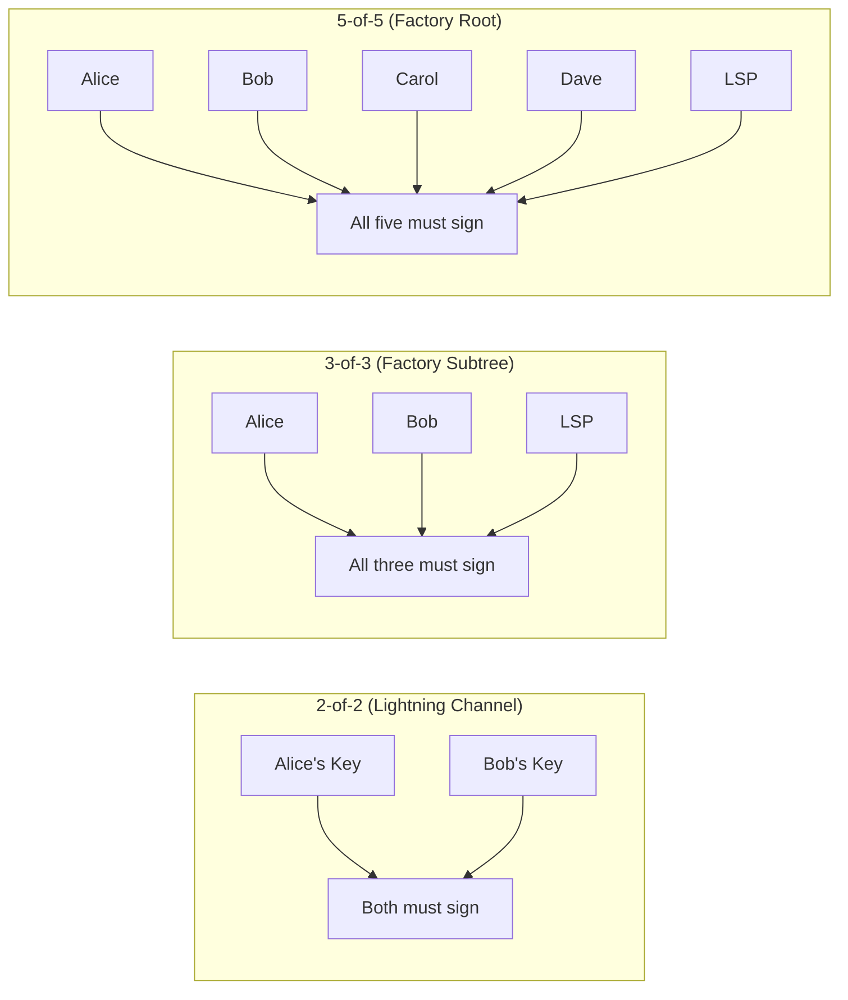

# What Is Multisig?

> **TLDR**: A Bitcoin address that requires multiple private keys to spend from. N-of-N means ALL parties must sign — nobody can steal unilaterally.

## The Analogy

Think of a **safe deposit box** that requires two keys to open. The bank holds one key, you hold the other. Neither of you can open the box alone. That's 2-of-2 multisig.

Now scale it up: a vault that requires **5 keys** to open — one held by each of 5 people. That's 5-of-5 multisig. Everyone must agree before anyone can spend.

## Types of Multisig

| Type | Meaning | Used In SuperScalar For |
|------|---------|------------------------|
| **2-of-2** | Both parties sign | Individual Lightning channels at the leaves |
| **3-of-3** | All three parties sign | Subtree nodes (2 clients + LSP) |
| **N-of-N** | Every participant signs | Factory root (all clients + LSP) |

## Why N-of-N Matters

**N-of-N multisig is the security foundation of SuperScalar.** Because every participant must sign every transaction in the factory tree:

- The **LSP cannot steal** — it's just one signer among many
- **No single party can censor** — everyone must cooperate
- **Unilateral exit is always possible** — the exit transactions are pre-signed during factory construction

The downside: if someone goes offline, you can't update the state without them. This is why the [[factory-tree-topology|factory tree]] uses subtrees — only the clients **in your subtree** need to be online for a local state update.

## Multisig on Bitcoin Today

Traditional Bitcoin multisig (OP_CHECKMULTISIG) puts all public keys on-chain, making it expensive and privacy-leaking. SuperScalar uses [[what-is-musig2|MuSig2]] instead:

| Approach | On-chain footprint | Privacy |
|----------|-------------------|---------|
| OP_CHECKMULTISIG | All N pubkeys visible | Everyone knows it's multisig |
| **MuSig2** (used by SuperScalar) | Looks like a single pubkey | Indistinguishable from a regular spend |

MuSig2 aggregates N public keys into **one** key and N partial signatures into **one** signature. On-chain, it looks like a normal single-signer [[what-is-taproot|Taproot]] transaction.

## Related Concepts

- [[what-is-musig2]] — How N-of-N multisig actually works with Schnorr signatures
- [[what-is-taproot]] — The Bitcoin upgrade that makes MuSig2 practical
- [[factory-tree-topology]] — How the tree uses different multisig subsets at each level
- [[security-model]] — Why N-of-N provides the strongest trust guarantees
