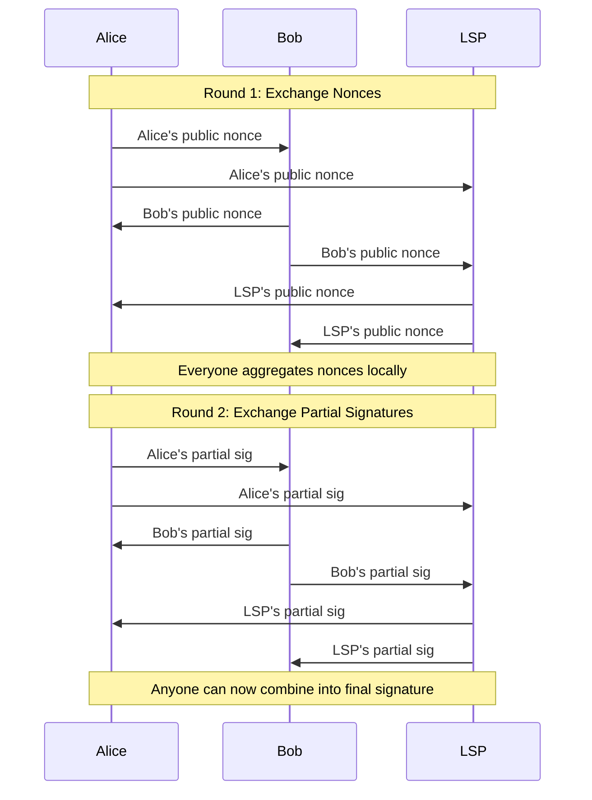
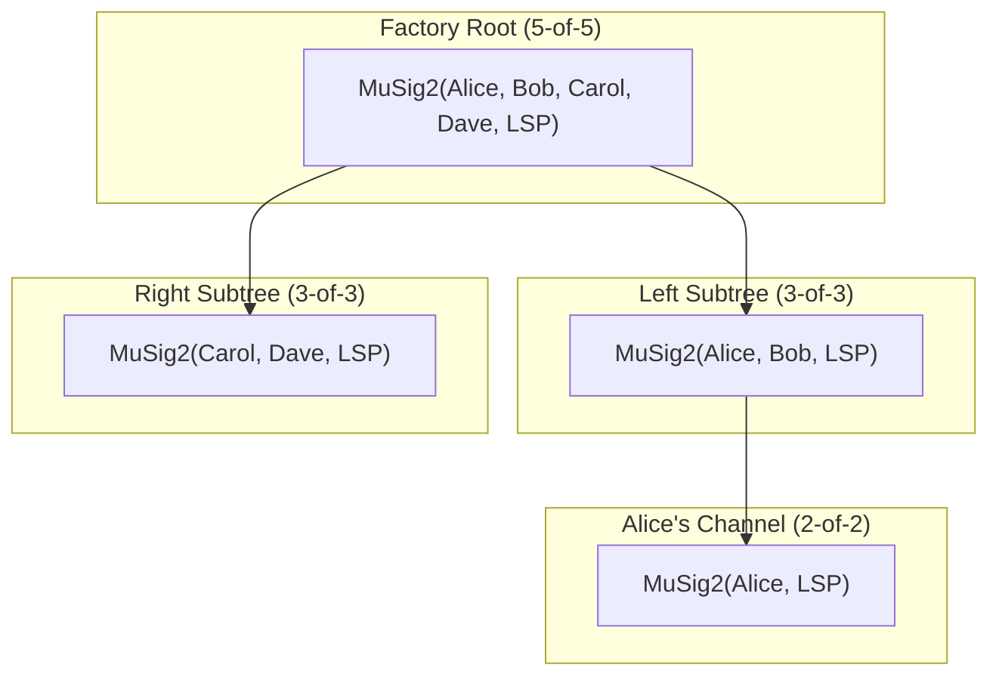

# What Is MuSig2?

> **TLDR**: A protocol that lets N people produce a single Schnorr signature from a single aggregated public key. On-chain, it looks like one person signed — but all N had to cooperate.

## The Analogy

Imagine N people each holding a piece of a jigsaw puzzle. Nobody can complete the picture alone. But when they all contribute their piece **in two rounds** of passing pieces around the table, a complete picture emerges — and to anyone who wasn't at the table, it looks like the picture was always whole. They can't tell N people were involved.

## Why MuSig2 Exists

Bitcoin's Taproot upgrade enabled **Schnorr signatures**, which have a special mathematical property: signatures and public keys can be **added together**.

| Property | What It Means |
|----------|--------------|
| Key aggregation | N public keys → 1 aggregate public key |
| Signature aggregation | N partial signatures → 1 valid signature |
| Indistinguishability | The aggregate looks identical to a single-signer key/sig |

This is impossible with the old ECDSA signature scheme. MuSig2 is the specific protocol that does this securely.

## The Two-Round Protocol



### Round 1: Nonce Exchange
Each signer generates a random **nonce** (a one-time secret number) and shares the public part with everyone else. This is like each person committing to their puzzle piece.

### Round 2: Partial Signature Exchange
Each signer creates a **partial signature** using their private key, their nonce, and the aggregated nonce from Round 1. When all partial signatures are combined, the result is a single valid Schnorr signature.

**Why two rounds?** MuSig1 had three rounds. MuSig2 reduced it to two by having each signer send **two** nonces in Round 1, which prevents a subtle attack where a malicious signer could manipulate the aggregate nonce.

## How SuperScalar Uses MuSig2

Every node in the [[factory-tree-topology|factory tree]] uses MuSig2:



Each level of the tree uses a **different subset** of signers. The root requires everyone; leaves only require the local client and the LSP.

### Nonce Management

For a factory with many nodes, each signer needs many nonces — one per transaction they'll sign. SuperScalar pre-generates **nonce pools** (batches of 64+) so that:

- Factory construction can sign all tree transactions in one coordinated session
- State updates only need nonces from the affected subtree's signers
- Nonces are never reused (reusing a nonce leaks your private key!)

### Taproot Integration

When MuSig2 is used with [[what-is-taproot|Taproot]], the aggregate key gets **tweaked** with the Merkle root of any hidden scripts:

```
tweaked_key = aggregate_key + hash(aggregate_key || script_merkle_root) × G
```

Signers must account for this tweak when creating partial signatures. The implementation handles this via `musig_session_finalize_nonces()` which applies the tweak during nonce aggregation.

## The Critical Safety Rule

> **Never reuse a nonce.** If a signer uses the same nonce in two different signing sessions, anyone who sees both partial signatures can compute that signer's private key.

This is why nonces are generated fresh for every signing session and why nonce pools must be carefully managed.

## Related Concepts

- [[what-is-multisig]] — The concept MuSig2 implements efficiently
- [[what-is-taproot]] — The Bitcoin feature that enables Schnorr-based MuSig2
- [[musig2-signing-rounds]] — Deep dive into the cryptographic protocol
- [[building-a-factory]] — How MuSig2 signing works during factory construction
