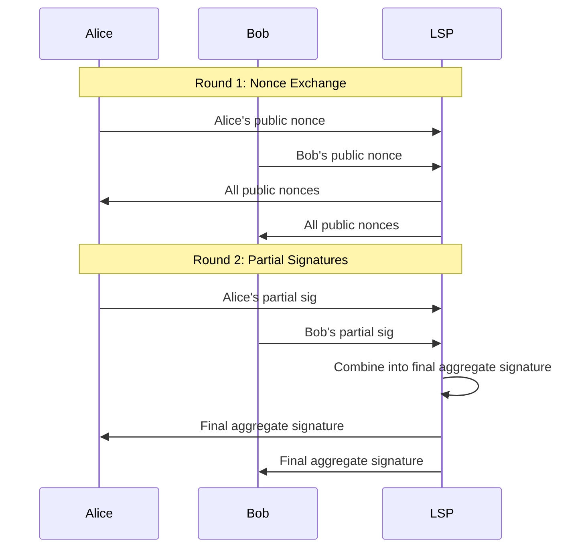
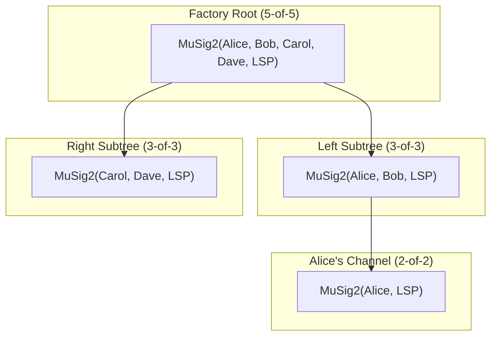

# What Is MuSig2?

> **Summary**: A protocol that lets N people produce a single Schnorr signature from a single aggregated public key. On-chain, it looks like one person signed — but all N had to cooperate.

## Why MuSig2 Exists

Bitcoin's Taproot upgrade enabled **Schnorr signatures**, which have a property that ECDSA lacks: public keys and signatures can be **linearly aggregated**.

| Property | What It Means |
|----------|--------------|
| Key aggregation | N public keys → 1 aggregate public key |
| Signature aggregation | N partial signatures → 1 valid signature |
| Indistinguishability | The aggregate is indistinguishable from a single-signer key/sig on-chain |

MuSig2 (BIP-327) is the protocol that performs this aggregation securely in two rounds, preventing rogue-key attacks and nonce manipulation.

## The Two-Round Protocol



### Round 1: Nonce Exchange
Each signer generates a random **nonce** (a one-time secret scalar) and shares the public nonce with all other signers.

### Round 2: Partial Signature Exchange
Each signer creates a **partial signature** using their private key, their nonce, and the aggregated nonce from Round 1. When all partial signatures are combined, the result is a single valid Schnorr signature.

**Why two rounds?** MuSig1 had three rounds: signers first committed to their nonces (preventing manipulation), then revealed them, then signed. MuSig2 eliminates the commitment round by having each signer send **two** nonces in Round 1. These are combined using a binding factor derived from the message, which prevents a signer from biasing the aggregate nonce even without seeing commitments first.

## How SuperScalar Uses MuSig2

Every node in the [[factory-tree-topology|factory tree]] uses MuSig2:



Each level of the tree uses a **different subset** of signers. The root requires all participants; leaves require only the channel counterparties (client and LSP).

### Nonce Management

For a factory with many nodes, each signer needs many nonces — one per transaction they'll sign. SuperScalar pre-generates **nonce pools** (batches of 64+) so that:

- Factory construction can sign all tree transactions in one coordinated session
- State updates only need nonces from the affected subtree's signers
- Nonces are never reused (see [[#The Critical Safety Rule|below]])

### Taproot Integration

When MuSig2 is used with [[what-is-taproot|Taproot]], the aggregate key gets **tweaked** with the Merkle root of any hidden scripts:

```
tweaked_key = aggregate_key + hash(aggregate_key || script_merkle_root) × G
```

Signers must account for this tweak when creating partial signatures. In libsecp256k1-zkp, `secp256k1_musig_nonce_process()` incorporates the tweak during nonce processing. See [[musig2-signing-rounds]] for the full protocol.

## The Critical Safety Rule

> **Never reuse a nonce.** If a signer uses the same nonce in two different signing sessions, anyone who sees both partial signatures can compute that signer's private key.

This is why nonces are generated fresh for every signing session and why nonce pools must be carefully managed.

## Related Concepts

- [[what-is-multisig]] — The concept MuSig2 implements efficiently
- [[what-is-taproot]] — The Bitcoin feature that enables Schnorr-based MuSig2
- [[musig2-signing-rounds]] — Deep dive into the cryptographic protocol
- [[building-a-factory]] — How MuSig2 signing works during factory construction
