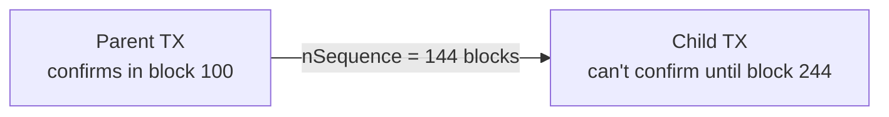
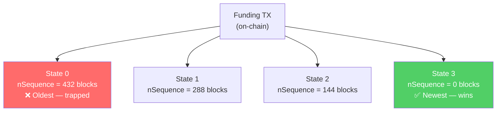

# What Is nSequence? (Relative Timelocks)

> **TLDR**: A field in every Bitcoin transaction input that can enforce a **waiting period** — "this transaction can't confirm until X blocks after its parent confirms." This is the core trick that makes Decker-Wattenhofer work.

## The Analogy

Imagine a race where different runners have different **head starts**:

- Runner A (newest state) starts at the starting line — no delay
- Runner B starts 1 mile back — 144 blocks of delay
- Runner C starts 2 miles back — 288 blocks of delay
- Runner D (oldest state) starts 3 miles back — 432 blocks of delay

No matter how fast Runner D is, Runner A always wins. That's how nSequence prevents old states from beating new ones.

## How nSequence Works (BIP-68)

Every Bitcoin transaction input has a 32-bit `nSequence` field. When certain bits are set, it enforces a **relative timelock**:

```
nSequence bits:
[31]    = disable flag (if set, no timelock enforced)
[22]    = type flag (0 = blocks, 1 = seconds)
[15:0]  = value (number of blocks or 512-second intervals)
```



**Example**: If a parent transaction confirms at block 100 and the child has `nSequence = 144`, the child cannot be included in any block before 244.

## The Decker-Wattenhofer Trick

This is where it gets clever. In [[decker-wattenhofer-invalidation|Decker-Wattenhofer]], every time the state updates, the new version gets a **lower** nSequence than the old one:



All these state transactions spend the **same output** (only one can confirm). Since State 3 has `nSequence = 0`, it can confirm immediately. State 0 must wait 432 blocks. Even if a cheater broadcasts State 0 first, State 3 will confirm first.

**Important**: Only one of these transactions can actually confirm (they all spend the same UTXO). The nSequence just ensures the **newest** one always wins the race.

## The Trade-off: Finite States

Each step costs you some delay. With a step size of 144 blocks:

| States Available | Starting Delay | Step Size |
|-----------------|---------------|-----------|
| 4 states | 432 blocks (~3 days) | 144 blocks |
| 8 states | 1008 blocks (~7 days) | 144 blocks |
| 16 states | 2160 blocks (~15 days) | 144 blocks |

More states = longer initial delay = longer worst-case force-close time.

This is why SuperScalar uses the [[the-odometer-counter|odometer counter]] — by stacking multiple layers, you get exponentially more states without linearly increasing the delay.

## nSequence = 0 vs nSequence Disabled

There's a subtle but important distinction:

| Value | Meaning |
|-------|---------|
| `nSequence = 0` | Timelock is **enabled** but set to zero blocks — confirms immediately |
| `nSequence = 0xFFFFFFFF` | Timelock is **disabled** — the field is ignored entirely |

In the SuperScalar [[factory-tree-topology|factory tree]]:
- **State nodes** use decreasing nSequence values (the DW mechanism)
- **Kickoff nodes** use `nSequence = disabled` — they confirm immediately and aren't part of the time-delay race

## Related Concepts

- [[decker-wattenhofer-invalidation]] — The full state machine that uses nSequence
- [[the-odometer-counter]] — How multiple layers multiply state capacity
- [[kickoff-vs-state-nodes]] — Why some nodes use nSequence and others don't
- [[what-is-a-payment-channel]] — The broader context of off-chain state
