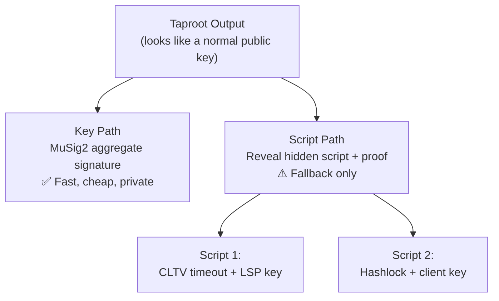

# What Is Taproot?

> **Summary**: A Bitcoin upgrade (activated 2021) that lets a UTXO be spent either by a single aggregated key (fast, private) or by revealing a hidden script (fallback). SuperScalar uses both paths.

## The Analogy

Imagine a locked door with **two ways to open it**:

1. **The front door key** — Everyone agrees, they combine their keys into one master key, and the door opens cleanly. Nobody watching can tell how many people were involved. This is the **key path**.

2. **The emergency override** — Hidden behind a panel is a combination lock with specific rules (like "only works after January 2025"). You only use this if the key path fails. This is the **script path**.

Taproot lets every Bitcoin output work exactly like this: a fast, private cooperative path, and a fallback script path for when cooperation breaks down.

## How Taproot Works



### Key Path (the happy path)
- All participants combine keys using [[what-is-musig2|MuSig2]]
- Produces a single signature that looks like any other Bitcoin transaction
- **Cheapest** (smallest witness), **fastest**, and **most private**
- Used when everyone cooperates

### Script Path (the fallback)
- Hidden scripts are committed in a **Merkle tree** hashed into the public key
- To use a script, you reveal: the script itself + a Merkle proof + a valid signature
- **More expensive** (larger witness) but doesn't require cooperation
- Used when someone goes offline or misbehaves

## How SuperScalar Uses Taproot

Every output in the SuperScalar factory tree is a Taproot output with both paths:

| Output Type | Key Path | Script Path |
|-------------|----------|-------------|
| **Funding UTXO** | All N clients + LSP (N-of-N MuSig2) | — |
| **Tree node output** | Subset of clients + LSP (MuSig2) | `<timeout> OP_CLTV OP_DROP <LSP_key> OP_CHECKSIG` |
| **Client channel** | Client + LSP (2-of-2 MuSig2) | Standard Poon-Dryja scripts |
| **LSP liquidity stock** | LSP only | `<shachain_secret> OP_DROP <LSP_key> OP_CHECKSIG` |

### The Timeout Script Path

This is the critical safety mechanism in [[timeout-sig-trees|timeout-sig-trees]]:

```
<cltv_timeout> OP_CHECKLOCKTIMEVERIFY OP_DROP <LSP_pubkey> OP_CHECKSIG
```

Translation: **"After block height X, the LSP alone can spend this."**

This prevents the LSP's capital from being locked forever if clients disappear. If a client never comes back online, the LSP can recover its funds after the timeout — but ONLY after the timeout. Before then, the N-of-N key path is the only way to spend.

## The Taproot Trick: Tweaking

The public key on-chain isn't the raw aggregate key — it's **tweaked** with the Merkle root of the script tree:

```
output_key = internal_key + hash(internal_key || merkle_root) × G
```

This means:
- If you know the internal key and want to use the **key path**, you adjust your signature by the tweak
- If you want to use the **script path**, you reveal the internal key, the script, and a control block (Merkle proof)
- Anyone looking at the blockchain just sees a normal-looking public key — they can't tell scripts are hidden inside

## Why This Matters

Before Taproot, doing N-of-N multisig on Bitcoin required putting all N public keys on-chain. With Taproot + MuSig2:

- **Privacy**: Factory transactions look identical to regular single-sig payments
- **Efficiency**: One key, one signature, regardless of how many participants
- **Flexibility**: Hidden script paths enable timeout recovery, punishment mechanisms, and more — without bloating the common case

## Related Concepts

- [[what-is-musig2]] — How the key-path aggregate signature is created
- [[timeout-sig-trees]] — The specific script trees used in SuperScalar
- [[tapscript-construction]] — Technical deep dive on building Taproot scripts
- [[shachain-revocation]] — How the LSP liquidity stock scripts prevent cheating
