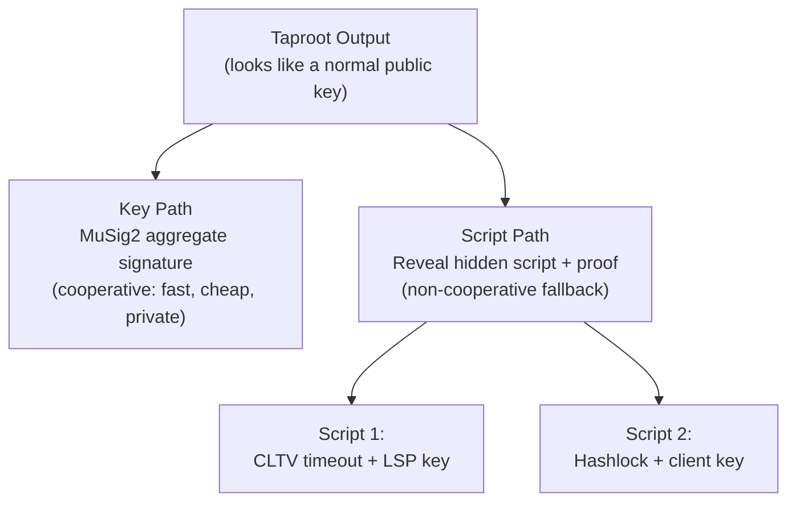

# What Is Taproot?

> **Summary**: A Bitcoin upgrade (activated 2021) that lets a UTXO be spent either by a single aggregated key (fast, private) or by revealing a hidden script (fallback). SuperScalar uses both paths.

## How Taproot Works

A Taproot output encodes two spending paths in a single public key: a **key path** for cooperative spends, and a **script path** for unilateral fallback.



### Key Path (the happy path)
- All participants combine keys using [[what-is-musig2|MuSig2]]
- Produces a single signature that looks like any other Bitcoin transaction
- Smallest witness size, lowest cost, highest privacy
- Used when everyone cooperates

### Script Path (the fallback)
- Hidden scripts are committed in a **Merkle tree** hashed into the public key
- To use a script, you reveal: the script itself + a Merkle proof + a valid signature
- **More expensive** (larger witness) but doesn't require cooperation
- Used when someone goes offline or misbehaves

## How SuperScalar Uses Taproot

Every output in the SuperScalar factory tree is a Taproot output with both paths:

| Output Type | Key Path | Script Path |
|-------------|----------|-------------|
| **Funding UTXO** | All N clients + LSP (N-of-N MuSig2) | — |
| **Tree node output** | Subset of clients + LSP (MuSig2) | `<timeout> OP_CLTV OP_DROP <LSP_key> OP_CHECKSIG` |
| **Client channel** | Client + LSP (2-of-2 MuSig2) | Standard Poon-Dryja scripts |
| **LSP liquidity stock** | LSP only | `<shachain_secret> OP_DROP <LSP_key> OP_CHECKSIG` |

### The Timeout Script Path

This is the critical safety mechanism in [[timeout-sig-trees|timeout-sig-trees]]:

```
<cltv_timeout> OP_CHECKLOCKTIMEVERIFY OP_DROP <LSP_pubkey> OP_CHECKSIG
```

Translation: **"After block height X, the LSP alone can spend this."**

This prevents the LSP's capital from being locked forever if clients disappear. Before the timeout, the N-of-N key path is the only spending path; after it, the LSP can unilaterally recover funds.

## Key Tweaking

The public key on-chain is not the raw aggregate key — it is **tweaked** with the Merkle root of the script tree:

```
output_key = internal_key + H_TapTweak(internal_key || merkle_root) × G
```

Where `H_TapTweak` is SHA-256 with the tagged hash prefix `"TapTweak"` (BIP-341).

This means:
- If you know the internal key and want to use the **key path**, you adjust your signature by the tweak
- If you want to use the **script path**, you reveal the internal key, the script, and a control block (Merkle proof)
- Anyone looking at the blockchain just sees a normal-looking public key — they can't tell scripts are hidden inside

## Implications for SuperScalar

Before Taproot, N-of-N multisig required revealing all N public keys and N signatures in the spending witness. With Taproot + MuSig2:

- **Privacy**: Cooperative factory spends are indistinguishable from single-sig transactions
- **Efficiency**: One 32-byte key and one 64-byte signature regardless of participant count
- **Flexibility**: Script paths (timeout recovery, punishment) are committed but not revealed unless used

## Related Concepts

- [[what-is-musig2]] — How the key-path aggregate signature is created
- [[timeout-sig-trees]] — The specific script trees used in SuperScalar
- [[tapscript-construction]] — Technical deep dive on building Taproot scripts
- [[shachain-revocation]] — How the LSP liquidity stock scripts prevent cheating
