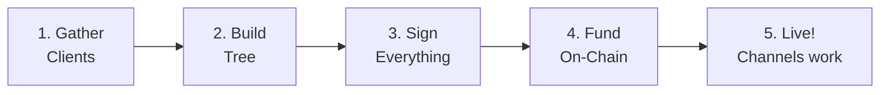
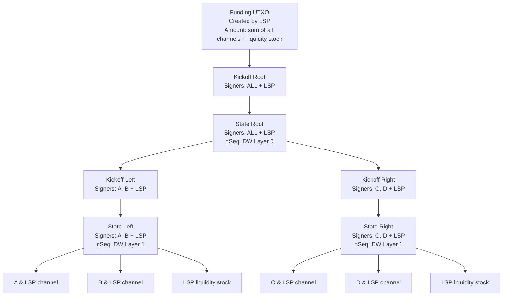
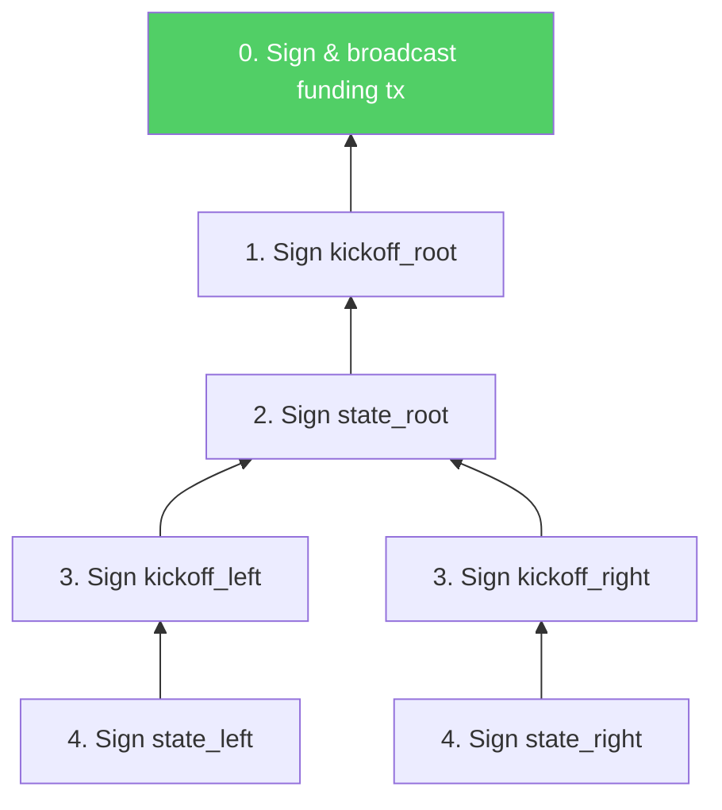

# Building a Factory

> **Summary**: The LSP gathers online clients, constructs a tree of pre-signed transactions, and funds the whole structure with one on-chain UTXO — all without any individual client needing on-chain Bitcoin. Many users safely share a single UTXO, with standard Lightning channels at the leaves.

## Overview

Building a factory is a coordinated ceremony between the LSP and all participating clients. It happens once when the factory is born, and the result is a set of pre-signed transactions that encode every possible exit path.



## Step 1: Gather Clients

The LSP identifies which clients will participate in this factory. Factors include:

| Factor | Consideration |
|--------|--------------|
| **Online status** | All clients must be online during construction (for MuSig2 signing) |
| **Uptime history** | High-uptime clients can be at higher arity (more siblings) |
| **Channel size** | Determines how much LSP liquidity to allocate |
| **Previous factory** | Clients migrating from a dying factory get priority |

**Typical factory**: 4-8 clients + LSP, organized into a binary tree.

## Step 2: Build the Tree

The LSP constructs the [[factory-tree-topology|factory tree]] — determining which clients go in which subtree:



For each node, the LSP computes:
- The [[what-is-musig2|MuSig2]] aggregate public key for the signer subset
- The [[what-is-taproot|Taproot]] output key (with [[timeout-sig-trees|CLTV timeout]] script tree)
- The transaction outputs and amounts
- The initial [[decker-wattenhofer-invalidation|DW]] nSequence values

## Step 3: Sign Everything (The MuSig2 Ceremony)

This is the most complex step. Every transaction in the tree must be pre-signed before the funding UTXO is created — because once the funding UTXO exists on-chain, the exit paths must already be guaranteed.

### Signing Order: Inside-Out

Transactions are signed from **leaves to root**, not root to leaves. Why? Because you need to know a child transaction's txid to compute the parent's output. And you should never fund a parent before the child exit paths are signed.



### The Two-Round MuSig2 Flow

For each transaction in the tree:

**Round 1 — Nonce Exchange:**
1. Each signer in the subset generates a fresh nonce pair
2. Public nonces are shared with all other signers in the subset
3. The LSP collects and distributes nonces

**Round 2 — Partial Signatures:**
1. Each signer creates a partial signature using their key + nonce + aggregated nonce
2. Partial signatures are collected by the LSP
3. The LSP aggregates them into a final Schnorr signature

With N nodes in the tree, each requiring its own MuSig2 session, the LSP coordinates **N parallel signing sessions** across two rounds.

### Nonce Pools

Since each signing session needs fresh nonces, signers pre-generate **nonce pools** — batches of 64+ nonces — so the ceremony can proceed without waiting for on-demand nonce generation.

## Step 4: Fund On-Chain

Once ALL tree transactions are signed:

1. The LSP creates the **funding transaction** — sending Bitcoin to the Taproot address that the kickoff_root spends from
2. This is the **only on-chain transaction** in the entire construction
3. The funding amount = sum of all client channel capacities + all LSP liquidity stock

```
Funding TX:
  Input:  LSP's existing UTXO(s)
  Output: P2TR(MuSig2(A, B, C, D, LSP) | CLTV timeout)
          Amount: e.g., 1.0 BTC total
```

## Step 5: Channels Go Live

Once the funding transaction confirms:

- Each client has a pre-signed path from the funding UTXO to their individual channel
- Clients can start sending and receiving Lightning payments immediately
- The LSP can begin selling inbound liquidity from its liquidity stock
- Regular Lightning payments **do not touch the factory** — they use standard Poon-Dryja mechanics within the leaf channels

## Who Pays for What?

| Cost | Paid By | Why |
|------|---------|-----|
| Funding transaction fee | LSP | LSP is the one with on-chain Bitcoin |
| Tree node fees (endogenous) | LSP (default) | Recovered if factory closes cooperatively |
| Inbound liquidity | Client | Purchased from LSP — this is how the LSP earns revenue |
| Force-close fees | Whoever publishes | P2A outputs allow CPFP fee-bumping |

> *"Tree node fees are default-paid by the LSP. The result is that tree node fees are recovered if the LSP reaps the UTXO without publishing the entire tree."* — ZmnSCPxj

Clients can enter the factory with **zero on-chain Bitcoin**. The LSP fronts all capital and earns it back through liquidity sales.

## What Could Go Wrong During Construction?

| Problem | Impact | Solution |
|---------|--------|----------|
| Client goes offline mid-ceremony | Can't complete signing | LSP restarts with remaining clients |
| Nonce reuse | Private key leaked! | Never happens — nonce pools are single-use |
| LSP refuses to fund after signing | No factory created | Clients lose nothing (no funds were committed) |
| Funding tx doesn't confirm | Factory delayed | Wait for confirmation, or RBF the funding tx |

## Related Concepts

- [[factory-tree-topology]] — The structure being built
- [[what-is-musig2]] — The signing protocol used throughout
- [[what-is-taproot]] — The output format for every tree node
- [[timeout-sig-trees]] — The CLTV scripts committed during construction
- [[updating-state]] — What happens after the factory is live
