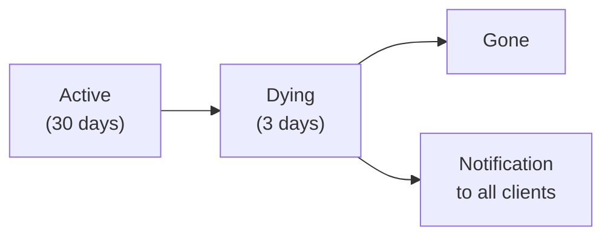
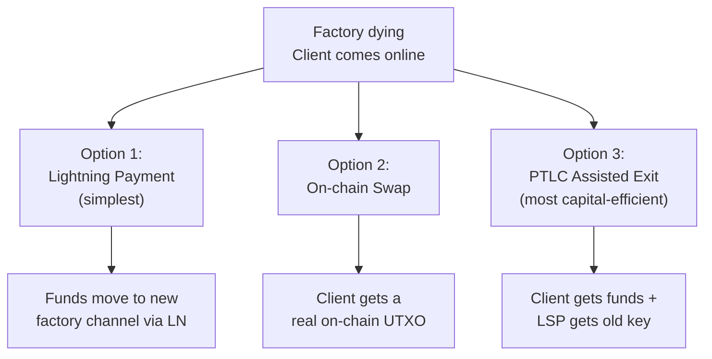
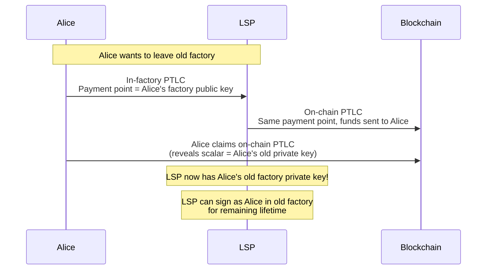
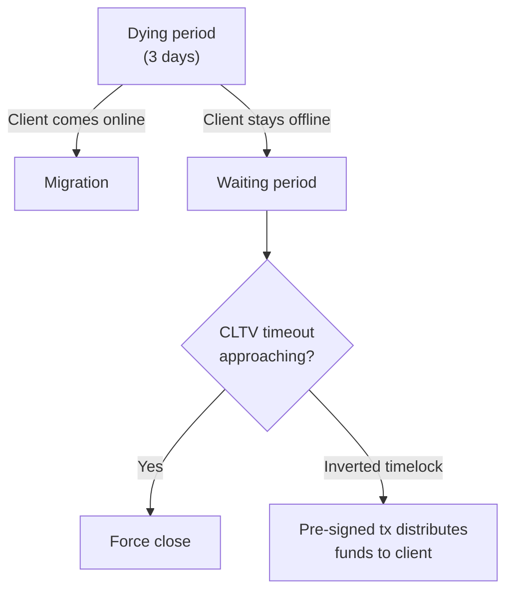

# Client Migration

> **Summary**: When a factory enters its dying period, clients have 3 days to move their funds to a new factory. Options include a standard Lightning payment, an offchain-to-onchain swap, or a PTLC-based "assisted exit" where the client hands over their old factory key in exchange for funds via an on-chain PTLC.

## When Migration Happens

Every factory has a [[laddering|fixed lifetime]]. When the active period ends:

The client receives a push notification: **"Your factory is entering its dying period. Come online to migrate."**

## Migration Options

### Option 1: Normal Lightning Payment

The simplest approach:
1. The LSP has already set up a new factory with a channel for this client
2. The client pays from their old channel to their new channel via a standard Lightning payment
3. The old channel is emptied; the new channel is funded

**Pros**: Simple, no extra on-chain footprint
**Cons**: Requires the new factory to already exist; routing fees apply

### Option 2: Offchain-to-Onchain Swap

The client cashes out to an on-chain UTXO:
1. Client receives funds as an on-chain UTXO
2. Client can join a new factory later or hold on-chain

**Pros**: Client gets full sovereignty — their own UTXO
**Cons**: On-chain transaction required; client needs to pay fees to join new factory

### Option 3: PTLC Assisted Exit

Uses **Point Time-Locked Contracts** for private key handover:

**What happens:**
1. Alice creates an in-factory PTLC where the **payment point equals her factory public key**
2. The LSP creates a corresponding on-chain PTLC
3. Alice claims the on-chain PTLC, which **reveals the scalar** (her private key)
4. The LSP now possesses Alice's private key for the old factory

**Why this matters:**

> *"If A and B are on the same leaf, A has performed this assisted exit and never comes online again, the LSP can, with B and its private key copy of A, sign a new leaf state, without A ever talking to the LSP ever again. The LSP can even use the funds of the A-L channel to provide additional liquidity to the remaining client B!"* — ZmnSCPxj

The LSP can now act as Alice for any remaining operations in the old factory. This reduces the number of real participants that must be coordinated for the old factory's remaining lifetime.

**Safety**: The PTLC is **atomic** — Alice only reveals her key when she successfully receives funds. If the LSP doesn't provide the on-chain PTLC, Alice keeps her key and can force-close instead.

## What If the Client Doesn't Migrate?

If a client misses all 3 days:

1. Their funds remain in the old factory
2. As the CLTV timeout approaches, the LSP is **forced** to resolve the factory
3. With the **inverted timelock** design, a pre-signed nLockTime'd transaction automatically distributes funds to clients
4. The client's funds eventually land on-chain — safe but inconvenient

**The liveness requirement is forgiving**: clients only need to come online **once per month** (during their factory's 3-day dying period).

## The Full Picture: A Day in the Life

## Related Concepts

- [[laddering]] — The lifecycle that triggers migration
- [[cooperative-close]] — The ideal factory shutdown
- [[force-close]] — What happens if migration fails
- [[security-model]] — Trust assumptions during migration
- [[building-a-factory]] — How the new factory is constructed
