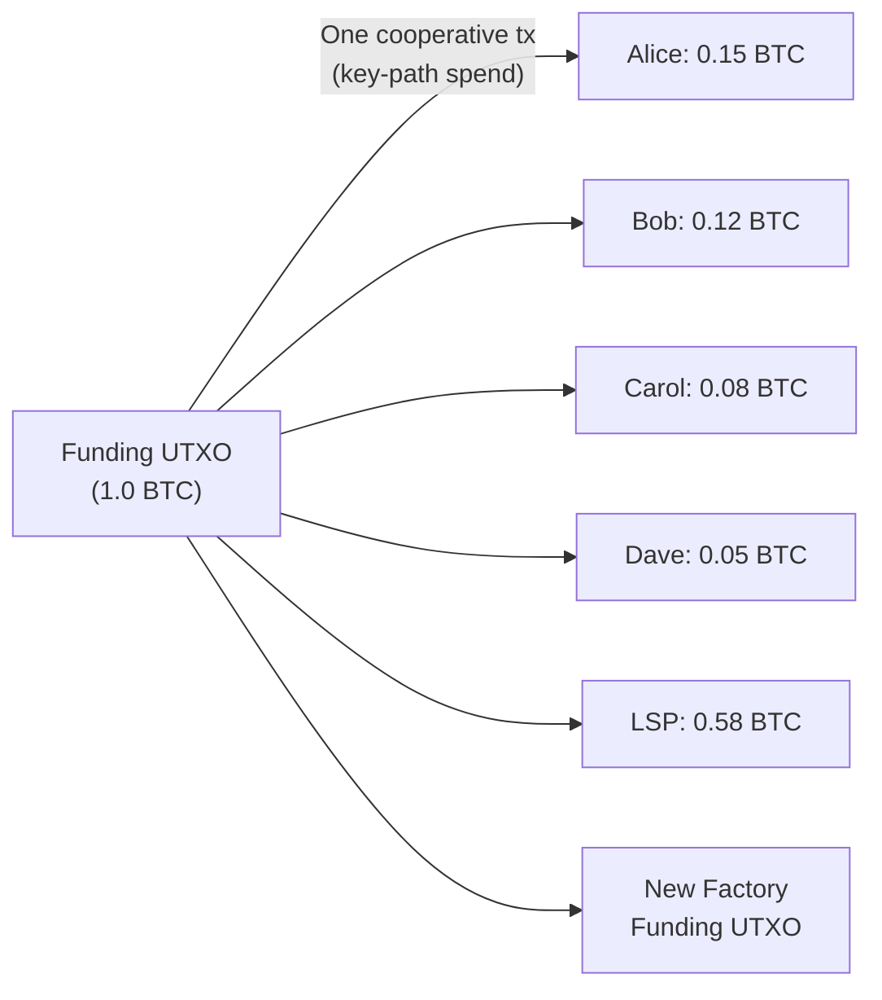
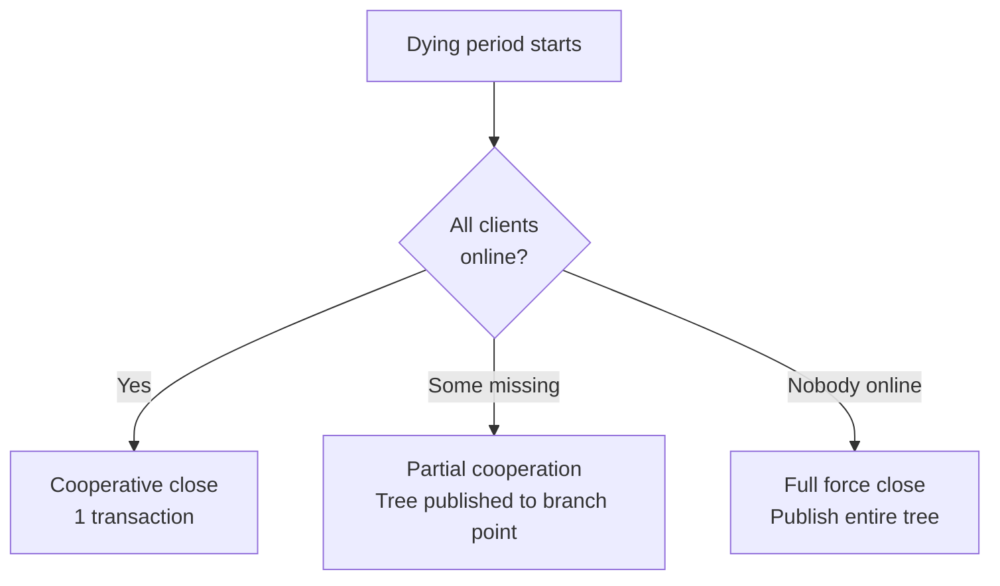

# Cooperative Close

> **Summary**: When a factory's lifetime ends and all clients cooperate, everyone signs a single transaction that distributes funds directly from the funding UTXO. No tree transactions are published on-chain.

## The Happy Path

If all clients come online during the [[laddering|dying period]] and cooperate, the entire factory can be closed with a **single on-chain transaction**:



Because the funding UTXO is a [[what-is-taproot|Taproot]] output with an N-of-N [[what-is-musig2|MuSig2]] key path, a cooperative close appears on-chain as a standard single-signature Taproot spend. The factory structure is not revealed.

## Comparison to Force Close

| Metric | Cooperative Close | [[force-close|Force Close]] |
|--------|------------------|------------|
| On-chain transactions | **1** | O(N) tree txs + channel closes |
| Total fees paid | Minimal (one tx) | Substantial (many txs) |
| Time to completion | 1 block | Days (Decker-Wattenhofer delays + to_self_delay) |
| Privacy | Input indistinguishable from single-sig spend | Reveals tree structure |
| LSP capital recovery | Immediate | Delayed by timelocks |

## How It Works

### During the Dying Period

1. Factory enters its 3-day dying period
2. LSP sends push notifications to all clients
3. Clients come online one by one

### When All Clients Are Online

1. **LSP proposes** final balances based on current channel states
2. All clients **verify** their balances are correct
3. Everyone participates in a **MuSig2 signing ceremony** for the close transaction
4. The close transaction is **broadcast** — spends the funding UTXO via key path
5. Clients receive their funds (either on-chain or in a new factory)

### Combining Close + New Factory

In the ideal [[laddering]] flow, the cooperative close of the old factory and the funding of the new factory happen in the same transaction:

```
Close + Fund TX:
  Input:  Old factory funding UTXO (key-path spend)
  Output 1: New factory funding UTXO
  Output 2: On-chain payouts for departing clients
  Output 3: Change back to LSP
```

This is why laddering can achieve ~1 on-chain transaction per day.

## What If Not Everyone Cooperates?

If one or more clients don't come online during the dying period:



**Partial cooperation**: Since the funding UTXO is an N-of-N MuSig2 key-path output, a cooperative close requires ALL signers. If some clients are absent, the tree must be published on-chain down to the branch point where absent clients diverge from online clients. Online clients' subtrees can then be closed cooperatively (key-path spend of their subtree output), while absent clients' subtrees are force-closed. The tree structure limits the blast radius — absent clients only affect their own branch.

## The Endogenous Fee Recovery

During factory construction, small fees were embedded in each tree transaction (endogenous fees). On cooperative close:

> *"Tree node fees are recovered if the LSP reaps the UTXO without publishing the entire tree."* — ZmnSCPxj

Since the tree is never published, those fees never get paid to miners. The LSP recovers them — they were essentially a deposit against the possibility of force-close.

## Related Concepts

- [[force-close]] — What happens when cooperation fails
- [[laddering]] — The lifecycle that leads to cooperative close
- [[client-migration]] — How clients move to new factories
- [[building-a-factory]] — The ceremony that created the factory
- [[what-is-musig2]] — The signing protocol for the close transaction
