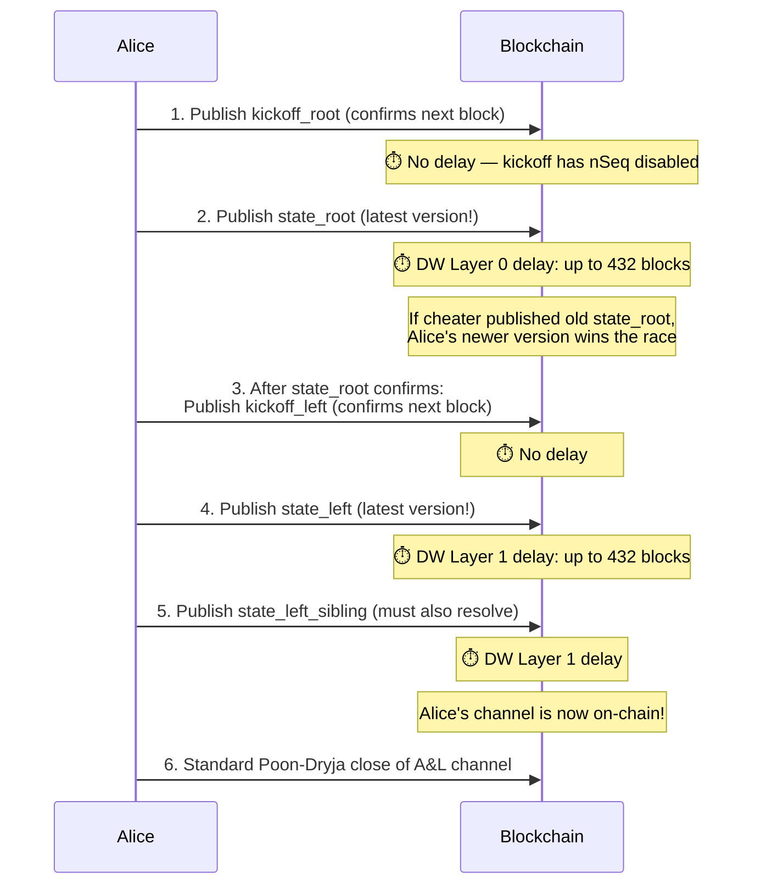
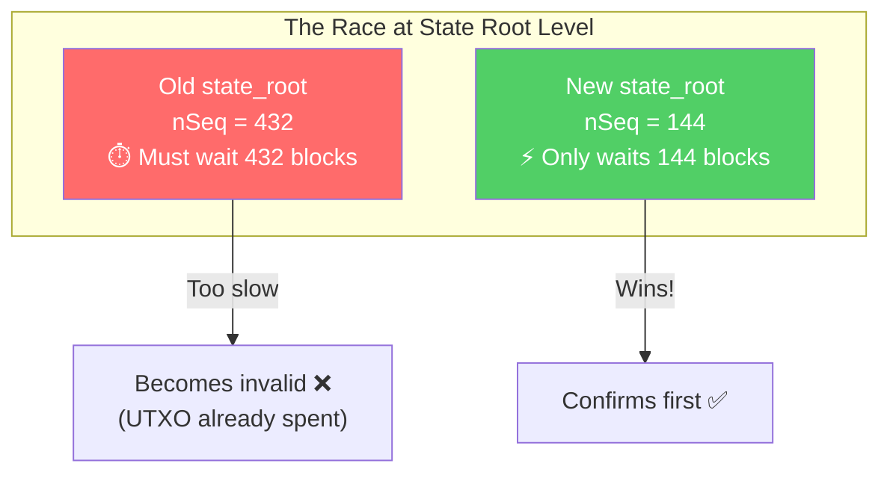
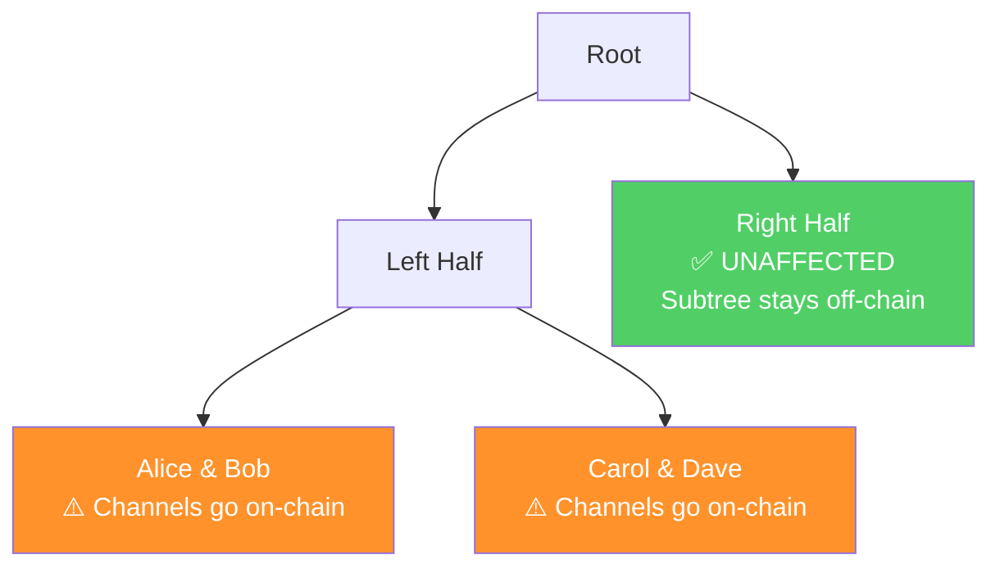

# Force Close (Unilateral Exit)

> **Summary**: If the LSP misbehaves or a client can't cooperate, anyone can publish the pre-signed tree transactions on-chain. The Decker-Wattenhofer mechanism ensures the newest state wins. It's expensive and slow, but funds are always recoverable.

## When Does Force-Close Happen?

| Scenario | Who Initiates |
|----------|--------------|
| LSP goes offline permanently | Client |
| LSP refuses to cooperate | Client |
| Client misses dying period and never returns | LSP (via timeout) |
| Suspected cheating | Either party |
| LSP shut down by authorities | All clients |

Force-close is the **last resort**. It's always available, but it's expensive — multiple transactions must hit the blockchain, each paying fees, and time delays add up.

## The Process (8-Client Factory, Arity 2)

Alice wants to exit unilaterally from a factory with 8 clients:



### Transaction Count

```
1 kickoff_root + 1 state_root + 1 kickoff_left + 2 state_leaves + 1 channel close
= 6 transactions total
```

In general: **O(log N) tree transactions + 1 channel close**.

## The DW Race

At each state node level, a race happens:



Even if a cheater broadcasts their old state transaction first, it can't confirm before the honest party's newer transaction (which has a shorter nSequence). This is the [[decker-wattenhofer-invalidation|Decker-Wattenhofer mechanism]] at work.

## The [[kickoff-vs-state-nodes|Kickoff Circuit Breaker]]

Notice the alternation: kickoff → state → kickoff → state. The kickoff nodes **isolate** the DW races at each level. Without them, replacing a state at one level would invalidate all the pre-signed transactions below it.

## Collateral Damage

Not everyone is equally affected:



| Party | Impact |
|-------|--------|
| **Alice** (exiting) | Fully exits — gets her funds on-chain |
| **Bob** (same leaf as Alice) | Channel goes on-chain; still functional but loses factory benefits |
| **Carol, Dave** (same half of tree) | Same as Bob — their kickoff must also be resolved |
| **Eve, Frank, Grace, Heidi** (other half) | **Completely unaffected** — their subtree was never published |

The tree structure **contains the blast radius**. Only Alice's half of the tree is affected.

## Fee Bumping with P2A

Every tree transaction includes a **P2A (Pay-to-Anchor)** output — a special output that anyone can spend to attach a CPFP (Child-Pays-for-Parent) fee bump:

```
Tree TX outputs:
  Output 0: Taproot (normal tree output)
  Output 1: P2A (anyone can spend → attach fee-bump child tx)
```

This solves the fee estimation problem: tree transactions are pre-signed with low endogenous fees. If the mempool is congested at force-close time, any participant can bump the fee by spending the P2A output.

### Shachain Protection for P2A

What prevents a griefing attack where someone fee-bumps an OLD state transaction? The [[shachain-revocation|shachain mechanism]]:

- Old state transactions have liquidity stock outputs with revealed secrets
- If someone publishes an old state, clients burn the LSP's liquidity stock to fees
- This makes it economically irrational to fee-bump old states

## Timing: How Long Does It Take?

Worst-case timing for a 2-layer DW factory:

| Step | Duration |
|------|----------|
| Kickoff root confirms | 1 block (~10 min) |
| State root DW delay | Up to 432 blocks (~3 days) |
| Kickoff left confirms | 1 block (~10 min) |
| State left DW delay | Up to 432 blocks (~3 days) |
| Poon-Dryja to_self_delay | ~144 blocks (~1 day) |
| **Total worst case** | **~7 days** |

This is significantly worse than a regular Lightning force-close (~1 day). The longer delay is the cost of sharing a UTXO among multiple participants.

## The Inverted Timelock Safety Net

With the [[timeout-sig-trees|inverted timelock]] design, even if a client CAN'T publish the tree (e.g., they don't have the pre-signed transactions), a pre-signed nLockTime'd transaction ensures:

> At the factory's CLTV timeout, funds are automatically distributed to clients.

The client just has to wait. The LSP is forced to act before the timeout or lose capital.

## Related Concepts

- [[decker-wattenhofer-invalidation]] — The race mechanism at each state level
- [[kickoff-vs-state-nodes]] — Why the alternation prevents cascade failures
- [[shachain-revocation]] — Punishment for broadcasting old states
- [[cooperative-close]] — The much better alternative
- [[security-model]] — Full analysis of force-close guarantees
