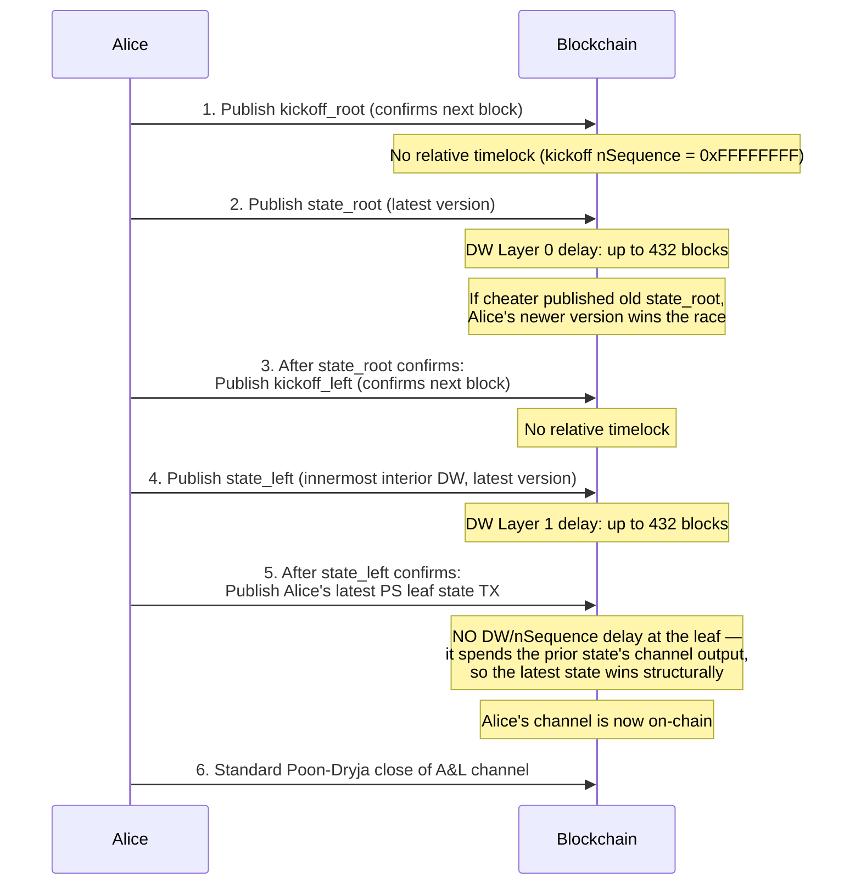
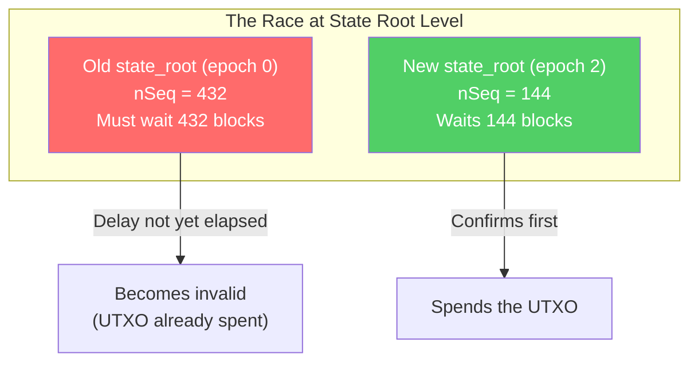
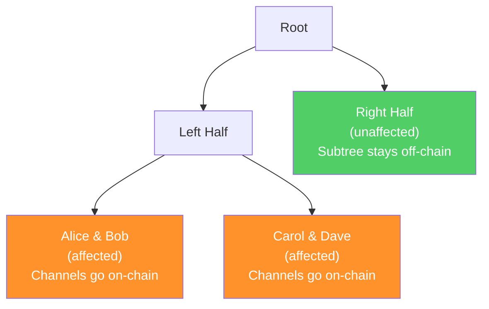

# Force Close (Unilateral Exit)

> **Summary**: If the LSP misbehaves or a client cannot cooperate, any participant can publish pre-signed tree transactions on-chain. The Decker-Wattenhofer mechanism ensures the newest state wins. The process takes up to a week and requires on-chain fees, but funds are always recoverable.

> **Leaf note**: At the **leaves**, SuperScalar now uses [[pseudo-spilman-leaves|pseudo-Spilman]] chaining — a unilateral exit publishes the **latest PS state TX** (which spends the prior state's output), with **no DW/nSequence delay at the leaf**. The Decker-Wattenhofer races described below apply to the **interior** tree layers.

## When Does Force-Close Happen?

| Scenario | Who Initiates |
|----------|--------------|
| LSP goes offline permanently | Client |
| LSP refuses to cooperate | Client |
| Client misses dying period and never returns | LSP (via CLTV timeout path) |
| Suspected cheating | Either party |
| LSP shut down by authorities | All clients |

Force-close is the **last resort**. Multiple tree transactions must be published on-chain, and Decker-Wattenhofer delays accumulate at each state layer.

## The Process (8-Client Factory, Arity 2)

Alice wants to exit unilaterally from a factory with 8 clients:


```mermaid
sequenceDiagram
    participant A as Alice
    participant Chain as Blockchain

    A->>Chain: 1. Publish kickoff_root (confirms next block)
    Note over Chain: No relative timelock (kickoff nSequence = 0xFFFFFFFF)

    A->>Chain: 2. Publish state_root (latest version)
    Note over Chain: DW Layer 0 delay: up to 432 blocks

    Note over Chain: If cheater published old state_root,<br/>Alice's newer version wins the race

    A->>Chain: 3. After state_root confirms:<br/>Publish kickoff_left (confirms next block)
    Note over Chain: No relative timelock

    A->>Chain: 4. Publish state_left (innermost interior DW, latest version)
    Note over Chain: DW Layer 1 delay: up to 432 blocks

    A->>Chain: 5. After state_left confirms:<br/>Publish Alice's latest PS leaf state TX
    Note over Chain: NO DW/nSequence delay at the leaf —<br/>it spends the prior state's channel output,<br/>so the latest state wins structurally

    Note over Chain: Alice's channel is now on-chain

    A->>Chain: 6. Standard Poon-Dryja close of A&L channel
```

### Transaction Count

```
1 kickoff_root + 1 state_root + 1 kickoff_left + 1 state_left (interior DW)
+ 1 PS leaf state TX + 1 channel close = 6 transactions total
```

In general: **O(log N) tree transactions + 1 channel close**.

## The DW Race

At each state node level, a race happens:


```mermaid
graph TD
    subgraph "The Race at State Root Level"
        SR_OLD["Old state_root (epoch 0)<br/>nSeq = 432<br/>Must wait 432 blocks"]
        SR_NEW["New state_root (epoch 2)<br/>nSeq = 144<br/>Waits 144 blocks"]
    end

    SR_NEW -->|"Confirms first"| CONFIRM["Spends the UTXO"]
    SR_OLD -->|"Delay not yet elapsed"| INVALID["Becomes invalid<br/>(UTXO already spent)"]

    style SR_NEW fill:#51cf66,color:#fff
    style SR_OLD fill:#ff6b6b,color:#fff
```

This is the [[decker-wattenhofer-invalidation|Decker-Wattenhofer mechanism]]: a shorter nSequence always wins the race for the same UTXO.

## The [[kickoff-vs-state-nodes|Kickoff Circuit Breaker]]

Notice the alternation: kickoff → state → kickoff → state. The kickoff nodes **isolate** the DW races at each level. Without them, replacing a state at one level would invalidate all the pre-signed transactions below it.

## Collateral Damage

Not everyone is equally affected:


```mermaid
graph TD
    R["Root"] --> L["Left Half"]
    R --> Ri["Right Half<br/>(unaffected)<br/>Subtree stays off-chain"]

    L --> LL["Alice & Bob<br/>(affected)<br/>Channels go on-chain"]
    L --> LR["Carol & Dave<br/>(affected)<br/>Channels go on-chain"]

    style Ri fill:#51cf66,color:#fff
    style LL fill:#ff922b,color:#fff
    style LR fill:#ff922b,color:#fff
```

| Party | Impact |
|-------|--------|
| **Alice** (exiting) | Fully exits — gets her funds on-chain |
| **Bob** (same leaf as Alice) | Channel goes on-chain; still functional but loses factory benefits |
| **Carol, Dave** (same half of tree) | Same as Bob — their kickoff must also be resolved |
| **Eve, Frank, Grace, Heidi** (other half) | **Completely unaffected** — their subtree was never published |

The tree structure **contains the blast radius**. Only Alice's half of the tree is affected.

## Fee Bumping with P2A

Tree node transactions (kickoff, state, leaf state) are pre-signed with **endogenous fees** baked in at signing time — they do **not** carry a P2A output. The **P2A (Pay-to-Anchor)** outputs live on the **distribution transaction** and on the **channel commitment/penalty transactions**, where market-rate fee-bumping is needed at broadcast time (see [[transaction-structure]]):

```
Distribution / channel TX outputs:
  Output 0..N: payouts (Taproot)
  Output N+1: P2A (anyone can spend → attach fee-bump child tx)
```

This solves the fee estimation problem: tree transactions carry low endogenous fees, while the transactions that actually settle value on-chain expose a P2A anchor — so if the mempool is congested at force-close time, any participant can attach a CPFP child to bump the fee.

### Stale-state protection for P2A

What prevents a griefing attack where someone fee-bumps an OLD state transaction? The [[l-stock-redistribution|redistribution TX mechanism]]:

- Every L-stock UTXO has a matching pre-signed redistribution TX co-signed during the state advance that minted it
- If an old state's L-stock UTXO appears on-chain, anyone can broadcast the matching redistribution TX, which redistributes the LSP's L-stock equally to clients in that leaf
- This makes it economically irrational for the LSP to broadcast old states — the LSP loses the entire L-stock to clients

## Timing: How Long Does It Take?

Worst-case timing for a 2-layer DW factory:

| Step | Duration |
|------|----------|
| Kickoff root confirms | 1 block (≈10 min) |
| State root DW delay (interior) | Up to 432 blocks (≈3 days) |
| Kickoff left confirms | 1 block (≈10 min) |
| State left DW delay (interior) | Up to 432 blocks (≈3 days) |
| PS leaf publish (latest state TX) | No DW delay (PS chain) — confirms next block |
| Channel-level to_self_delay (Poon-Dryja) | ≈144 blocks (≈1 day) |
| **Total worst case** | **≈7 days** |

This is significantly worse than a regular Lightning force-close (≈1 day). The longer delay is the cost of sharing a UTXO among multiple participants.

## The Inverted Timelock Safety Net

With the [[timeout-sig-trees|inverted timelock]] design, even if a client cannot publish the tree (e.g., they lost the pre-signed transactions), a pre-signed `nLockTime` transaction exists that distributes funds to clients once the factory's CLTV timeout height is reached:

> Any party holding a copy of the pre-signed timeout transaction can broadcast it after the CLTV height. The LSP must act before the timeout or lose its capital locked in the factory.

## Related Concepts

- [[decker-wattenhofer-invalidation]] — The race mechanism at each state level
- [[kickoff-vs-state-nodes]] — Why the alternation prevents cascade failures
- [[shachain-revocation|Revocation Secrets]] — Punishment at the **inner channel** (BOLT-2 / Poon-Dryja) level for broadcasting an old commitment; the factory-tree L-stock instead uses the [[l-stock-redistribution|redistribution TX]]
- [[cooperative-close]] — The much better alternative
- [[security-model]] — Threat analysis and trust assumptions, including force-close guarantees
